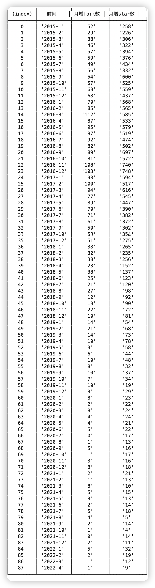

#		开源期中报告

**小组成员**

杨珂（学号：51215903064，完成历史轨迹分析任务1-4，绘图与整理实验报告）

张凌峰（学号：51215903067，完成历史轨迹分析任务5-8，总结归纳项目被归档的可能原因）

贺慧慧（学号：51215903015，整理资料，分析与总结项目的基本背景和发展历程介绍）

##	一、项目的基本背景和发展历程介绍

###		1.1 技术类型

​	RxJS 是 Reactive Extensions for JavaScript 的缩写，起源于 Reactive Extensions，是一个基于可观测数据流在异步编程应用中的库。它提供了一个核心类型 Observable，附属类型 (Observer、 Schedulers、 Subjects) 和操作符Operators，通过使用 observable 序列来编写异步和基于事件的程序。ReactiveX 结合了观察者模式、迭代器模式和使用集合的函数式编程，以满足用一种理想方式来管理事件序列所需要的一切。

​	该项目主要使用JavaScript 为开发语言。

###		1.2 历史发布版本

​	正式版本共发布了34次，发布的时间和版本如下：

| 发布时间    | 版本    | 更新功能                                                     |
| ----------- | ------- | ------------------------------------------------------------ |
| 23 Oct 2013 | v2.2.0  |                                                              |
| 28 Oct 2013 | v2.2.1  | 加法                                                         |
| 28 Oct 2013 | v2.2.2  |                                                              |
| 28 Oct 2013 | v2.2.3  | 加法，移动                                                   |
| 28 Oct 2013 | v2.2.4  | 简化了只有一个值的回调行为                                   |
| 18 Nov 2013 | v2.2.5  | 包含运算符的新文件                                           |
| 19 Nov 2013 | v2.2.7  |                                                              |
| 28 Nov 2013 | v2.2.9  |                                                              |
| 29 Dec 2013 | v2.2.10 |                                                              |
| 05 Jan 2014 | v2.2.12 |                                                              |
| 18 Mar 2014 | v2.2.14 | Bug修复                                                      |
| 18 Mar 2014 | V2.2.15 |                                                              |
| 19 Mar 2014 | V2.2.16 | 错误修复和对 Enumerable 的更改以使其与 ES6 兼容              |
| 19 Mar 2014 | v2.2.17 |                                                              |
| 01 Apr 2014 | v2.2.18 | 辅助函数等                                                   |
| 06 Apr 2014 | v2.2.19 | Rx.Observable.fromEvent 变化                                 |
| 14 Apr 2014 | v2.2.20 | 添加更多 Promises 支持                                       |
| 22 May 2014 | v2.2.24 | RxJS 完整构建，附加功能                                      |
| 05 Jun 2014 | v2.2.25 | ConcatMap/SelectConcat                                       |
| 12 Jul 2014 | v2.2.28 | 添加Rx.Observable.of匹配Array.of                             |
| 04 Oct 2014 | v2.3.0  | A Commitment to  Standards;  Custom Builds;  A lighter Lite;  New Operators;  Operator Changes |
| 24 Oct 2014 | v2.3.14 | 传感器支持;flatMap向seleectMany和concatMap添加可迭代支持selectConcat |
| 16 Nov 2014 | v2.3.18 | 删除不佳操作符                                               |
| 12 Dec 2014 | v2.3.22 | 长堆栈跟踪支持；泰塞尔支持；更多背压运算符；TypeScript 定义更新；文档和代码更新 |
| 15 Jan 2015 | v2.3.23 | 性能改进，文档修复                                           |
| 07 Feb 2015 | v2.3.25 | 性能升级                                                     |
| 28 Mar 2015 | v2.4.0  | 性能增强；新的 NPM 包；新的运算符/方法                       |
| 18 Apr 2015 | v2.5.0  | 移动 node.js 特定绑定；  改进了创建操作符的性能；  添加更多 Rx-Lite NPM 模块 |
| 04 Aug 2015 | v3.0.0  | rx.core.jsRx-Core 系列以及rx.lite.jsRx-Lite  系列库          |
| 19 Aug 2015 | v3.1.0  |                                                              |
| 22 Aug 2015 | v3.1.1  |                                                              |
| 26 Sep 2015 | v4.0.0  | 这版本将解决模块化和运算符性能优化                           |
| 15 Oct 2015 | v4.0.6  | 修复4.0bug                                                   |
| 08 Mar 2016 | v4.1.0  | 增加新功能                                                   |

 ###		1.3 主要贡献者的构成

该项目由 Microsoft 与自由开源开发人员合作开发。该开源项目一共有279个贡献者，两个管理员。排名前三的贡献者的用户名所属组织地区如下：

| 用户名             | 组织                   | 地区                 |
| ------------------ | ---------------------- | -------------------- |
| Matthew Podwysocki | Microsoft  Corporation | Washington, DC       |
| Paul Daniels       | 无                     | Singapore            |
| Igor Oleinikov     | 无                     | Vancouver,BC, Canada |

###		1.4 CI/CD的使用

​	2013年4月5日，2.1.5版本的时候部署了travis ci，做自动构建，经过一段时间的维护，在版本3.0.0提交时逐步趋向稳定。

##		二、项目历史轨迹分析

​	基于给出的镜像数据和 OpenDigger，完成项目 **2015年/创建 - 归档**期间的以下数据分析任务：

###		2.1 每月新增 Star 和 Frok 的个数

###	 2.2 每月打开 Issue 和 关闭 Issue 的个数

###	2.3 每月打开 PR 和**合入**PR 的个数（注意，关闭 PR 不等于合入）

###		2.4 每月在仓库中活跃（只要有日志产生就算）的不同开发者（也就是一个GitHub账号）总数

###		2.5 Issue 从打开到关闭的平均时长和中位数（单位：天）

###		2.6 PR 从打开到合入的平均时长和中位数（单位：天）

###		2.7 Issue和PR从打开到第一次有人回复（非本人回复）的平均时长和中位数（单位：天）

###		2.8 根据你观察到的仓库的历史数据，尝试找到几个你认为关键或值得注意的时间节点

+ 2015-10
+ 2016-11

##		三、洞察项目被归档的可能原因 

**总结项目被归档的可能原因：**

​	RxJS的v5版本对整个RxJS进行重写，因此弃置了原有的Reactive-Extensions/RxJS, 并将新版RxJS和RX的其他语言实现一起放在ReactiveX上.（https://www.npmjs.com/package/rxjs/v/5.0.0-alpha.10）

**结合你搜集到的信息，尝试分析项目归档后可能产生的影响（对开发者和用户）**

+ 更换仓库: 可能会有开发者困惑两个仓库的区别 https://github.com/Reactive-Extensions/RxJS/issues/1262

* 重写可能带来兼容性问题

**表述你对开源项目如何可持续发展的理解**

开源项目的可持续性问题一直存在，可能的原因有：

1. 维护一个开源项目的成本不为公众所熟知。多数人和不少企业认为免费使用开源软件是理所应当的，不关心甚至不知道维护开源项目的人力和成本。
1. 开源文化传统反对商业利益，认为金钱会削弱开源的资源精神，一些人不愿意公开讨论自己的经济困难。
1. 最主要的可能是缺少可行的商业模式。常见的"商业模式"包括：
   1. 专业服务：例如Red Hat为提供企业的Linux支持，培训和其他服务。
   1. Open Core：开源核心产品，围绕这个核心提供商业扩展。
   1. 托管服务：提供SaaS化产品，用户可以自己部署或选择托管。
   1. 开源社区版+付费商业版：社区版开源且免费，但不提供任何保障。商业版闭源且收费，提供如质量测试、Bug 修复、性能优化等其他服务。
   1. 基金会支持：例如Apache软件基金会。通过接受企业捐赠，它为项目提供组织和法务等方面的支持，但不直接为项目提供资金。
   1. 企业支持：企业因项目价值聘请开源贡献者全职工作。
   1. 赏金：个人或公司有时会发布赏金，希望以此得到想要的功能特性。
   1. 众筹：通过众筹获得资助，如Kickstarter或Indiegogo。

严格意义上说，上述的许多方法根本不算是商业模式，且收入不稳定，还存在以下问题：

1. 支持对象：以特定项目为主，对个人贡献者的支持较少。
1. 时间精力：如果有足够多的用户使用该项目并愿意付费，那么专业服务对于个人开发者或小型团队来说是一个可行的选择，但同时这也会分散开发者改进项目本身的时间和精力。
1. 贫富差距：越来越多的眼球和资源都投到了极少数热门项目和个人上，导致基础和小众软件的生存空间越来越有限。
1. 中立性：企业聘请个人贡献者全职工作，可能会影响项目的中立性或原本的发展方向，不利于整个社区的发展。

本项目(RxJS)是原为微软内部产品Reactive Extensions的一部分，属于企业支持的开源项目。该项目核心技术影响范围巨大，背靠企业收入可靠，具有相当良好的可持续性。

