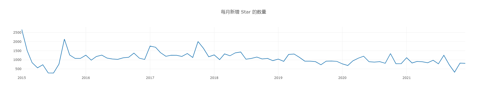
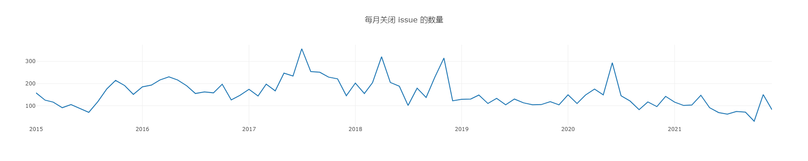

# 开源期中作业

开源项目：https://github.com/nodejs/node  
项目序号：177
项目ID： 27193779

小组成员及分工：

* 刘丹琪 51215903016，
* 刘晟驰 52215903004，负责任务二
* 梅文娟 51215903013，

## 一、项目的基本背景和发展历程

### 1. 项目基本信息

### 2. 版本发布历史

### 3. 主要贡献者的构成（国家、区域和组织等）

### 4. CI/CD 的使用

## 二、项目的历史轨迹分析

### 1. 每月新增 Star 和 Frok 的个数

图2-1 每月新增的 star 个数

图2-2 每月新增的 fork 个数
  
&nbsp;

### 2. 每月打开 issue 和关闭 issue 的个数

图2-3 每月打开的 issue 个数

图2-4 每月关闭的 issue 个数

&nbsp;

### 3. 每月打开 PR 和合并 PR 的个数

图2-5 每月打开的 PR 个数

图2-6 每月合并的 PR 个数

### 4. 每月在仓库中活跃（只要有日志产生就算）的不同开发者总数

图2-7 每月活跃的不同开发者个数

**（更详细的结果展示，以及5-7数据分析结果，请查阅.ipynb文件）**

##  三、结合期中分析的归档项目，对比分析活跃/归档项目

