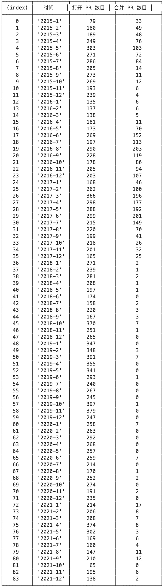

# 项目分析报告

组员：王怡静（代码撰写、绘图）、吴帆（完成分析报告）

## 一、项目的基本背景和发展历程介绍

项目地址：https://github.com/angular/angular

### 1 项目简介

Angular是一个基于TypeScript的开源Web应用框架。总Star数82.2k，fork数21.7k，使用者2.3m个，具有1576个活跃的贡献者，是一个高度活跃的项目。且现今TypeScript逐渐发展推广，势必会有更多人趋向于使用TypeScript版本的Angular。

### 2 功能说明

它能让用户使用简单的声明式模板，快速实现各种特性。使用自定义组件和大量现有组件，扩展模板语言。能够跨平台使用，充分利用现代 Web 平台的各种能力，提供 App 式体验。高性能、离线使用、免安装，用于创建高效、复杂、精致的单页面应用。

### 3 技术类型

项目主要使用TypeScript和JavaScript作为开发语言。

### 4 版本发布历史

在此项目地址中，最早的版本历史记录可追溯到2021年2月12日，用户josephperrott(Angular Team)发布第一个版本11.0.0-next.0，自此之后更新迭代，直到今天还有较高的更新频率，到目前为止，最新一版在2022年6月22日更新到v14.1.0-next.2，共迭代了181个版本。但其实Angular更早的项目初始版本始于2016年9月14日。

Angular的所有主版本都提供了 18 个月的支持。其中包括 6 个月的活跃支持，在此期间会定期发布更新和补丁。然后是12个月的长期支持（LTS），在此期间只会发布关键修复程序和安全补丁。

### 5 主要贡献者的构成（国家、区域和组织等）

Angular项目由**Google的Angular团队及社区共同领导**，是由AngularJS的同一个开发团队完全重写的。自2014年起，Google团队就在开发维护这个项目，并且一直维持着较高的活跃度。

### 6 CI/CD 的使用

#### 6.1 GitHub Actions

Angular 使用 GitHub Actions 进行CI/CD。

持续集成由很多操作组成，比如抓取代码、运行测试、登录远程服务器，发布到第三方服务等等。GitHub 把这些操作就称为 actions。很多操作在不同项目里面是类似的，完全可以共享。GitHub 允许开发者把每个操作写成独立的脚本文件，存放到代码仓库，使得其他开发者可以引用。如果需要某个 action，不必自己写复杂的脚本，直接引用他人写好的 action 即可，整个持续集成过程，就变成了一个 actions 的组合。

GitHub Actions 有一些自己的术语。

（1）workflow （工作流程）：持续集成一次运行的过程，就是一个 workflow。

（2）job （任务）：一个 workflow 由一个或多个 jobs 构成，含义是一次持续集成的运行，可以完成多个任务。

（3）step（步骤）：每个 job 由多个 step 构成，一步步完成。

（4）action （动作）：每个 step 可以依次执行一个或多个命令（action）。

GitHub Actions 的配置文件叫做 workflow 文件，存放在代码仓库的 .github/workflows 目录。workflow 文件采用 YAML 格式，文件名可以任意取，但是后缀名统一为 .yml，比如 foo.yml。一个库可以有多个 workflow 文件。GitHub 只要发现 .github/workflows 目录里面有 .yml 文件，就会自动运行该文件。

#### 6.2 具体分析

Angular 中共有四个 workflow，对应了四个 yml 文件，各执行不同的job序列。

DevInfra对应的 yml 文件如下，on 之后是限定 workflow 执行的条件，jobs 中包含每一步的 job。job 中每个 step 要利用 uses 关键字使用一个 action，紧跟的 with 表明参数。

DevInfra 执行的任务序列如下：主要运行了2个 action 任务。

feature_triage 对应的 yml 文件如下，主要进行 feature 分类，在每天 14:00 运行。

feature_triage 的对应工作任务序列如下：主要运行了1个 action 任务。

lock_closed 的 yml 文件如下，主要用来关闭一些不活跃的 issues，在每天 16:00 运行。

lock_closed 对应的工作序列如下：主要运行了1个 action 任务。

scorecard.yml 文件如下，主要用于进行代码分析审查。

对应的工作序列如下，主要进行build、代码复核审查、代码扫描、运行分析、发布代码、清理进程。

### 7 其他有价值的信息

Angular主要的板块是由模块、组件、模板、元数据、数据绑定、指令、服务和依赖注入构成的。下图展示了每个部分是如何相互作用的。

图中的模板 (Templates) 是由 Angular 扩展的 HTML 语法组成，组件(Components) 用来管理这些模板，应用逻辑部分通过服务 (Services) 来完成，然后在模块中打包服务与组件，最后通过引导根模块来启动应用。

Angular 几年前就着手于 TypeScript 的重写直至今日，可以说TypeScript的普及有Angular的一份功劳。Angular 是目前所有前端框架中，唯一所有的三方库 100% 支持 Typescript 的。而 React 和 Vue 都是近几年才开始支持生成 Typescript 代码，最新发布的 Vue3.0 宣布支持 Typescript，而 Vue 的开发者也承认这样需要重写很多代码。

Angular似乎一直在国内不够“火”，其中原因可能和发布时间有些关系，Angular的发布时间（2016年9月）晚于 Vue（2014年2月）**两年** ，晚于 React（2013年3月） **三年半**，而所有的第三方生态的建立都需要时间。

如果想要进一步了解Angular，可以进入官方网站学习：https://angular.io/

## 二、项目的历史轨迹分析

基于给出的镜像数据和 OpenDigger，完成项目 2015年 - 2021年期间的以下数据分析任务：

### 2.1 每月新增 Star 和 Fork 的个数

**分析**：Angular 其实在之前就有 AngularJS 的项目作铺垫和基础，因此在一开始就会获得较高的关注度，断崖式升级之后，虽然较为先进的一些理念（如使用TS、RxJS）在当时也许不被理解和支持，用户转而去使用Vue和React，但现在看来Angular 在 2016 年就已经支持的几个技术方向，在 4 年后的今天看起来都是超前的，因此现在的接受度和关注度也比之前提高许多，这也体现了Angular设计的优秀，在将来亦能持续发力。

### 2.2 每月打开 Issue 和 关闭 Issue 的个数

**分析**：在 GitHub Actions 中也可以看到工作流中有每日自动检查关闭 issue 的功能，当 issue 不活跃或者已完成时，每日检查运行将会关闭 issue，从表中也可以看到每个月关闭issue的数目较多，这不单单是专人维护的结果，其中也有使用了有效的自动化工具达成的部分效果。这也启发了我们以后在维护自己的项目时也可以使用有效的脚本工具进行自动化地维护、开发，帮助我们提高效率。Angular 是个高度活跃的项目，因此至今也可以看到每天都有被不同开发者提出的issue，issue总数也超过了24000个。

### 2.3 每月打开 PR 和合入 PR 的个数

**分析**：Angular 是由团队来维护，而这个团队是由 Google 支持的，不会像个人开发者的项目一样使用的都是业余的时间，有可观测到的周期来进行 PR，对于一个使用人数很多的项目来说，涉及到代码的修改都需要慎之又慎，经过重重代码审查。Angular 也表示主版本都提供了 18 个月的支持。其中包括 6 个月的活跃支持，在此期间会定期发布更新和补丁。然后是12个月的长期支持（LTS），在此期间只会发布关键修复程序和安全补丁。因此可以看出在发布版本后的一段时间合并PR的数目很多，进行活跃支持，之后则逐渐减少甚至几乎没有PR的合并，出现PR则会在审核后，由专人合入主分支。结合“PR 从打开到合入的平均时长和中位数”数值来看，这并不是因为响应不及时导致的，而是提交的大部分PR都被关闭了。

### 2.4 每月在仓库中活跃的不同开发者总数

**分析**：从每月在仓库中活跃的不同开发者总数来看，Angular 的热度其实一直居高不下，虽然同类型框架 Vue 和 React 的发行时间要早于 Angular，但 Angular 依然能有较高的关注度，是开发者在构建中大型的应用，了解一些基础概念和规范的必要选择。同时 Google 公司也在其中投入了很多人力，也能看出直到2021年12月，Angular 项目中依然有很多活跃的开发者。

### 2.5 Issue 从打开到关闭的平均时长和中位数

- Issues 从打开到关闭的平均时长：126.25 天
- Issues 从打开到关闭的时长中位数： 4.58 天

**分析**：Angular 的项目建立的时间较长，活跃人数较多，在 issue 中会有些遗留的或者描述不明确的 issue，因此关闭的平均时间会远大于中位数。大多数建立的 issue 都能够得到妥善的处理安排。开发团队每周都在 issue 中会挑选值得商讨的功能请求列入开发任务清单，社区以60天为周期进行投票，如果超过20票则会列入考虑的功能开发清单中。

### 2.6 PR 从打开到合入的平均时长和中位数

- PR 从打开到合入的平均时长： 4.33 天
- PR 从打开到合入的时长中位数： 0.83 天

**分析**：此处我们结合“每月打开 PR 和合入 PR 的个数”图来看，2018年开始 PR 打开数目虽然很多，但是合并PR数非常少；而PR打开到合入时长中位数只有0.83天。由此可见：PR合并少并不是因为响应不及时，而是提交的大部分PR都被关闭了，而不是合入。总体来看，PR的回应与issue相同，因为有专业团队的维护，反馈都较为及时。

### 2.7 Issue和PR从打开到第一次有人回复的平均时长和中位数

- Issue 从打开到第一次有人回复的平均时长： 101.88 天
- Issue 从打开到第一次有人回复的时长中位数： 0.21 天
- PR 从打开到第一次有人回复的平均时长： 8.17 天
- PR 从打开到第一次有人回复的时长中位数： 0.33 天

**分析**：项目由专业团队维护，issue打开后会由不同的开发人员贴标签或者进行 comment 的操作，还有 angular-robot 对issue 进行回答。并且由于项目社区活跃度也较高，使用人数多，因此遇到同样问题的人也能够得到其他人回复的解决方案。所以不论PR还是issue，回复时间的中位数都能满足在一天之内，   可见Google Angular 的开发运营人员对此付出了较多的时间和心力去维护良好的开发生态。

## 三、结合期中分析的归档项目，对比分析活跃/归档项目

我们的期中分析项目是 jQuery_file_upload，项目地址：https://github.com/blueimp/jQuery-File-Upload 。这是个人开发者开发维护的文件上传组件，支持跨平台，适用于任何支持标准HTML 表单文件上传的服务器端平台。

jQuery_file_upload 与 Angular 都是针对于前端的项目，二者区别在于 jQuery_file_upload 是一个较小的功能组件，而 Angular 是体系庞大，门槛较高的前端开发框架。

### 3.1 每月新增Star和Fork的个数对比

jQuery_file_upload：

Angular：

**分析**：jQuery_file_upload是较小的功能组件，在刚开始开源发布时很受欢迎，无疑解决了当时很多人的需求，但在很久之后的关注度逐日下降，很多开发者也会转向关注其他类似功能实现上更符合发展趋势的部件。

Angular 体系更为庞大，开发者由专业团队组成，可以全职投入，由 Google 公司财力支持，活跃度居高不下，开发中使用的都是较为先进的理念，在持续了多年后仍能够收获很多开发者和用户的关注，从中学习一些体系架构和概念。

### 3.2 每月打开 Issue 和 关闭 Issue 的个数对比

jQuery_file_upload：

Angular：

**分析**：在分析 jQuery_file_upload 我们发现由于个人的时间精力有限，作者在很长一段时间关闭了 issue 的功能，因此数据都是从2019年11月开始的，在之后的 issue 中也很难做到较及时地回复。打开和关闭 issue 的时间也较为有随机周期性，视个人开发者业余的时间安排。

而 Angular 使用者和开发者都很多，使用者更是远大于 jQuery_file_upload，很多人在使用中会碰到问题，就会提出issue，Google 相关的开发团队也非常重视社区生态的维护，在 issue 中回复都非常及时，并能够在一段时间内解决，可以看到 issue 打开和关闭的数目一直都维持较高的水平，项目开发周期也比 jQuery_file_upload 更长，投入了更多的人力。

### 3.3 每月打开 PR 和合入 PR 的个数对比

jQuery_file_upload：

Angular：

**分析**：不同于 Angular 基本维持较高的数目，jQuery_file_upload 可以肉眼可见地为锯齿形，忽高忽低，一般在个人较有空闲的时间会批量处理 PR 请求，其贡献者有99位，作者对合入 PR 的要求也没有那么严格。

Angular 的贡献者数以千计，很多人也期望能为此开源项目贡献出一份自己的力量，可以看到两者的纵坐标量级也不同，此外 Angular 的开发团队也会对PR和代码质量进行严格管控，以防影响万千使用者。

### 3.4 开发者数量变化趋势对比

jQuery_file_upload：

Angular：

**分析**：对 jQuery_file_upload 来说，单个组件的基本功能已经开发完成，少数只剩下几个较难短期解决的问题，关注度和开发者活跃度逐年下降，到最后作者也进行了归档，暂不考虑持续开发更新代码，无疑这是一个好用的跨平台组件，但只涉及了单个功能，代码上难免有很多部分耦合度高，使用时也会有很多限制，具体的解决方案很多时候除了从作者提供的文档，还需要从社区中获取。在作者归档不再维护的情况下，项目活跃度和开发者数量下降是难以避免的事情。

而Angular 有较好的社区生态，有专门的官网介绍和详细的文档，还有专业团队的开发维护，满足日常反馈相应，对于一个位列第三的优美框架来说，使用者也能够在论坛中互相讨论。活跃的开发者一直很多也是情理之中，且两者的量级一直都不在同一等级，团队的力量无疑是更强大的。

### 3.5 其他维度的对比

### 3.5.1 Issue 从打开到关闭的平均时长和中位数

jQuery-file-upload：

- Issues 从打开到关闭的平均时长： 194.65 天
- Issues 从打开到关闭的时长中位数： 5 天

Angular：

- Issues 从打开到关闭的平均时长：126.25 天
- Issues 从打开到关闭的时长中位数： 4.58 天

**分析**：两个项目 issue 从打开到合入的平均时长和中位数较为相近，Angular 因为有团队的支持无疑会小于个人开发者，但也能看出 jQuery-file-upload 已经维持了一个相对不错的响应速度。

### 3.5.2 PR 从打开到合入的平均时长和中位数

jQuery-file-upload：

- PR 从打开到合入的平均时长： 20.17 天
- PR 从打开到合入的时长中位数： 2 天

Angular：

- PR 从打开到合入的平均时长： 4.33 天
- PR 从打开到合入的时长中位数： 0.83 天

**分析**：在 PR 代码审查上无疑团队使用的工具能更迅速有效地进行自动化地扫描，也有专人能及时审查和响应维护 PR，因此 Angular 的 PR 响应速度要相对比 jQuery-file-upload 项目快一些。

### 3.5.3 Issue和PR从打开到第一次有人回复的平均时长和中位数

jQuery-file-upload：

- Issue 从打开到第一次有人回复的平均时长： 189.96 天

- Issue 从打开到第一次有人回复的时长中位数： 2 天

- PR 从打开到第一次有人回复的平均时长： 30.80 天

- PR 从打开到第一次有人回复的时长中位数： 2 天

Angular:

- Issue 从打开到第一次有人回复的平均时长： 101.88 天

- Issue 从打开到第一次有人回复的时长中位数： 0.21 天

- PR 从打开到第一次有人回复的平均时长： 8.17 天

- PR 从打开到第一次有人回复的时长中位数： 0.33 天

**分析**：从issue和PR打开到第一次回复的平均时长和中位数来看，Angular项目都要少于jQuery-file-upload项目，在期中分析报告中，我们已经认为个人开发者能达到这样的水平已经足以看出其花费的时间和精力，及项目的活跃度较高。而Angular团队无疑投入了更多的人力、精力，维持到了这样的水平，才获得了开发人员的高满意度。

### 3.6 给出你认为的项目发展到活跃/归档的主要影响因素及原因

Angular 和 jQuery-file-upload 两个项目都是非常优秀、活跃的前端开发项目。

Angular 项目理念设计超前，体系完整，使用者多。Angular 的开发团队在社区中投入了很多维护运营的时间。在调查中，超过 84% 的开发人员回答他们对 Angular 感到满意。Angular 团队能较快地回应开发者提出的问题和 PR，认真对待每个人提出的 issue，并挑选出有价值的功能反馈作为需求进行下一步讨论开发。虽然 Angular 在国内的使用似乎一直没有 Vue、React 高，但是在国外以及涉及中大型应用时，它构建的规范和理念依然是非常有用的利器。且专业团队会对构建的版本进行管控，用户可以随着官方的版本升级而升级，官方会统一考虑兼容性，使用者不需要操太多的心。使用者多也能够促进开发者的热情，当使用者提出 issue 时，开发者也能够去重新思考一些功能的构建。有团队的时间投入和公司的财力保障，及时的运营反馈，项目持续活跃是可以预见的。

无疑 jQuery-file-upload 的个人开发者在其中投入了大量的时间精力金钱，但个人难免力量有限，其一没有财力的支持，其二无法持续投入很多时间，仅靠个人兴趣在项目中投入时间是很难的事情，对 issue 的及时反馈、PR 的审核个人难免有心无力，而且个人在构建代码时难免会有些局限性和未考虑到的 bug。并且随着关注度的下降，也很难维持高涨的热情，作者最后选择关闭issue功能或者归档也是情理之中。

