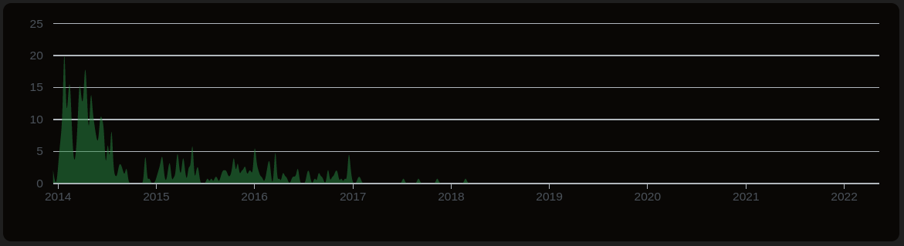

# 项目分析报告

组员：乔凡超（代码撰写、绘图）、顾建树（完成背景分析）、陈立翔（完成归档原因分析及技术支持）

## 一、项目基本背景和发展历程介绍 

项目地址：https://github.com/boltdb/bolt

### 1.1 项目简介 

BoltDB是一个纯用golang实现的支持事务的文件型单机KV数据库，参考 Howard Chu 的LMDB（Lightning Memory-Mapped Database）项目，是一个开源持久性库。 LMDB旨在为那些无需诸如Postgres、MySQL这些完整数据库服务器的项目提供一个简单、快速、可靠的数据库。


### 1.2 功能说明 

​	BoltDB提供最基本的存储功能，并不支持网络连接，不支持复杂的SQL查询。单个数据库数据存储在单个文件里，通过API的方式对数据文件读写，达到数据持久化的效果。适用于读多写少的场景。

​	在数据库的使用方面，Bolt将所有数据存储在一个文件中，使其很容易使用和部署，用户不需要配置数据库或要DBA去维护数据库，只需要打开它们，如果想要打开的文件不存在则会新建。

​	在数据存储方面，Bolt是一个K/V的存储，并提供一个映射表，使用者可以通过name拿到值，如同Go原生的map；此外，因为key是有序的，使用者可以通过key来遍历。另外，K-V存储在bucket中，bucket可以视为key的集合或者是数据库中的表。

​	在结构体的存储方面，可以通过Go的标准库实现，用户可以存储Json或是Gob编码后的结构化数据，也可以使用Protocal Buffer或是其他的序列化方法。

​	此外，BoltDB提供了一个名叫bolt的命令行工具，可以列出buckets和keys、检索value、一致性检验。

### 1.3 技术类型 


此项目主要使用 Go 为开发语言。

### 1.4 版本发布历史 

本项目于2015年10月28日发布第一个版本1.1.0，此后在16年更新了版本1.2.0、版本1.2.1、版本1.3.0，在2017年7月18日发布了最后一个版本1.3.1。

版本的主要更新内容如下：

​	v1.1.0 : 新增发行写事务的引用；新增关闭数据库前等待挂起事务的完成；新增只读数据库支持；把最小的mmap的大小改为32KB；修复32位的分配大小。

​	v1.2.0 ：新增Windows上的文件锁；新增IBM Power & Z 支持； 修复光标查询是跳过空页面的bug；文件大小的增加变得更加缓慢；修复`node.rebalance（）`的bug。

​	v1.2.1 ：修复部分元页面写的恢复功能；修复Windows中的锁文件清理；合理地设置了返回切片的大小。

​	v1.3.0 ：修复Go 1.7 SSA后端中的bug

​	v1.3.1：合并`nilslice/patch-1`中的拉取请求。将Ponzu加入使用Bolt的项目的列表中

### 1.5 主要贡献者的构成（国家、区域和组织等） 

项目主要由美国个人开发者Ben Johnson （id:benjohnson）完成。


此外共有99位开发人员对该项目进行了微调：

### 1.6 CI/CD 的使用 

​	CI/CD 是一种通过在应用开发阶段引入自动化来频繁向客户交付应用的方法。CI/CD 的核心概念是持续集成、持续交付和持续部署。作为一个面向开发和运营团队的解决方案，CI/CD 主要针对在集成新代码时所引发的问题。具体而言，CI/CD 可让持续自动化和持续监控贯穿于应用的整个生命周期（从集成和测试阶段，到交付和部署）。这些关联的事务通常被统称为"CI/CD 管道"，由开发和运维团队以敏捷方式协同支持。

​	本项目并未使用CI/CD。

## 二、项目的历史轨迹分析 

基于给出的镜像数据和 OpenDigger，完成项目 2015年/创建 - 归档 期间的以下数据分析任务： 

### 2.1 每月新增 Star 和 Frok 的个数


```
┌─────────┬───────────┬───────────┬───────────┐
│ (index) │ fork_date │ fork_data │ star_data │
├─────────┼───────────┼───────────┼───────────┤
│    0    │ '2015-1'  │   '20'    │   '216'   │
│    1    │ '2015-2'  │   '17'    │   '112'   │
│    2    │ '2015-3'  │   '16'    │   '133'   │
│    3    │ '2015-4'  │   '16'    │   '152'   │
│    4    │ '2015-5'  │   '15'    │   '119'   │
│    5    │ '2015-6'  │   '12'    │   '110'   │
│    6    │ '2015-7'  │   '10'    │   '125'   │
│    7    │ '2015-8'  │   '26'    │   '160'   │
│    8    │ '2015-9'  │   '21'    │   '147'   │
│    9    │ '2015-10' │   '25'    │   '150'   │
│   10    │ '2015-11' │   '17'    │   '128'   │
│   11    │ '2015-12' │   '16'    │   '161'   │
│   12    │ '2016-1'  │   '33'    │   '416'   │
│   13    │ '2016-2'  │   '21'    │   '159'   │
│   14    │ '2016-3'  │   '22'    │   '141'   │
│   15    │ '2016-4'  │   '18'    │   '202'   │
│   16    │ '2016-5'  │   '12'    │   '125'   │
│   17    │ '2016-6'  │   '14'    │   '171'   │
│   18    │ '2016-7'  │   '26'    │   '198'   │
│   19    │ '2016-8'  │   '15'    │   '208'   │
│   20    │ '2016-9'  │   '15'    │   '169'   │
│   21    │ '2016-10' │   '18'    │   '158'   │
│   22    │ '2016-11' │   '21'    │   '140'   │
│   23    │ '2016-12' │   '14'    │   '176'   │
│   24    │ '2017-1'  │   '26'    │   '232'   │
│   25    │ '2017-2'  │   '23'    │   '176'   │
│   26    │ '2017-3'  │   '20'    │   '200'   │
│   27    │ '2017-4'  │   '23'    │   '287'   │
│   28    │ '2017-5'  │   '19'    │   '198'   │
│   29    │ '2017-6'  │   '20'    │   '197'   │
│   30    │ '2017-7'  │   '17'    │   '204'   │
│   31    │ '2017-8'  │   '25'    │   '166'   │
│   32    │ '2017-9'  │   '20'    │   '265'   │
│   33    │ '2017-10' │   '20'    │   '169'   │
│   34    │ '2017-11' │   '30'    │   '244'   │
│   35    │ '2017-12' │   '17'    │   '175'   │
│   36    │ '2018-1'  │   '24'    │   '232'   │
│   37    │ '2018-2'  │   '16'    │   '248'   │
│   38    │ '2018-3'  │   '21'    │   '279'   │
│   39    │ '2018-4'  │   '29'    │   '209'   │
│   40    │ '2018-5'  │   '23'    │   '139'   │
│   41    │ '2018-6'  │   '16'    │   '146'   │
│   42    │ '2018-7'  │   '21'    │   '123'   │
│   43    │ '2018-8'  │   '27'    │   '124'   │
│   44    │ '2018-9'  │   '22'    │   '104'   │
│   45    │ '2018-10' │   '19'    │   '111'   │
│   46    │ '2018-11' │   '26'    │   '137'   │
│   47    │ '2018-12' │   '26'    │   '106'   │
│   48    │ '2019-1'  │   '25'    │   '114'   │
│   49    │ '2019-2'  │   '16'    │   '97'    │
│   50    │ '2019-3'  │   '16'    │   '137'   │
│   51    │ '2019-4'  │   '31'    │   '132'   │
│   52    │ '2019-5'  │   '19'    │   '109'   │
│   53    │ '2019-6'  │   '28'    │   '103'   │
│   54    │ '2019-7'  │   '10'    │   '118'   │
│   55    │ '2019-8'  │   '22'    │   '113'   │
│   56    │ '2019-9'  │   '19'    │   '101'   │
│   57    │ '2019-10' │   '16'    │   '92'    │
│   58    │ '2019-11' │   '13'    │   '106'   │
│   59    │ '2019-12' │   '13'    │   '93'    │
│   60    │ '2020-1'  │   '12'    │   '91'    │
│   61    │ '2020-2'  │   '14'    │   '74'    │
│   62    │ '2020-3'  │    '8'    │   '78'    │
│   63    │ '2020-4'  │   '15'    │   '117'   │
│   64    │ '2020-5'  │   '20'    │   '97'    │
│   65    │ '2020-6'  │   '20'    │   '90'    │
│   66    │ '2020-7'  │   '15'    │   '103'   │
│   67    │ '2020-8'  │   '20'    │   '118'   │
│   68    │ '2020-9'  │   '14'    │   '106'   │
│   69    │ '2020-10' │   '16'    │   '81'    │
│   70    │ '2020-11' │   '12'    │   '79'    │
│   71    │ '2020-12' │   '26'    │   '115'   │
│   72    │ '2021-1'  │   '23'    │   '147'   │
│   73    │ '2021-2'  │   '11'    │   '136'   │
│   74    │ '2021-3'  │   '17'    │   '103'   │
│   75    │ '2021-4'  │   '27'    │   '125'   │
│   76    │ '2021-5'  │   '22'    │   '94'    │
│   77    │ '2021-6'  │   '15'    │   '101'   │
│   78    │ '2021-7'  │   '24'    │   '126'   │
│   79    │ '2021-8'  │   '11'    │   '101'   │
│   80    │ '2021-9'  │   '19'    │   '107'   │
│   81    │ '2021-10' │    '8'    │   '44'    │
│   82    │ '2021-11' │   '18'    │   '124'   │
│   83    │ '2021-12' │   '25'    │   '94'    │
└─────────┴───────────┴───────────┴───────────┘
```

​	从图和数据中可以看出，在项目发布到归档之前，每月新增star数较多，在2016年达到峰值。而fork数则一直并不显著。可以看出，该项目热度有所减退，但依旧很多人对该项目感兴趣。

### 2.2 每月打开 Issue 和 关闭 Issue 的个数


```
┌─────────┬────────────┬──────┬───────────┐
│ (index) │ issue_date │ open │   close   │
├─────────┼────────────┼──────┼───────────┤
│    0    │  '2015-1'  │ '10' │   '10'    │
│    1    │  '2015-2'  │ '15' │   '11'    │
│    2    │  '2015-3'  │ '15' │    '8'    │
│    3    │  '2015-4'  │ '10' │    '7'    │
│    4    │  '2015-5'  │ '10' │    '6'    │
│    5    │  '2015-6'  │ '7'  │    '5'    │
│    6    │  '2015-7'  │ '5'  │    '1'    │
│    7    │  '2015-8'  │ '3'  │    '6'    │
│    8    │  '2015-9'  │ '10' │    '5'    │
│    9    │ '2015-10'  │ '7'  │    '9'    │
│   10    │ '2015-11'  │ '4'  │    '3'    │
│   11    │ '2015-12'  │ '5'  │    '4'    │
│   12    │  '2016-1'  │ '12' │    '8'    │
│   13    │  '2016-2'  │ '15' │    '8'    │
│   14    │  '2016-3'  │ '8'  │    '8'    │
│   15    │  '2016-4'  │ '3'  │    '6'    │
│   16    │  '2016-5'  │ '5'  │    '4'    │
│   17    │  '2016-6'  │ '3'  │    '2'    │
│   18    │  '2016-7'  │ '4'  │    '3'    │
│   19    │  '2016-8'  │ '7'  │    '4'    │
│   20    │  '2016-9'  │ '2'  │    '4'    │
│   21    │ '2016-10'  │ '8'  │   '13'    │
│   22    │ '2016-11'  │ '5'  │    '2'    │
│   23    │ '2016-12'  │ '10' │    '9'    │
│   24    │  '2017-1'  │ '9'  │    '3'    │
│   25    │  '2017-2'  │ '6'  │    '3'    │
│   26    │  '2017-3'  │ '8'  │    '2'    │
│   27    │  '2017-4'  │ '4'  │    '5'    │
│   28    │  '2017-5'  │ '8'  │    '1'    │
│   29    │  '2017-6'  │ '4'  │    '4'    │
│   30    │  '2017-7'  │ '6'  │    '3'    │
│   31    │  '2017-8'  │ '4'  │    '2'    │
│   32    │  '2017-9'  │ '4'  │    '2'    │
│   33    │ '2017-10'  │ '2'  │    '2'    │
│   34    │ '2017-12'  │ '1'  │ undefined │
│   35    │  '2018-1'  │ '3'  │ undefined │
│   36    │  '2018-2'  │ '4'  │ undefined │
│   37    │  '2018-3'  │ '2'  │ undefined │
│   38    │  '2018-4'  │ '2'  │ undefined │
└─────────┴────────────┴──────┴───────────┘
```

​	从issue的记录可以看出，该项目使用人数一直不少，且使用者对该项目产生的疑问和建议创始人都有及时的给予回答。当该项目归档之后，创始人便不再及时回答issue了。

### 2.3 每月打开 PR 和合入 PR 的个数


```
┌─────────┬───────────┬─────────┐
│ (index) │  pr_date  │ pr_open │
├─────────┼───────────┼─────────┤
│    0    │ '2015-1'  │  '10'   │
│    1    │ '2015-2'  │   '9'   │
│    2    │ '2015-3'  │  '10'   │
│    3    │ '2015-4'  │   '5'   │
│    4    │ '2015-5'  │  '13'   │
│    5    │ '2015-6'  │   '6'   │
│    6    │ '2015-7'  │   '3'   │
│    7    │ '2015-8'  │   '6'   │
│    8    │ '2015-9'  │   '9'   │
│    9    │ '2015-10' │  '12'   │
│   10    │ '2015-11' │   '7'   │
│   11    │ '2015-12' │   '9'   │
│   12    │ '2016-1'  │  '16'   │
│   13    │ '2016-2'  │   '9'   │
│   14    │ '2016-3'  │  '12'   │
│   15    │ '2016-4'  │   '5'   │
│   16    │ '2016-5'  │   '4'   │
│   17    │ '2016-6'  │   '4'   │
│   18    │ '2016-7'  │   '4'   │
│   19    │ '2016-8'  │   '2'   │
│   20    │ '2016-9'  │   '8'   │
│   21    │ '2016-10' │   '8'   │
│   22    │ '2016-11' │   '6'   │
│   23    │ '2016-12' │   '6'   │
│   24    │ '2017-1'  │   '3'   │
│   25    │ '2017-2'  │   '3'   │
│   26    │ '2017-3'  │   '1'   │
│   27    │ '2017-4'  │   '2'   │
│   28    │ '2017-5'  │   '5'   │
│   29    │ '2017-6'  │   '6'   │
│   30    │ '2017-7'  │   '4'   │
│   31    │ '2017-8'  │   '9'   │
│   32    │ '2017-9'  │   '2'   │
│   33    │ '2017-10' │   '1'   │
│   34    │ '2017-11' │   '3'   │
│   35    │ '2018-1'  │   '1'   │
│   36    │ '2018-2'  │   '1'   │
│   37    │ '2018-3'  │   '1'   │
└─────────┴───────────┴─────────┘
```

​	截止项目归档之前，创始人对该项目投入的精力都不少，每个月都会有新的PR，可见创始人对该项目较为上心。

### 2.4 每月在仓库中活跃的不同开发者总数


​	

```
┌─────────┬────────────┬───────────┐
│ (index) │ actor_date │ actor_num │
├─────────┼────────────┼───────────┤
│    0    │  '2015-1'  │   '247'   │
│    1    │  '2015-2'  │   '140'   │
│    2    │  '2015-3'  │   '167'   │
│    3    │  '2015-4'  │   '173'   │
│    4    │  '2015-5'  │   '143'   │
│    5    │  '2015-6'  │   '131'   │
│    6    │  '2015-7'  │   '145'   │
│    7    │  '2015-8'  │   '192'   │
│    8    │  '2015-9'  │   '179'   │
│    9    │ '2015-10'  │   '191'   │
│   10    │ '2015-11'  │   '151'   │
│   11    │ '2015-12'  │   '184'   │
│   12    │  '2016-1'  │   '443'   │
│   13    │  '2016-2'  │   '191'   │
│   14    │  '2016-3'  │   '174'   │
│   15    │  '2016-4'  │   '225'   │
│   16    │  '2016-5'  │   '146'   │
│   17    │  '2016-6'  │   '187'   │
│   18    │  '2016-7'  │   '230'   │
│   19    │  '2016-8'  │   '231'   │
│   20    │  '2016-9'  │   '185'   │
│   21    │ '2016-10'  │   '186'   │
│   22    │ '2016-11'  │   '165'   │
│   23    │ '2016-12'  │   '201'   │
│   24    │  '2017-1'  │   '265'   │
│   25    │  '2017-2'  │   '210'   │
│   26    │  '2017-3'  │   '229'   │
│   27    │  '2017-4'  │   '311'   │
│   28    │  '2017-5'  │   '237'   │
│   29    │  '2017-6'  │   '222'   │
│   30    │  '2017-7'  │   '232'   │
│   31    │  '2017-8'  │   '202'   │
│   32    │  '2017-9'  │   '283'   │
│   33    │ '2017-10'  │   '191'   │
│   34    │ '2017-11'  │   '261'   │
│   35    │ '2017-12'  │   '189'   │
│   36    │  '2018-1'  │   '259'   │
│   37    │  '2018-2'  │   '266'   │
│   38    │  '2018-3'  │   '302'   │
│   39    │  '2018-4'  │   '239'   │
│   40    │  '2018-5'  │   '151'   │
│   41    │  '2018-6'  │   '159'   │
│   42    │  '2018-7'  │   '138'   │
│   43    │  '2018-8'  │   '141'   │
│   44    │  '2018-9'  │   '118'   │
│   45    │ '2018-10'  │   '122'   │
│   46    │ '2018-11'  │   '158'   │
│   47    │ '2018-12'  │   '126'   │
│   48    │  '2019-1'  │   '133'   │
│   49    │  '2019-2'  │   '108'   │
│   50    │  '2019-3'  │   '148'   │
│   51    │  '2019-4'  │   '157'   │
│   52    │  '2019-5'  │   '124'   │
│   53    │  '2019-6'  │   '129'   │
│   54    │  '2019-7'  │   '124'   │
│   55    │  '2019-8'  │   '132'   │
│   56    │  '2019-9'  │   '117'   │
│   57    │ '2019-10'  │   '98'    │
│   58    │ '2019-11'  │   '113'   │
│   59    │ '2019-12'  │   '100'   │
│   60    │  '2020-1'  │   '99'    │
│   61    │  '2020-2'  │   '84'    │
│   62    │  '2020-3'  │   '86'    │
│   63    │  '2020-4'  │   '124'   │
│   64    │  '2020-5'  │   '114'   │
│   65    │  '2020-6'  │   '102'   │
│   66    │  '2020-7'  │   '116'   │
│   67    │  '2020-8'  │   '129'   │
│   68    │  '2020-9'  │   '113'   │
│   69    │ '2020-10'  │   '91'    │
│   70    │ '2020-11'  │   '89'    │
│   71    │ '2020-12'  │   '132'   │
│   72    │  '2021-1'  │   '161'   │
│   73    │  '2021-2'  │   '144'   │
│   74    │  '2021-3'  │   '113'   │
│   75    │  '2021-4'  │   '143'   │
│   76    │  '2021-5'  │   '106'   │
│   77    │  '2021-6'  │   '112'   │
│   78    │  '2021-7'  │   '144'   │
│   79    │  '2021-8'  │   '107'   │
│   80    │  '2021-9'  │   '121'   │
│   81    │ '2021-10'  │   '51'    │
│   82    │ '2021-11'  │   '135'   │
│   83    │ '2021-12'  │   '109'   │
└─────────┴────────────┴───────────┘
```

​	项目归档前关注度较高，在2016年达到顶峰，但由于作者在2018年将项目归档并停止访问，因而近期关注度下降且区域平稳。

### 2.5 Issue 从打开到关闭的平均时长和中位数

- Issues 从打开到关闭的平均时长： 38.80 天
- Issues 从打开到关闭的时长中位数： 1.33 天

   从Issue从打开到关闭的平均时长和中位数可以看出，创始人对该项目很是用心，出现问题都及时维护和解答。

### 2.6 PR 从打开到合入的平均时长和中位数

- PR 从打开到合入的平均时长：6.45天 
- PR 从打开到合入的时长中位数0.57天

  从PR从打开到合入的平均时长和中位数可以看出，创始人对该项目的维护较为及时。

### 2.7 Issue和PR从打开到第一次有人回复的平均时长和中位数 

- Issue 从打开到第一次有人回复的平均时长： 40.53 天 
- Issue 从打开到第一次有人回复的时长中位数： 1.62 天
- PR 从打开到第一次有人回复的平均时长： 123.52 天 
- PR 从打开到第一次有人回复的时长中位数： 3.31 天

   Issue和PR从打开到第一次有人回复的平均时长较长，但中位数较短，可以看出作者在早期对该项目较为上心，后面随着该项目归档回复也更不那么及时了

### 2.8 根据观察到的仓库历史数据，找到认为关键或值得注意的时间节点

1. 2014年上半年，相较其它时间创始人对该项目投入了更多的经历这点可以从contribution图中看出，可见在这段时间是该项目主要工作完成的时间点。

## 三、洞察项目被归档的可能原因 

### 3.1 总结项目可能的归档原因


### 3.2 分析项目归档后可能产生的影响


### 3.3 对开源项目如何可持续发展的理解

