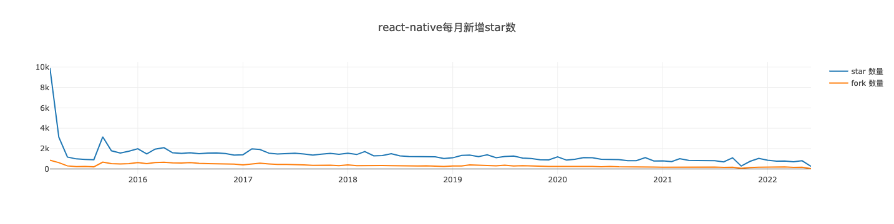
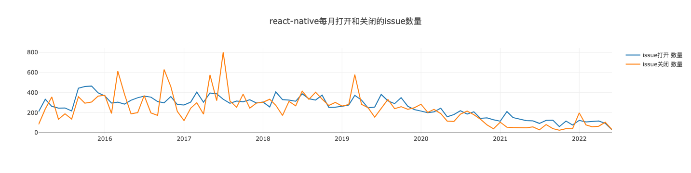
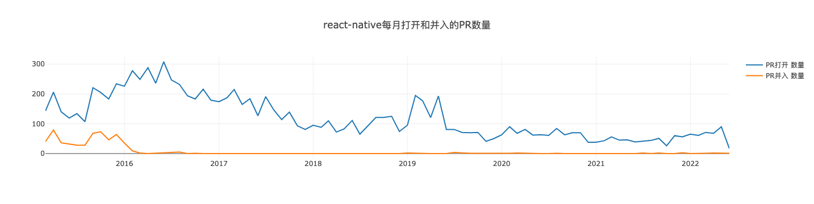
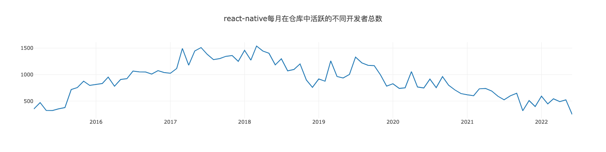

# 开源课程期末作业
## 基本信息
小组成员：秦长久51215903107，吴贤佑51215903108，刘添然51215903077

组内分工：

&emsp;&emsp;秦长久：数据挖掘与可视化

&emsp;&emsp;吴贤佑：信息汇总报告撰写

&emsp;&emsp;刘添然：项目基本信息收集

项目序号: 39

项目id: 29028775

项目名: facebook/react-native
## 一、项目的基本背景和发展历程介绍
* **技术类型**

    &emsp;&emsp;React Native(简称RN)是Facebook于2015年4月开源的跨平台移动应用开发框架，是Facebook早先开源的JS框架 React 在原生移动应用平台的衍生产物，目前支持iOS和安卓两大平台。RN使用Javascript语言，类似于HTML的JSX，以及CSS来开发移动应用，因此熟悉Web前端开发的技术人员只需很少的学习就可以进入移动应用开发领域。

    &emsp;&emsp;React Native使开发者能够在Javascript和React的基础上获得完全一致的开发体验，构建世界一流的原生APP，并着力于提高多平台开发的开发效率 —— 仅需学习一次，编写任何平台。(Learn once, write anywhere)。Facebook已经在多项产品中使用了React Native，并且将持续地投入建设React Native。
* **版本发布历史**

    &emsp;&emsp;共200次发布，其中a2（Alexsander Akers）在2015.03.27贡献了第一个版本（v0.1.0: Initial public release）。目前的最新稳定版本（v0.68.2）是由fortmarek（Marek Fořt）在2022.05.09贡献的。而cortinico（Nicola Corti）则在2022.06.01贡献了v0.69.0-rc.6。值得一提的是到目前为止该项目都没有跨越v0。

    2015.03.27首次上线v0.1.0，来自a2：
    1. 从FAQ中删除无关的问题。

    2018.05.15由vjeux发布最早的带说明版本v0.4.3：
    1. 新功能：
    Websocket polyfill；
    AlertIOS.prompt ()；
    letterSpacing <Text>样式属性；
    borderTopLeftRadius borderTopRightRadius…<View>样式属性；
    2. 主要变化：
    ref. gettnativehandle()和ref.getNodeHandle()将不复存在。取而代之的是React.findNodeHandle(ref)；
    如果之前正在使用没有文档的createReactIOSNativeComponentClass或ReactIOSViewAttributes来创建iOS包装器，现在应该使用requireNativeComponent；
    3. 升级：将flow升级至0.11，jest升级至0.4.2；
    4. Bug修复：
    修复了内部有空间的文件夹的软件包；
    修复RCTImageLoader的线程安全问题；
    正确支持<ScrollView>上的overflow: 'visible'；
    如果组件已卸载，就不能再调用度量回调；
    不再需要ruby依赖；
    UIExplorer图标可显示在主屏幕上；
    更改左侧图标现在可以在<NavigatorIOS>上工作；
    修复<Navigator>的边界情况。

    2022.05.09最新稳定版本v0.68.2，来自fortmarek：
    1. 变更：将react-native-codegen的版本升级为0.0.17 (by @cortinico)；
    2. 修复：在Android平台上解决Windows上的长路径限制(by @mganandraj)。

    2022.05.11-2022.06.01由fortmarek和cortinico陆续发布开发版本v0.69.0-rc1至rc6。

    2022.06.23 v0.69.0稳定版正式发布。

* **主要贡献者的构成（国家、区域和组织等）**

    &emsp;&emsp;贡献者一共有2302位。

    &emsp;&emsp;shergin（Valentin Shergin），来自Austin, TX，就职于Coinbase；

    &emsp;&emsp;JoshuaGross（Joshua Gross），来自Bay Area, CA，就职于Facebook；

    &emsp;&emsp;RSNara（Ramanpreet Nara），就职于Facebook；

    &emsp;&emsp;hramos（Héctor Ramos），来自Scottsdale, AZ，就职于Facebook；

    &emsp;&emsp;rickhanlonii（Ricky），来自EST. AKRON，就职于Facebook；

    &emsp;&emsp;cortinico（Nicola Corti），来自London, UK；

    &emsp;&emsp;fortmarek（Marek Fořt），来自Berlin, Germany，就职于Shopify。

* **CI/CD的使用**

    &emsp;&emsp;目前包含6条工作流程，共运行52505次且还在不断增加。

    &emsp;&emsp;应用于issue的版本标记：1252次；

    &emsp;&emsp;问题注意：34968次；

    &emsp;&emsp;标识旧issue和PR：240次；

    &emsp;&emsp;issue标记：6496次；

    &emsp;&emsp;PR的危险运行：193次；

    &emsp;&emsp;测试安卓容器镜像：2331次。
* **其他有价值的信息**

    **主要特性**
    * **原生的 iOS 组件**

    &emsp;&emsp;有了 ReactNative，你可使用标准平台组件，比如 iOS 平台上的 UITabBar 和 UINavigationController。这可以让你的应用程序拥有和原生平台一致的外观和体验，并保持较高的品质。使用相应的 React 组件，如 iOS 标签栏和 iOS 导航器，这些组件可以轻松并入你的应用程序中。

    * **异步执行**

    &emsp;&emsp;JavaScript 应用代码和原生平台之间所有的操作都是异步执行，并且原生模块也可以使用额外线程。这意味着开发者可以解码主线程图像，并将其在后台保存至磁盘，在不阻塞 UI 的情况下进行文本和布局的估量计算，等等。因此，React Native 应用程序的流畅度和响应性都非常好。通信也是完全可序列化的，当运行完整的应用程序时，这允许我开发者使用 Chrome Developer Tools 来调试 JavaScript，或者在模拟器中，或者在真机上。

    * **触摸处理**

    &emsp;&emsp;iOS 有一个非常强大的系统称为 Responder Chain，可以用来响应复杂视图层级中的事件，但是在 Web 中并没有类似功能的工具。React Native 可实现类似的响应系统并提供高水平的组件，比如 TouchableHighlight，无需额外配置即可与滚动视图和其他元素适度整合。

    * **弹性框和样式**

    &emsp;&emsp;布局视图应该是简单的，所以 Web 平台上的弹性框模块也被引入了 React Native。弹性框可用来搭建最常用的 UI 布局，比如代用边缘和填充的堆叠和嵌入。React Native 还支持常见的 Web 样式，比如 fontWeight 和 StyleSheet 抽象，它们提供了一种优化机制来宣称你所有的样式和布局在组件中的应用是正确的，且组件把它们应用到了内网中。

    * **Polyfills**

    &emsp;&emsp;React Native 的重点是改变视图代码编写的方式。可以使用 npm 安装 JavaScript 库，这些库用于融入到 React Native 中的顶级功能，比如 XMLHttpRequest，window.requestAnimationFrame 及 navigator.geolocation。团队正在扩大可用的 API，并致力于为开源社区做出贡献。

    * **可扩展性**

    &emsp;&emsp;使用 React Native 无需编写一行原生代码即可创建出一款不错的应用程序，并且 React Native 可通过自定义原生视图和模块来进行扩展--也就是说你可以重用你已经构建的任何内容，并且可导入和使用你最喜欢的原生库。为了在 iOS 中创建一个简单的模块，需要创建一个新的类来实现 RCTBridgeModule 协议，并将你想要在 RCT_EXPORT_METHOD 中对 JavaScript 可用的功能包装起来。另外，类本身必须可以用 RCT_EXPORT_MODULE() 显式导出；自定义的 iOS 视图可以通过子类化 RCTViewManager，实现 -(UIView *)view 方法并用 RCT_EXPORT_VIEW_PROPERTY 宏导出属性的办法来公开。然后一个简单的 JavaScript 文件会连接这些点。

## 二、项目的历史轨迹分析
1. 每月新增 Star 和 Frok 的个数

    

2. 每月打开 Issue 和关闭 Issue 的个数

    

3. 每月打开 PR 和合入 PR 的个数

    

4. 每月在仓库中活跃的不同开发者总数

    

5. Issue 从打开到关闭的平均时长和中位数（单位：天）

    &emsp;&emsp;issue从打开到关闭的平均时长:  66.329 (天)

    &emsp;&emsp;issue从打开到关闭时长中位数:  7.075 (天)

6. PR 从打开到合入的平均时长和中位数（单位：天）

    &emsp;&emsp;PR从打开到关闭的平均时长:  2.613 (天)

    &emsp;&emsp;PR从打开到关闭时长中位数:  0.085 (天)

7. Issue和PR从打开到第一次有人回复（非本人回复）的平均时长和中位数（单位：天）

    &emsp;&emsp;Issue和PR从打开到第一次有人回复（非本人回复）的平均时长:  11.646 （天）

    &emsp;&emsp;Issue和PR从打开到第一次有人回复（非本人回复）的中位数:  0.035（天）

## 三、对比分析活跃/归档项目
### 3.1 项目数据对比分析
* **项目基础数据（2.1/2.2/2.3）的变化趋势**

    &emsp;&emsp;从每月新增star数量来看，react-native和vlayout的数据均呈现在项目初期达到峰值随后快速下降至某一区间再缓慢下降的趋势。react-native的峰值为10k，稳定区间位于2k左右，至今仍有1k左右的每月新增star。vlayout的峰值为3k，稳定区间位于150附近，随着项目归档目前每月仅有约15新增star。

    &emsp;&emsp;每月新增fork数据的趋势与star接近。react-native无明显峰值，呈现出一种平稳的下降，从最初约1k至如今约50。vlayout峰值约400，在50附近进入平稳下降，如今每月fork数据在5左右。

    &emsp;&emsp;在每月打开和关闭的issue数量上，两个项目呈现完全不同的趋势。忽略波动仅趋势而言，RN两条曲线吻合程度很高，呈较扁的拱形，左起200，最高点约400，右点约100。vlayout两条曲线则呈现不同态势，打开issue数量曲线波动下降，从34降至1，关闭issue数量曲线则前期在较高位（20）震荡，后突降并维持在1附近。

    &emsp;&emsp;关于每月打开和合入PR的数量，RN两条曲线表现出一定的差异性，vlayout则仅有个位数的数据不足以支持趋势分析。RN每月打开PR数量曲线有两轮波动上涨和下降，第一轮起于150左右至波峰约300再落至100，第二轮从100上涨至200再回落至80附近并保持相对平稳。RN每月关闭PR数量曲线也呈现两个阶段，第一阶段位于高位，在70周围震荡，第二阶段迅速衰减至个位数并保持稳定。

    &emsp;&emsp;综合上述数据的对比，可见react-native的的火热程度远高于vlayout，前者在近几年保持了较好的生命力，而后者则如昙花一现很快步入衰退。我们对比的对象react-native为活跃项目，vlayout为归档项目，数据也佐证了这一分类，活跃项目记录到的各类行为数据均远超归档项目，这一现象不仅反映在现在，而是贯穿整个项目的生命周期。

* **开发者数量（2.4）变化趋势**
   
    &emsp;&emsp;react-native的开发者数量总体变化曲线呈拱形，先上升后下降，至今二者跨度所占比例约为2：3。开发者数量最初在500人左右，而后逐步增长到约1500人，转而开始流失，期间有三个下降幅度较大的时间段，如今开发者数量同最初相近约为500人。

    &emsp;&emsp;vlayout的开发者数量处于一种持续减少的状况，从开始的40人左右，波动下降至如今仅剩个位数的开发者，过程中伴随有小幅回升。

    &emsp;&emsp;二者的开发者数目不处于同一量级，RN不仅具有开发者多的优势，同时表现出从外部吸引开发者的优势，两点优势促成了项目的持续活跃。反观vlayout则是在基数少的情况下团队逐渐缩小，由此走向归档也是情理之中。

* **其他你感兴趣的对比方向**

   * **Issue和PR响应时间**

   &emsp;&emsp;从数据中可以看到react-native项目的Issue和PR响应速度较快，Issue持续时间较久PR持续时间较短，vlayout的响应速度同样很快，Issue的持续时间较短，PR的持续时间非常短。对于时长平均数和中位数，我们认为中位数更能反应出一个项目的真实状况。响应速度可以看出一个项目的活跃性，更快的响应说明项目参与者的积极性更高。Issue和PR的持续时间反应出的信息可以从多方面解读，Issue持续时间短可能社区很活跃问题被很快的解决了，也可能是Issue数量较少使得每个Issue被更加认真地对待，PR持续时间短可能是审核人员工作高效，也可能是内部人员直接合入。

   * **资料丰富程度**
   
   &emsp;&emsp;react-native具有非常丰富的网络资源，它有独立的网站，网站中涵盖了文档、组件、API、架构、实战课等多方面的资料，能够帮助用户快速上手，降低学习成本。vlayout则没有构建全面系统的资料，仅提供了说明文档，网络上有项目负责人或者其他用户撰写的相关文章，其中不乏全面且优质的内容，但缺点是较为分散不成系统。

   * **应用范围**

   &emsp;&emsp;RN针对移动应用开发领域，使用户能够在Javascript和React的基础上获得完全一致的开发体验，构建世界一流的原生APP，熟悉Web前端开发的技术人员只需很少的学习就可以进入移动应用开发领域。vlayout是一个针对RecyclerView的LayoutManager扩展, 主要提供一整套布局方案和布局间的组件复用的问题，比较适用于电商领域。虽然二者都适用于多平台开发，但相比之下前者的应用范围要广于后者，页面布局只是移动开发的一部分内容。

   * **核心组织**

   &emsp;&emsp;react-native是Facebook公司支撑的项目，vlayout是Alibaba旗下的项目。两个公司都是当今世界的互联网巨头，如今二者相比facebook在市值上略高一些。Facebook扎根美国，业务范围覆盖全球，Alibaba则是立足中国，目前业务重心更多在国内，但同时海外业务也在蓬勃发展。综合来看，两家公司属于同一水准。

### 3.2 项目发展到活跃/归档的主要影响因素及原因
* **业务需求**

    &emsp;&emsp;前文提到react-native和vlayout二者在适用范围上有所差异，作为活跃项目的RN具有更加广泛的应用场景，移动开发领域具有经久不衰的业务需求。如今智能手机早已成为人们的生活必需品，由此对手机应用的需求也是源源不断的，RN可以帮助相关人员更加便捷地进行开发，迎合了时代的潮流。

    &emsp;&emsp;vlayout擅长的领域则是实现类似手机淘宝的页面布局，在电子商务兴起阶段此类需求较为旺盛，而随着市场被几大巨头占领完毕该领域便不再具有很强的发展空间。因此vlayout表现的如同昙花一现。

* **开发者数量和积极性**

    &emsp;&emsp;开源项目想要可持续发展，需要有一定的合作开发者数量。react-native具有庞大的开发者队伍，这便使得项目有充足的人力去将项目自身和配套资源做得更好，形成良性的循环。一个优质的项目可以帮助用户完成他们的需求，并吸引其中一部分人自发成为开发者对项目进行贡献，造就一个活跃的社区，形成更好的氛围并不断扩大影响力巩固自身的地位。

    &emsp;&emsp;vlayout只有两位主要开发者，当主要开发者离职或者因为某些原因停止对项目进行贡献时，容易出现后继无人的现象。如果项目不能从外部吸引到开发者，那么原有团队及背后的组织也会逐渐失去动力，使得项目最终走向衰落。

* **竞争对手**

    &emsp;&emsp;react-native目前主要的竞争对手是来自谷歌的Flutter，二者作为目前人气最高的多平台移动应用框架可谓难分伯仲，网络上不乏讨论二者孰优孰劣的文章。两个产品的背后都是全世界前列的大公司，如此两款产品进行竞争通常会达到一种相互促进的效果。市场大头被两家占据自然也会获得更多的关注和讨论，反作用于项目持续保持项目的活力。

    &emsp;&emsp;vlayout作为RecyclerView的LayoutManager则面临更加复杂的竞争局面，市场上还有诸如FanLayoutManager，CarouselLayoutManager，HiveLayoutManager等等多款类似产品。这种环境下用户具有充分的选择空间按照自己的喜好和工具的性能来选择，如果不能在一众产品中脱颖而出则可能走向衰亡。