#### 一、项目的基本背景和发展历程介绍

通过项目仓库的查阅，以及搜索引擎上项目的相关资料，给出项目一些基本的介绍：

- 技术类型

  tgstation是一款基于BYOND开发的二维多人角色扮演游戏。

  截至目前该项目在GitHub上，Star数量有1.3k，Fork数量有3.8k。

  tgstation主要是基于DreamMaker实现的，在Github仓库中DreamMaker的代码占比达到89.8%。

- 版本发布历史

  目前在Github上开源的tgstation总commit数为92270次，共计发布了14个版本，其中：

      v1.0.0的发布时间是2014年2月9日
      v1.0.1的发布时间是2014年2月16日
      v1.1.0的发布时间是2014年8月13日
      tgui-1.0的发布时间是2020年4月17日
      tgui-2.0-next-1的发布时间是2020年4月17日
      tgui-2.0-next-2的发布时间是2020年4月17日
      tgui-2.0的发布时间是2020年4月17日
      tgui-3.0的发布时间是2020年4月20日
      tgui-4.0的发布时间是2020年7月17日
      tgui-4.1的发布时间是2020年7月23日
      tgui-4.2的发布时间是2020年8月14日
      runtime-condenser-1.13的发布时间是2020年12月16日
      tgui-4.3-hotfix-1的发布时间是2021年1月17日
      tgui-4.3的发布时间是2021年1月17日

* 主要贡献者的构成：tgstation项目共有1082名贡献者，项目的前三名贡献者为tgstation-server、ChangelingRain、Cyberboss

  * tgstation-server：存储库中只有tgstation一个项目，猜测是多人共享的账号，专用于该项目，一共提交了17749次，最新一次提交是2022年6月27日。
  * ChangelingRain（Joan Lung）：提交了1847次，位于北佛罗里达州，最新一次提交是2018 年 2 月 20 日。
  * Cyberboss：提交了1616次，Jordan和其丈夫Atlas共享该账号，最新一次提交是2022 年 3 月 29 日。

* CI/CD 的使用

  ​	   CI/CD 是一种通过在应用开发阶段引入自动化来频繁向客户交付应用的方法。CI/CD 的核心概念是持续集成、持续交付和持续部署。具体而言，CI/CD 可让持续自动化和持续监控贯穿于应用的整个生命周期（从集成和测试阶段，到交付和部署）。这些关联的事务通常被统称为"CI/CD 管道"，由开发和运维团队以敏捷方式协同支持。

  ​        tgstation项目使用的是 GitHub Actions。GitHub Actions 是由 GitHub 创建的 CI/CD，是一个持续集成和持续交付的平台，它可以帮助贡献通过自动化的构建（包括编译、发布、自动化测试）来验证代码，从而尽快地发现集成错误。

  ​         可以在根目录路径下的.github/workflows目录中查看相关的配置文件。

  

* 其他有价值的信息

  - Website: [https://www.tgstation13.org](https://www.tgstation13.org/)
  - Code: https://github.com/tgstation/tgstation
  - Wiki: https://tgstation13.org/wiki/Main_Page
  - Codedocs: https://codedocs.tgstation13.org/
  - /tg/station Discord: https://tgstation13.org/phpBB/viewforum.php?f=60
  - Coderbus Discord: https://discord.gg/Vh8TJp9

#### 三、结合期中分析的归档项目，对比分析活跃/归档项目

完成以下方向的项目数据对比分析

- 项目基础数据（2.1/2.2/2.3）的变化趋势

  - 每月新增 Star 和 Fork 的个数

    SimianArmy：

    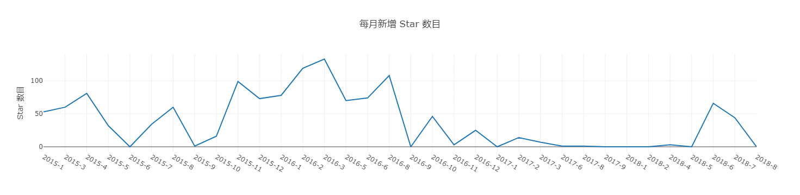

    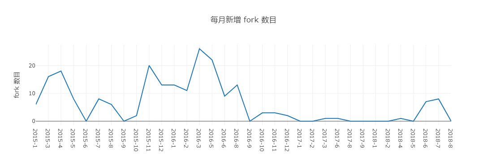

    tgstation：

    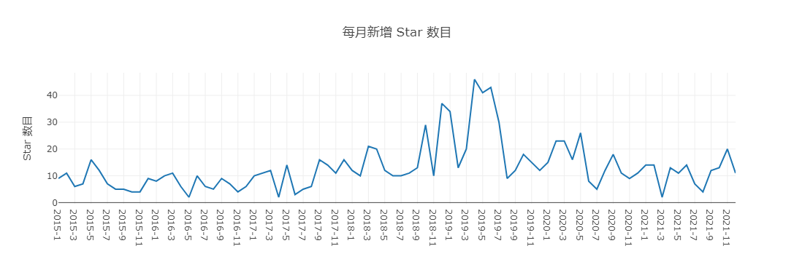

    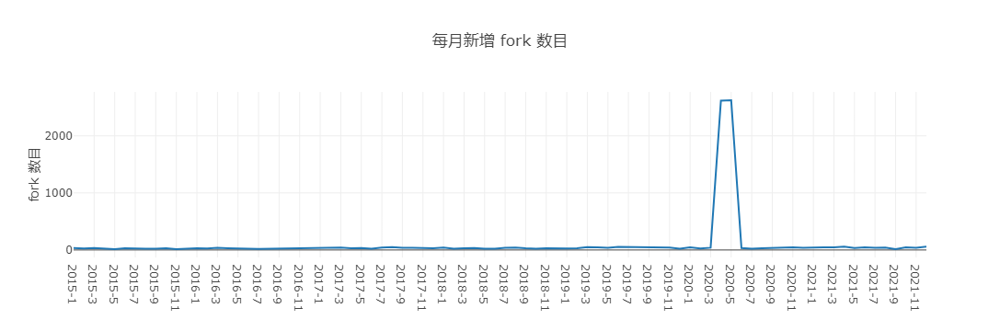

    可以看到，SimianArmy在项目前中期新增 Star 和 Fork 个数还是较多的，但从2016年底开始项目就不再活跃， Star 和 Fork 个数接近为0，最终在2018年项目关闭。

    而tgstation的 Star 和 Fork 个数一直保持在一个较为活跃的水平，其中fork数一直保持在50左右，甚至在2020年4-5月达到2600+的数量。

  - 每月打开 Issue 和 关闭 Issue 的个数

    SimianArmy：

    

    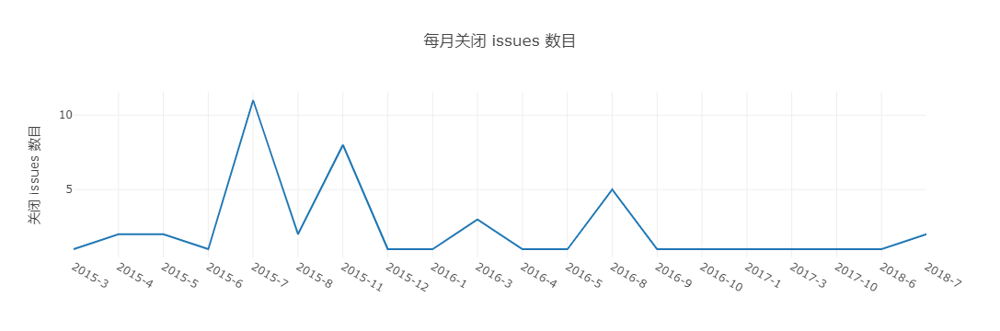

    tgstation：

    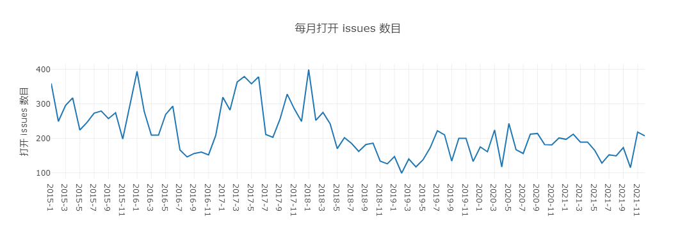

    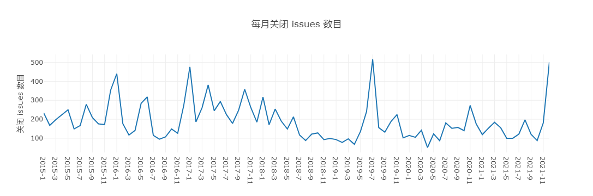

    可以看到，SimianArmy的issue数量很少，一直在5个以下，并且自2016年开始，虽然仍有新增issue，却很少对其进行修正，关闭issue数量一直很低，甚至2016年9月开始关闭issue数量基本保持在0。

    而tgstation的 issue个数一直保持在一个较为活跃的水平，达到几百的数量级。

  - 每月打开 PR 和合入 PR 的个数（注意，关闭 PR 不等于合入）

    SimianArmy：

    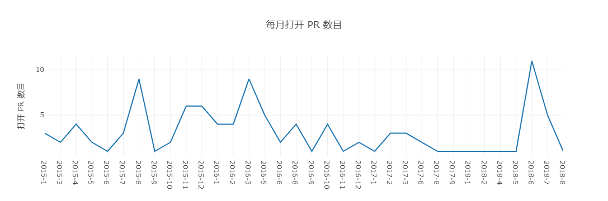

    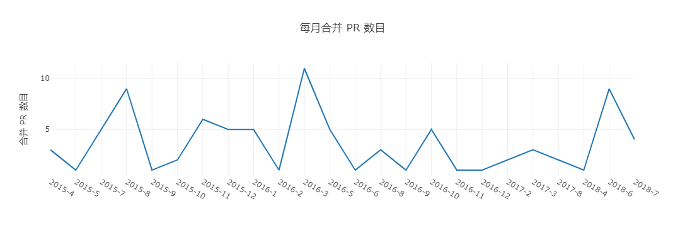

    tgstation：

    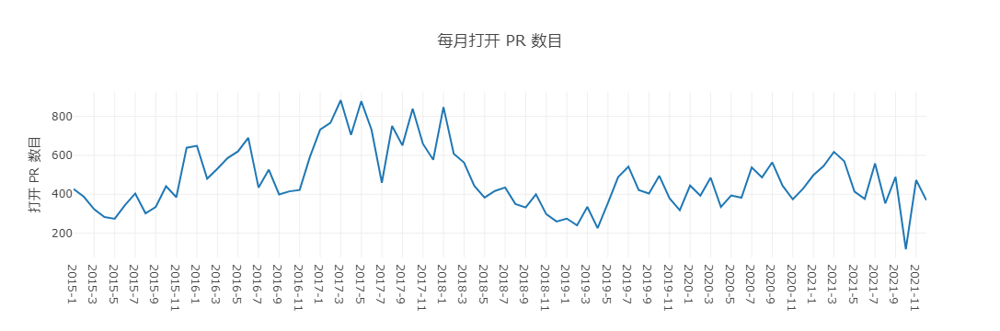

    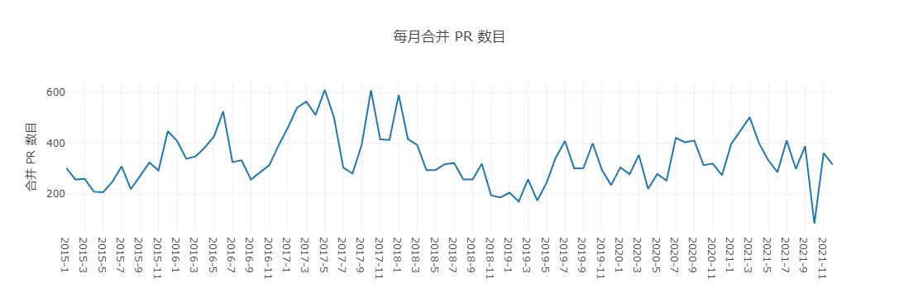

    可以看到，SimianArmy的新增PR数量很少，基本在5个左右，只有一次到达11，并且自2017年8月开始基本维持在1个的低水平，只在2018年6、7月短暂出现峰值；合并PR也一直维持在10个以下的低值。

    而tgstation的PR个数一直保持在一个400左右的较为活跃的水平，达到几百的数量级，打开和合并PR都很活跃。

- 开发者数量（2.4）变化趋势

  归档项目（Simian Army）：从2015年到2017年，每月活跃的开发者数目在100-250。从2018年下半年开始，每月活跃的开发者数目大幅度减少（从100减少至0）。

  活跃项目（tgstation）：从2015年开始，每月活跃的开发者数目波动上升。并且从2019年到2021年年底，每月库活跃开发者数量大致稳定在300-400。

- 其他你感兴趣的对比方向

  - Issue 从打开到关闭的平均时长和中位数（单位：天）
  
    SimianArmy：
  
    ```
    Issue 从打开到关闭的平均时长: 139.50778388278388 天
    Issue 从打开到关闭的时长中位数: 12.5 天
    ```
  
    tgstation：
  
    ```
    Issue 从打开到关闭的平均时长: 126.24073376052267 天
    Issue 从打开到关闭的时长中位数: 5 天
    ```
  
    可以看到，在issue的处理时间上，SimianArmy要长于tgstation，在时长的中位数中达到了两倍多的处理时间。
  
  - PR 从打开到合入的平均时长和中位数（单位：天）
  
    SimianArmy：
  
    ```
    PR 从打开到关闭的平均时长: 17.247176995798316 天
    PR 从打开到关闭的时长中位数: 0.5 天
    ```
  
    tgstation：
  
    ```
    PR 从打开到关闭的平均时长: 3.69496170332373 天
    PR 从打开到关闭的时长中位数: 2 天
    ```
  
    可以看到，在PR 的处理时间上，SimianArmy的平均时长远长于tgstation，是后者的4倍多，在时长的中位数虽然小于后者，但2天内的处理时间差异并不太大。
  
  - Issue和PR从打开到第一次有人回复（非本人回复）的平均时长和中位数（单位：天）
  
    SimianArmy：
  
    ```
    Issue从打开到第一次有人回复（非本人回复）的平均时长: 192.47912733100233 天
    Issue从打开到第一次有人回复（非本人回复）的时长中位数: 1 天
    ```
  
    ```
    PR 从打开到第一次有人回复（非本人回复）的平均时长: 8.75 天
    PR 从打开到第一次有人回复（非本人回复）的时长中位数: 1.5 天
    ```
  
    tgstation：
  
    ```
    Issue从打开到第一次有人回复（非本人回复）的平均时长: 9.404969137173055 天
    Issue从打开到第一次有人回复（非本人回复）的时长中位数: 0 天
    ```
  
    ```
    PR 从打开到第一次有人回复（非本人回复）的平均时长: 1.4604524180967238 天
    PR 从打开到第一次有人回复（非本人回复）的时长中位数: 0 天
    ```

​			可以看到，在issue和PR 的回复响应时间上，SimianArmy的时长无论是平均数还是中位数都远长于tgstation。

最后，给出你认为的项目发展到活跃/归档的主要影响因素及原因

* 项目活跃的因素：
  * 开发者数量：当活跃的开发者数量不断增加，且在较长一段时间内保持一个稳定的高数量时，项目较为活跃，表明许多开发者愿意为该项目付出时间和精力。
  * Star 和 Fork 数量：当一个项目Star 和 Fork 数量不断增加或维持在一个较高水平，表明有许多人在关注该项目，可以给项目的开发者带来更大的动力，并且更多的关注者也意味着可能有更多的人参与到项目建设中来。
  * issue、PR的月打开关闭数量：当一个项目issue、PR的月打开关闭数量一直维持在一个较高水平，说明这个项目的功能一直在更新，bug一直在被及时的发现和修复，项目的用户使用体验感会比较好。
  * issue、PR的关闭、回复速度：当一个项目issue、PR的的关闭、回复速度较快时，bug被及时的发现和修复，项目的用户使用体验感会比较好；同时较快的回复速度也会让该任务更容易被跟进完成，人们也会更积极地发现问题，参与到项目的建设中。
* 项目归档的因素：
  * 开发者数量：当活跃的开发者数量不断减少至0时，该项目会被归档，表明开发者不会再对该项目进行增删改，可能要将精力投入到其他项目中。
  * Star 和 Fork 数量：当一个项目Star 和 Fork 数量不断减少至0，表明已经几乎没有人在关注该项目，没有人对其进行维护，也代表该项目不太具有使用价值，会被归档。
  * issue、PR的月打开关闭数量：当一个项目issue、PR的月关闭数量不断减少至0，说明这个项目的功能停止更新，bug也得不到修复，而打开的issue、PR一直不被关闭，也会影响使用者们发现问题和改进项目的热情。
  * issue、PR的关闭、回复速度：当一个项目issue、PR的的关闭、回复速度较慢时，bug一直没有被及时修复，项目的用户使用体验感会比较差；同时较慢的回复速度让问题发现者容易遗忘问题，不再积极跟进问题的改进，也影响到了人们对项目建设的热情。

#### 四、分工

* 第一部分：傅也轩、沈文怡

  * 技术类型：傅也轩
  * 版本发布历史：傅也轩
  * 主要贡献者的构成：沈文怡
  * CI/CD 的使用：沈文怡
  * 其他有价值的信息：沈文怡

* 第二部分：潘梦婷

  基于给出的数据，完成项目 **2015年/创建 - 2021** 期间的以下数据分析任务：

  - 每月新增 Star 和 Fork 的个数
  - 每月打开 Issue 和 关闭 Issue 的个数
  - 每月打开 PR 和合入 PR 的个数（注意，关闭 PR 不等于合入）
  - 每月在仓库中活跃（只要有日志产生就算）的不同开发者（也就是一个GitHub账号）总数
  - Issue 从打开到关闭的平均时长和中位数（单位：天）
  - PR 从打开到合入的平均时长和中位数（单位：天）
  - Issue和PR从打开到第一次有人回复（非本人回复）的平均时长和中位数（单位：天）

* 第三部分：傅也轩、沈文怡

  * 项目基础数据（2.1/2.2/2.3）的变化趋势：傅也轩
  * 开发者数量（2.4）变化趋势：沈文怡
  * 其他你感兴趣的对比方向：傅也轩
  * 项目发展到活跃/归档的主要影响因素及原因：傅也轩、沈文怡
