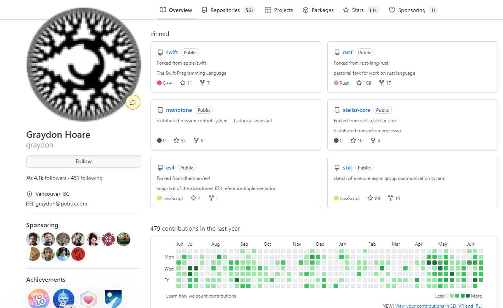
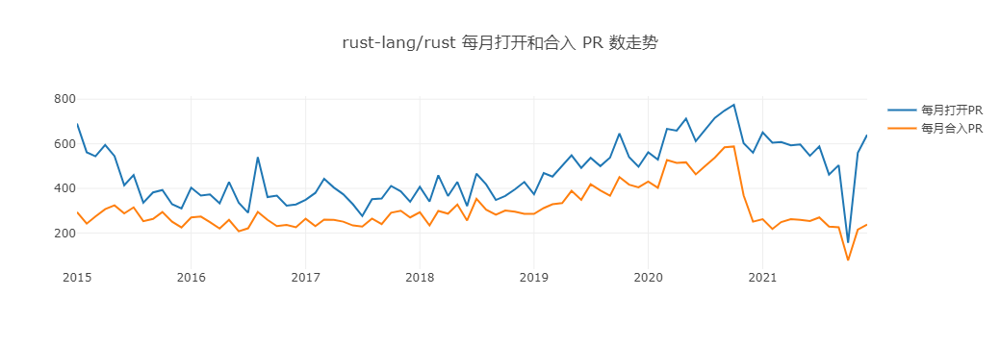

# 项目分析报告

组员：乔凡超（代码撰写、绘图）、顾建树（完成背景分析）、陈立翔（完成对比和归档原因分析）

## 一、项目基本背景和发展历程介绍

项目地址：https://github.com/rust-lang/rust

### 1.1 项目简介

    Rust是一种使每个人都可以构建可靠、高效软件的编程语言。

    **Rust**是一种**系统级编程语言**，注重**高性能**、**可靠性**和**生产力**，支持结构化编程、函数式编

程、面向对象编程等多种编程范式。

    Rust是**编译型语言**，没有运行时(Runtime)和垃圾回收(Garbage Collector)。Rust使用所有权机制来实现自动内存管理，并以此来保证内存安全。Rust是**开源项目**，目前托管在Github上，Rust和所有其他官方项目都采用Apache许可证2.0和MIT许可证双重许可。Rust官方软件包管理器为Cargo。


### 1.2 语言特点

​    （1）零成本抽象是Rust实现高性能的核心。

    （2）Rust通过强大的类型系统和所有权模型来保证内存安全与线程安全，在编译时消除很多可能存在的错误。使用Rust语言编程不需要手动分配(malloc)释放(free)内存和资源。Rust通过所有权系统来判断资源分配和释放的时机，在资源不再使用自动调用析构函数并释放资源。所有权系统是Rust与其他语言最不同的一点，这也是Rust学习曲线较为陡峭的原因之一。

    （3）Rust使用特征(trait)机制来实现抽象和代码复用，而非使用其他编程语言中常见的类(Class)。特征(trait)的概念接近于其他编程语言的接口概念，trait可以包含方法声明和默认实现，但不能包含成员变量。

    （4）Rust语言使用返回值来进行错误处理，Rust中可能产生错误或空的函数的返回值一般为`Result<T, E>`或`Option<T>`类型，开发者必须在代码中显式的处理每一种情况，以此保证错误得到处理。

    （5）Rust支持多种类型的迭代器、迭代器适配器和消费器。Rust支持非装箱(Unboxed)闭包。

    （6）Async/await是Rust提供的异步编程方式。Rust支持异步函数(async function)、异步闭包(async closure)、异步代码块(async block)和在async标记的块中使用.await后置关键词。Rust只提供了async-await语法和Future特征等必要功能，没有提供默认的事件循环机制/异步运行时(asynchronous run-time)。目前Rust生态中主流的异步运行时有两个，分别是Tokio和async-std。Tokio是Rust生态中主流的异步运行时，正在向使用新的async-await语法迁移。Async-std是新出现(2019年9月26日发布1.0版本)的异步运行时实现，通过模仿标准库(std)实现相应的异步API来降低开发者的学习成本。

    （7）强大的类型系统和所有权模型保证了Rust的安全性，但也限制了Rust实现部分功能的能力，比如外部函数接口(FFI)等。对此，Rust提供了unsafe关键词，在unsafe标记的块中，部分操作不会提供安全检查。

    （8）Rust支持声明宏、过程宏、编译器插件等机制，显著提升了Rust的表达能力和易用性。

### 1.3 技术类型


此项目主要使用 Go 为开发语言。

### 1.4 版本发布历史

    Rust的版本是定时发布的，每六周一个版本。不管在这个周期里有二十个功能发布，还是一个功能都没有，版本都是照发不误。功能的发布叫做固化(stablize)，意思是，除非遇到关键事件（如安全问题、不得不纠正的错误等等），这个功能不会以向后不兼容的方式被移除掉。Rust希望你今天写的产品级代码，在10年、20年、50年之后还是能够继续使用的。这也同时意味着，Rust不会有2.0。

    第一个有版本号的Rust编译器于2012年1月发布。Rust 1.0是第一个稳定版本，于2015年5月15日发布。最新的版本是2022年5月19日更新的Rust 1.61.0。

版本更新里程碑：

    1.0.0版本（2015年5月15日）：第一个稳定版本，意味着Rust的语法和标准库已经稳定，以后发布的新版本可以前向兼容。也代表Rust可以开始应用于生产环境。

    1.31.0版本（2018年12月6日）：Rust以软件包为单位设置Rust版本，Rust 2018的软件包可以和Rust 2015的软件包无缝协同工作。Rust 2018引入了一些新特性，比如非词法生命周期(non-lexical lifetimes)，const fn，以及简化的模块系统等。

    1.39.0版本（ 2019年11月7日）：支持async-await语法稳定(stable)。async-await是基于Future的异步编程方法，async-await语法稳定对Rust异步生态系统的发展影响巨大。简而言之，2019年将是Rust项目复兴和成熟的一年。重点主要放在加强基础、偿还技术和组织债务上。

    最新版本1.61.0（2022年5月19日）：自定义 main 函数 ExitCode、const fn 增强、为锁定的 stdio 提供静态句柄。

    

### 1.5 主要贡献者的构成（国家、区域和组织等）

    Rust语言原本是Mozilla员工Graydon Hoare的私人计划，而Mozilla于2009年开始赞助这个计划，并且在2010年首次公开。



    Rust在完全开放的情况下开发，并且相当欢迎社区的反馈。在1.0稳定版之前，语言设计也因为透过撰写Servo网页浏览器排版引擎和rustc编译器本身，而有进一步的改善。它虽然由Mozilla资助，但其实是一个共有项目，有很大部分的代码是来自于社区的贡献者。

### 1.6 CI/CD 的使用

​    CI/CD 是一种通过在应用开发阶段引入自动化来频繁向客户交付应用的方法。CI/CD 的核心概念是持续集成、持续交付和持续部署。作为一个面向开发和运营团队的解决方案，CI/CD 主要针对在集成新代码时所引发的问题。具体而言，CI/CD 可让持续自动化和持续监控贯穿于应用的整个生命周期（从集成和测试阶段，到交付和部署）。这些关联的事务通常被统称为"CI/CD 管道"，由开发和运维团队以敏捷方式协同支持。

​    Rust使用的CI/CD为GitHub Actions。GitHub Actions 是一个持续集成 (Continuous integration)和持续交付 (Continuous delivery)的平台，它可以做到自动化构建、测试、部署。你可以创建工作流，构建和测试每一个 pull request 或者部署合并后的代码到生产环境。GitHub Actions 可以在你的代码仓库发生某个事件时运行一个工作流。举个例子，当有人给你的代码仓库新建了一个 issue，你可以跑一个工作流自动的添加合适的标签。GitHub 提供了 Linux、Windows、和 macOS 虚拟机运行你的工作流，当然你也可以自定义运行环境。

## 二、项目的历史轨迹分析

基于给出的镜像数据和 OpenDigger，完成项目 2015年至今的以下数据分析任务： 

### 2.1 每月新增 Star 和 Frok 的个数


```
┌─────────┬───────────┬───────────┬──────────┐
│ (index) │   date    │ watch_cnt │ star_cnt │
├─────────┼───────────┼───────────┼──────────┤
│    0    │ '2015-1'  │  '1033'   │  '247'   │
│    1    │ '2015-2'  │   '487'   │  '137'   │
│    2    │ '2015-3'  │   '421'   │  '123'   │
│    3    │ '2015-4'  │   '724'   │  '174'   │
│    4    │ '2015-5'  │  '1463'   │  '301'   │
│    5    │ '2015-6'  │   '623'   │  '158'   │
│    6    │ '2015-7'  │   '428'   │  '130'   │
│    7    │ '2015-8'  │   '482'   │  '125'   │
│    8    │ '2015-9'  │   '517'   │  '125'   │
│    9    │ '2015-10' │   '551'   │  '151'   │
│   10    │ '2015-11' │   '348'   │  '115'   │
│   11    │ '2015-12' │   '518'   │  '122'   │
│   12    │ '2016-1'  │   '520'   │  '153'   │
│   13    │ '2016-2'  │   '355'   │   '88'   │
│   14    │ '2016-3'  │   '696'   │  '134'   │
│   15    │ '2016-4'  │   '496'   │  '123'   │
│   16    │ '2016-5'  │   '515'   │  '143'   │
│   17    │ '2016-6'  │   '448'   │  '129'   │
│   18    │ '2016-7'  │   '476'   │  '127'   │
│   19    │ '2016-8'  │   '530'   │  '193'   │
│   20    │ '2016-9'  │   '411'   │  '112'   │
│   21    │ '2016-10' │   '482'   │  '116'   │
│   22    │ '2016-11' │   '391'   │  '105'   │
│   23    │ '2016-12' │   '518'   │  '103'   │
│   24    │ '2017-1'  │  '1402'   │  '136'   │
│   25    │ '2017-2'  │   '978'   │  '134'   │
│   26    │ '2017-3'  │   '626'   │  '135'   │
│   27    │ '2017-4'  │   '562'   │   '98'   │
│   28    │ '2017-5'  │   '537'   │  '107'   │
│   29    │ '2017-6'  │   '478'   │   '88'   │
│   30    │ '2017-7'  │   '513'   │  '112'   │
│   31    │ '2017-8'  │   '512'   │  '115'   │
│   32    │ '2017-9'  │   '485'   │  '149'   │
│   33    │ '2017-10' │   '729'   │  '149'   │
│   34    │ '2017-11' │   '825'   │  '136'   │
│   35    │ '2017-12' │   '696'   │  '112'   │
│   36    │ '2018-1'  │   '762'   │  '136'   │
│   37    │ '2018-2'  │   '562'   │   '96'   │
│   38    │ '2018-3'  │   '736'   │  '107'   │
│   39    │ '2018-4'  │   '625'   │  '100'   │
│   40    │ '2018-5'  │   '591'   │  '112'   │
│   41    │ '2018-6'  │   '639'   │  '108'   │
│   42    │ '2018-7'  │   '677'   │   '99'   │
│   43    │ '2018-8'  │   '672'   │   '96'   │
│   44    │ '2018-9'  │   '633'   │   '95'   │
│   45    │ '2018-10' │   '597'   │   '88'   │
│   46    │ '2018-11' │   '693'   │  '109'   │
│   47    │ '2018-12' │   '710'   │  '102'   │
│   48    │ '2019-1'  │   '937'   │  '114'   │
│   49    │ '2019-2'  │   '628'   │   '92'   │
│   50    │ '2019-3'  │   '808'   │  '104'   │
│   51    │ '2019-4'  │  '1015'   │  '119'   │
│   52    │ '2019-5'  │   '814'   │  '153'   │
│   53    │ '2019-6'  │   '746'   │  '116'   │
│   54    │ '2019-7'  │  '1053'   │  '156'   │
│   55    │ '2019-8'  │   '867'   │  '151'   │
│   56    │ '2019-9'  │   '665'   │  '146'   │
│   57    │ '2019-10' │   '745'   │  '129'   │
│   58    │ '2019-11' │   '926'   │  '159'   │
│   59    │ '2019-12' │   '821'   │  '128'   │
│   60    │ '2020-1'  │   '825'   │  '128'   │
│   61    │ '2020-2'  │   '846'   │  '131'   │
│   62    │ '2020-3'  │   '819'   │  '140'   │
│   63    │ '2020-4'  │   '966'   │  '162'   │
│   64    │ '2020-5'  │  '1001'   │  '159'   │
│   65    │ '2020-6'  │  '1149'   │  '155'   │
│   66    │ '2020-7'  │  '1071'   │  '156'   │
│   67    │ '2020-8'  │   '787'   │  '174'   │
│   68    │ '2020-9'  │   '849'   │  '167'   │
│   69    │ '2020-10' │   '763'   │  '156'   │
│   70    │ '2020-11' │   '834'   │  '143'   │
│   71    │ '2020-12' │  '1000'   │  '149'   │
│   72    │ '2021-1'  │  '1018'   │  '148'   │
│   73    │ '2021-2'  │  '1292'   │  '155'   │
│   74    │ '2021-3'  │   '955'   │  '150'   │
│   75    │ '2021-4'  │  '1041'   │  '144'   │
│   76    │ '2021-5'  │  '1406'   │  '161'   │
│   77    │ '2021-6'  │   '749'   │  '138'   │
│   78    │ '2021-7'  │  '1180'   │  '145'   │
│   79    │ '2021-8'  │  '1092'   │  '132'   │
│   80    │ '2021-9'  │   '954'   │  '151'   │
│   81    │ '2021-10' │   '390'   │   '74'   │
│   82    │ '2021-11' │  '1167'   │  '161'   │
│   83    │ '2021-12' │  '1278'   │  '182'   │
└─────────┴───────────┴───────────┴──────────┘
```

​    从图和数据中可以看出，star数和fork数分别在2015年5月、2017年11月。分析其原因，可能的原因是2015年5月Rust的第一个正式稳定版本1.0.0发布了；而在2017年10月和11月，Rust有了比较大的改动，包括字符串类型的静态链接、支持下划线、实现Drop的类型允许const和static类型等。在2017年至今，star和fork数都比较稳定，只有在2021年10月突然大大下跌，分析原因可能是在该时间段Rust发布了一个相对成熟和稳定的版本。

### 2.2 每月打开 Issue 和 关闭 Issue 的个数


```
┌─────────┬───────────┬────────────┬────────────┐
│ (index) │   date    │ opened_cnt │ closed_cnt │
├─────────┼───────────┼────────────┼────────────┤
│    0    │ '2015-1'  │   '738'    │   '912'    │
│    1    │ '2015-2'  │   '524'    │   '544'    │
│    2    │ '2015-3'  │   '466'    │   '353'    │
│    3    │ '2015-4'  │   '496'    │   '504'    │
│    4    │ '2015-5'  │   '375'    │   '286'    │
│    5    │ '2015-6'  │   '346'    │   '286'    │
│    6    │ '2015-7'  │   '290'    │   '249'    │
│    7    │ '2015-8'  │   '354'    │   '224'    │
│    8    │ '2015-9'  │   '265'    │   '242'    │
│    9    │ '2015-10' │   '319'    │   '269'    │
│   10    │ '2015-11' │   '300'    │   '262'    │
│   11    │ '2015-12' │   '226'    │   '169'    │
│   12    │ '2016-1'  │   '265'    │   '271'    │
│   13    │ '2016-2'  │   '277'    │   '305'    │
│   14    │ '2016-3'  │   '305'    │   '251'    │
│   15    │ '2016-4'  │   '306'    │   '183'    │
│   16    │ '2016-5'  │   '267'    │   '243'    │
│   17    │ '2016-6'  │   '258'    │   '193'    │
│   18    │ '2016-7'  │   '265'    │   '212'    │
│   19    │ '2016-8'  │   '482'    │   '311'    │
│   20    │ '2016-9'  │   '331'    │   '267'    │
│   21    │ '2016-10' │   '255'    │   '188'    │
│   22    │ '2016-11' │   '267'    │   '221'    │
│   23    │ '2016-12' │   '316'    │   '220'    │
│   24    │ '2017-1'  │   '334'    │   '281'    │
│   25    │ '2017-2'  │   '342'    │   '285'    │
│   26    │ '2017-3'  │   '361'    │   '348'    │
│   27    │ '2017-4'  │   '281'    │   '322'    │
│   28    │ '2017-5'  │   '299'    │   '606'    │
│   29    │ '2017-6'  │   '326'    │   '393'    │
│   30    │ '2017-7'  │   '299'    │   '248'    │
│   31    │ '2017-8'  │   '294'    │   '270'    │
│   32    │ '2017-9'  │   '355'    │   '236'    │
│   33    │ '2017-10' │   '302'    │   '201'    │
│   34    │ '2017-11' │   '350'    │   '286'    │
│   35    │ '2017-12' │   '338'    │   '228'    │
│   36    │ '2018-1'  │   '387'    │   '294'    │
│   37    │ '2018-2'  │   '352'    │   '245'    │
│   38    │ '2018-3'  │   '435'    │   '287'    │
│   39    │ '2018-4'  │   '356'    │   '238'    │
│   40    │ '2018-5'  │   '381'    │   '271'    │
│   41    │ '2018-6'  │   '316'    │   '218'    │
│   42    │ '2018-7'  │   '418'    │   '277'    │
│   43    │ '2018-8'  │   '421'    │   '258'    │
│   44    │ '2018-9'  │   '405'    │   '299'    │
│   45    │ '2018-10' │   '377'    │   '319'    │
│   46    │ '2018-11' │   '333'    │   '234'    │
│   47    │ '2018-12' │   '314'    │   '247'    │
│   48    │ '2019-1'  │   '291'    │   '317'    │
│   49    │ '2019-2'  │   '285'    │   '207'    │
│   50    │ '2019-3'  │   '316'    │   '322'    │
│   51    │ '2019-4'  │   '326'    │   '253'    │
│   52    │ '2019-5'  │   '432'    │   '296'    │
│   53    │ '2019-6'  │   '353'    │   '269'    │
│   54    │ '2019-7'  │   '377'    │   '265'    │
│   55    │ '2019-8'  │   '340'    │   '333'    │
│   56    │ '2019-9'  │   '314'    │   '365'    │
│   57    │ '2019-10' │   '390'    │   '298'    │
│   58    │ '2019-11' │   '364'    │   '254'    │
│   59    │ '2019-12' │   '352'    │   '330'    │
│   60    │ '2020-1'  │   '388'    │   '261'    │
│   61    │ '2020-2'  │   '349'    │   '236'    │
│   62    │ '2020-3'  │   '369'    │   '278'    │
│   63    │ '2020-4'  │   '415'    │   '286'    │
│   64    │ '2020-5'  │   '398'    │   '312'    │
│   65    │ '2020-6'  │   '403'    │   '250'    │
│   66    │ '2020-7'  │   '418'    │   '249'    │
│   67    │ '2020-8'  │   '395'    │   '274'    │
│   68    │ '2020-9'  │   '430'    │   '286'    │
│   69    │ '2020-10' │   '450'    │   '321'    │
│   70    │ '2020-11' │   '361'    │   '227'    │
│   71    │ '2020-12' │   '422'    │   '275'    │
│   72    │ '2021-1'  │   '379'    │   '251'    │
│   73    │ '2021-2'  │   '425'    │   '226'    │
│   74    │ '2021-3'  │   '445'    │   '274'    │
│   75    │ '2021-4'  │   '430'    │   '260'    │
│   76    │ '2021-5'  │   '451'    │   '303'    │
│   77    │ '2021-6'  │   '329'    │   '245'    │
│   78    │ '2021-7'  │   '315'    │   '282'    │
│   79    │ '2021-8'  │   '322'    │   '195'    │
│   80    │ '2021-9'  │   '330'    │   '182'    │
│   81    │ '2021-10' │   '145'    │   '119'    │
│   82    │ '2021-11' │   '378'    │   '176'    │
│   83    │ '2021-12' │   '404'    │   '267'    │
└─────────┴───────────┴────────────┴────────────┘
```

​    从图和表中可以看出，该项目每个月打开和关闭的issue数都比较多，而关闭的issue数在2017年5月和达到一个较高的峰值，说明这个时间段有一大部分问题被集中解决；此外，打开和关闭的issue数在2021年10月达到谷值，这与此时Rust发布了一个相对稳定的版本也有关系。

### 2.3 每月打开 PR 和合入 PR 的个数



```
┌─────────┬───────────┬─────────┬──────────┐
│ (index) │  pr_date  │ pr_open │ pr_merge │
├─────────┼───────────┼─────────┼──────────┤
│    0    │ '2015-1'  │  '691'  │  '294'   │
│    1    │ '2015-2'  │  '562'  │  '242'   │
│    2    │ '2015-3'  │  '544'  │  '274'   │
│    3    │ '2015-4'  │  '595'  │  '307'   │
│    4    │ '2015-5'  │  '545'  │  '324'   │
│    5    │ '2015-6'  │  '414'  │  '288'   │
│    6    │ '2015-7'  │  '460'  │  '315'   │
│    7    │ '2015-8'  │  '336'  │  '253'   │
│    8    │ '2015-9'  │  '382'  │  '263'   │
│    9    │ '2015-10' │  '393'  │  '294'   │
│   10    │ '2015-11' │  '329'  │  '251'   │
│   11    │ '2015-12' │  '310'  │  '225'   │
│   12    │ '2016-1'  │  '403'  │  '270'   │
│   13    │ '2016-2'  │  '368'  │  '274'   │
│   14    │ '2016-3'  │  '373'  │  '249'   │
│   15    │ '2016-4'  │  '333'  │  '220'   │
│   16    │ '2016-5'  │  '429'  │  '259'   │
│   17    │ '2016-6'  │  '336'  │  '208'   │
│   18    │ '2016-7'  │  '291'  │  '221'   │
│   19    │ '2016-8'  │  '540'  │  '295'   │
│   20    │ '2016-9'  │  '361'  │  '259'   │
│   21    │ '2016-10' │  '368'  │  '231'   │
│   22    │ '2016-11' │  '323'  │  '236'   │
│   23    │ '2016-12' │  '328'  │  '226'   │
│   24    │ '2017-1'  │  '349'  │  '264'   │
│   25    │ '2017-2'  │  '380'  │  '231'   │
│   26    │ '2017-3'  │  '443'  │  '260'   │
│   27    │ '2017-4'  │  '404'  │  '259'   │
│   28    │ '2017-5'  │  '374'  │  '251'   │
│   29    │ '2017-6'  │  '329'  │  '234'   │
│   30    │ '2017-7'  │  '276'  │  '229'   │
│   31    │ '2017-8'  │  '352'  │  '265'   │
│   32    │ '2017-9'  │  '355'  │  '240'   │
│   33    │ '2017-10' │  '411'  │  '291'   │
│   34    │ '2017-11' │  '387'  │  '300'   │
│   35    │ '2017-12' │  '340'  │  '270'   │
│   36    │ '2018-1'  │  '407'  │  '293'   │
│   37    │ '2018-2'  │  '341'  │  '234'   │
│   38    │ '2018-3'  │  '459'  │  '299'   │
│   39    │ '2018-4'  │  '366'  │  '287'   │
│   40    │ '2018-5'  │  '429'  │  '328'   │
│   41    │ '2018-6'  │  '321'  │  '256'   │
│   42    │ '2018-7'  │  '466'  │  '353'   │
│   43    │ '2018-8'  │  '418'  │  '305'   │
│   44    │ '2018-9'  │  '348'  │  '282'   │
│   45    │ '2018-10' │  '366'  │  '301'   │
│   46    │ '2018-11' │  '396'  │  '296'   │
│   47    │ '2018-12' │  '429'  │  '286'   │
│   48    │ '2019-1'  │  '374'  │  '286'   │
│   49    │ '2019-2'  │  '469'  │  '312'   │
│   50    │ '2019-3'  │  '453'  │  '329'   │
│   51    │ '2019-4'  │  '502'  │  '334'   │
│   52    │ '2019-5'  │  '548'  │  '389'   │
│   53    │ '2019-6'  │  '492'  │  '349'   │
│   54    │ '2019-7'  │  '537'  │  '419'   │
│   55    │ '2019-8'  │  '500'  │  '391'   │
│   56    │ '2019-9'  │  '538'  │  '367'   │
│   57    │ '2019-10' │  '646'  │  '451'   │
│   58    │ '2019-11' │  '540'  │  '417'   │
│   59    │ '2019-12' │  '497'  │  '405'   │
│   60    │ '2020-1'  │  '562'  │  '431'   │
│   61    │ '2020-2'  │  '529'  │  '403'   │
│   62    │ '2020-3'  │  '667'  │  '527'   │
│   63    │ '2020-4'  │  '659'  │  '514'   │
│   64    │ '2020-5'  │  '713'  │  '517'   │
│   65    │ '2020-6'  │  '612'  │  '463'   │
│   66    │ '2020-7'  │  '663'  │  '500'   │
│   67    │ '2020-8'  │  '716'  │  '538'   │
│   68    │ '2020-9'  │  '749'  │  '584'   │
│   69    │ '2020-10' │  '775'  │  '588'   │
│   70    │ '2020-11' │  '603'  │  '369'   │
│   71    │ '2020-12' │  '560'  │  '251'   │
│   72    │ '2021-1'  │  '651'  │  '262'   │
│   73    │ '2021-2'  │  '605'  │  '218'   │
│   74    │ '2021-3'  │  '608'  │  '249'   │
│   75    │ '2021-4'  │  '593'  │  '262'   │
│   76    │ '2021-5'  │  '597'  │  '259'   │
│   77    │ '2021-6'  │  '546'  │  '254'   │
│   78    │ '2021-7'  │  '588'  │  '270'   │
│   79    │ '2021-8'  │  '462'  │  '229'   │
│   80    │ '2021-9'  │  '504'  │  '226'   │
│   81    │ '2021-10' │  '156'  │   '77'   │
│   82    │ '2021-11' │  '559'  │  '215'   │
│   83    │ '2021-12' │  '640'  │  '238'   │
└─────────┴───────────┴─────────┴──────────┘
```

​    每月打开和合入的PR数在2015年达到峰值，因为在该该年Rust发布了1.0.0版本，而在2021年开始急剧下降，原因可能是在概念Rust发布了一个相对稳定、成熟的版本，对新的版本用户尚不熟悉。

### 2.4 每月在仓库中活跃的不同开发者总数


​    

```
┌─────────┬────────────┬───────────┐
│ (index) │ actor_date │ actor_num │
├─────────┼────────────┼───────────┤
│    0    │  '2015-1'  │  '1656'   │
│    1    │  '2015-2'  │   '969'   │
│    2    │  '2015-3'  │   '891'   │
│    3    │  '2015-4'  │  '1253'   │
│    4    │  '2015-5'  │  '2098'   │
│    5    │  '2015-6'  │  '1048'   │
│    6    │  '2015-7'  │   '818'   │
│    7    │  '2015-8'  │   '862'   │
│    8    │  '2015-9'  │   '889'   │
│    9    │ '2015-10'  │   '990'   │
│   10    │ '2015-11'  │   '732'   │
│   11    │ '2015-12'  │   '911'   │
│   12    │  '2016-1'  │   '945'   │
│   13    │  '2016-2'  │   '746'   │
│   14    │  '2016-3'  │  '1131'   │
│   15    │  '2016-4'  │   '940'   │
│   16    │  '2016-5'  │   '967'   │
│   17    │  '2016-6'  │   '872'   │
│   18    │  '2016-7'  │   '897'   │
│   19    │  '2016-8'  │  '1045'   │
│   20    │  '2016-9'  │   '893'   │
│   21    │ '2016-10'  │   '927'   │
│   22    │ '2016-11'  │   '853'   │
│   23    │ '2016-12'  │   '962'   │
│   24    │  '2017-1'  │  '1215'   │
│   25    │  '2017-2'  │  '1065'   │
│   26    │  '2017-3'  │  '1146'   │
│   27    │  '2017-4'  │  '1030'   │
│   28    │  '2017-5'  │  '1059'   │
│   29    │  '2017-6'  │  '1001'   │
│   30    │  '2017-7'  │  '1021'   │
│   31    │  '2017-8'  │   '958'   │
│   32    │  '2017-9'  │  '1011'   │
│   33    │ '2017-10'  │  '1283'   │
│   34    │ '2017-11'  │  '1385'   │
│   35    │ '2017-12'  │  '1205'   │
│   36    │  '2018-1'  │  '1368'   │
│   37    │  '2018-2'  │  '1124'   │
│   38    │  '2018-3'  │  '1357'   │
│   39    │  '2018-4'  │  '1208'   │
│   40    │  '2018-5'  │  '1193'   │
│   41    │  '2018-6'  │  '1209'   │
│   42    │  '2018-7'  │  '1271'   │
│   43    │  '2018-8'  │  '1260'   │
│   44    │  '2018-9'  │  '1220'   │
│   45    │ '2018-10'  │  '1139'   │
│   46    │ '2018-11'  │  '1304'   │
│   47    │ '2018-12'  │  '1279'   │
│   48    │  '2019-1'  │  '1594'   │
│   49    │  '2019-2'  │  '1187'   │
│   50    │  '2019-3'  │  '1423'   │
│   51    │  '2019-4'  │  '1611'   │
│   52    │  '2019-5'  │  '1473'   │
│   53    │  '2019-6'  │  '1301'   │
│   54    │  '2019-7'  │  '1675'   │
│   55    │  '2019-8'  │  '1522'   │
│   56    │  '2019-9'  │  '1294'   │
│   57    │ '2019-10'  │  '1382'   │
│   58    │ '2019-11'  │  '1625'   │
│   59    │ '2019-12'  │  '1431'   │
│   60    │  '2020-1'  │  '1464'   │
│   61    │  '2020-2'  │  '1464'   │
│   62    │  '2020-3'  │  '1467'   │
│   63    │  '2020-4'  │  '1722'   │
│   64    │  '2020-5'  │  '1702'   │
│   65    │  '2020-6'  │  '1863'   │
│   66    │  '2020-7'  │  '1806'   │
│   67    │  '2020-8'  │  '1483'   │
│   68    │  '2020-9'  │  '1578'   │
│   69    │ '2020-10'  │  '1517'   │
│   70    │ '2020-11'  │  '1502'   │
│   71    │ '2020-12'  │  '1775'   │
│   72    │  '2021-1'  │  '1685'   │
│   73    │  '2021-2'  │  '2042'   │
│   74    │  '2021-3'  │  '1733'   │
│   75    │  '2021-4'  │  '1800'   │
│   76    │  '2021-5'  │  '2174'   │
│   77    │  '2021-6'  │  '1412'   │
│   78    │  '2021-7'  │  '1879'   │
│   79    │  '2021-8'  │  '1768'   │
│   80    │  '2021-9'  │  '1752'   │
│   81    │ '2021-10'  │   '882'   │
│   82    │ '2021-11'  │  '1874'   │
│   83    │ '2021-12'  │  '2138'   │
└─────────┴────────────┴───────────┘
```

​    从表和图可以看出，总体趋势上开发者数目不断增加，说明Rust语言的关注度在逐年增加，也侧面表现出该语言逐年变得更加好用。同样，由于2021年10月由于新的稳定版本的发布，开发者在这段时间内相较减少。

### 2.5 Issue 从打开到关闭的平均时长和中位数

- Issues 从打开到关闭的平均时长： 179.77 天

- Issues 从打开到关闭的时长中位数： 18.29 天
  
   从Issue从打开到关闭的平均时长和中位数可以看出，有些issue可能长时间得不到回复，导致issue从打开到关闭的平均时长长达179天之久，而从时长中位数可以看出，一般issue的回复还是比较及时的

### 2.6 PR 从打开到合入的平均时长和中位数

- PR 从打开到合入的平均时长：8.93天 

- PR 从打开到合入的时长中位数2.48天
  
  从PR从打开到合入的平均时长和中位数可以看出，该项目的维护较为及时。

### 2.7 Issue和PR从打开到第一次有人回复的平均时长和中位数

- Issue 从打开到第一次有人回复的平均时长： 202.33天 

- Issue 从打开到第一次有人回复的时长中位数： 26.62 天

- PR 从打开到第一次有人回复的平均时长： 12.18 天 

- PR 从打开到第一次有人回复的时长中位数： 2.74 天
  
   Issue和PR从打开到第一次有人回复的平均时长较长，但中位数较短，说明有些issue和PR长时间得不到处理，但总体来说issue和PR的处理还是比较及时的。

## 三、结合期中分析的归档项目，对比分析活跃/归档项目

### 完成以下方向的项目数据对比分析

- 项目基础数据（2.1/2.2/2.3）的变化趋势

- 开发者数量（2.4）变化趋势

- 其他你感兴趣的对比方向

最后，给出你认为的项目发展到活跃/归档的主要影响因素及原因
