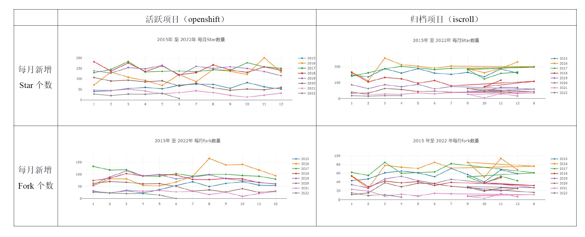
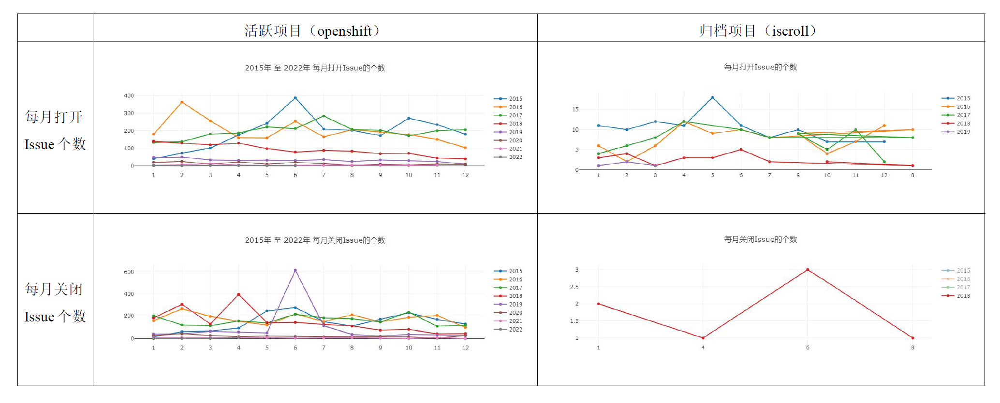
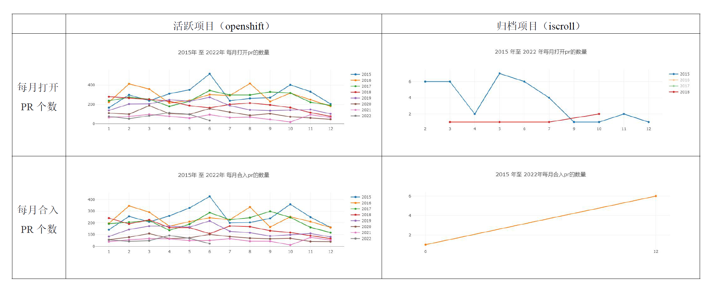
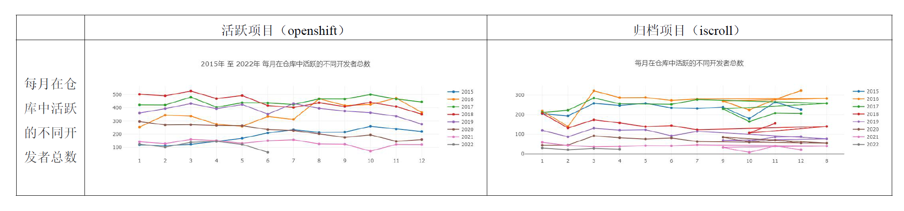

# 开源软件开发与社区治理期末作业

## 基本信息

**小组成员：**

镜像仓库搭建与数据源配置：郑泽洪（ 51215903109）；

仓库数据分析：杜方芮（51215903075），谭可人（51215903054），郑泽洪（ 51215903109）；

文档撰写：谭可人（51215903054），杜方芮（51215903075），郑泽洪（ 51215903109）。

**项目序号**：175

**项目id**：22442668

**项目名称**：openshift/origin

## 三、结合期中分析的归档项目，对比分析活跃/归档项目

* 期末的活跃项目为openshift/origin，期中的归档项目为iscroll。

### 1. 项目基础数据（2.1/2.2/2.3）的变化趋势

* **每月新增 Star 和 Fork 的个数变化趋势对比**

在活跃项目（openshift/origin）中，从2015年开始，该项目的 Star 和 Fork 的个数呈现先增加后缓慢减少的趋势，主要原因是该项目的版本更新迭代集中在2016-2018年，后期的活跃度缓慢下降，但是**仍然保持有一定的活跃度**。

在归档项目（iScroll）中，该项目从2013年开始兴起，在2013年、2014年最为活跃，因此从2015年开始项目的Star 和 Fork 的个数就逐年下降，后期由于新版本的发布，该项目不再维护，Star 和 Fork 的**个数降低到两位数**，最后被归档。

* **每月打开 Issue 和 关闭 Issue 的个数变化趋势对比**

对比发现，活跃项目（openshift/origin）每月打开Issue和关闭Issue的个数**数量要远远高于归档项目**（iScroll）。

活跃项目（openshift/origin）中，每月打开Issue和关闭Issue的个数虽然在近几年有逐年下降的趋势，但是该项目在很长时间内**保持在百余次**；而归档项目（iScroll）中，每月打开Issue和关闭Issue的个数最多不过两位数，**常年保持在个位数或者0的数量上**，说明该仓库的活跃度已经较低了。

* **每月打开 PR 和合入PR 的个数变化趋势对比**

对比发现，活跃项目（openshift/origin）每月打开PR和合入PR的个数**数量要远远高于归档项目**（iScroll）。

活跃项目（openshift/origin）中，每月打开PR和合入PR的个数虽然在近几年有逐年下降的趋势，但是该项目在很长时间内**保持在百余次**；而归档项目（iScroll）中，每月打开PR和合入PR的个数**常年保持在个位数或者0**的数量上，最多只有7次，说明该仓库的活跃度已经较低了。

### 2. 开发者数量（2.4）变化趋势

整体上看，活跃项目（openshift/origin）的开发者**数量要大于归档项目**（iScroll）。

活跃项目（openshift/origin）中，由于项目的版本更新迭代集中在2016-2018年，所以该期间的开发者访问量数量最多，最多达到了500多，近几年由于版本的稳定，开发者数量有逐年缓慢减少的趋势，但也**保持在百余人**的水平上，仍然处于活跃的状态下；而归档项目（iScroll）中，从2019年后半年开始，开发者数量已经**降低至两位数**的水平，仓库的活跃度较低，直至被归档。

### 3. 其他你感兴趣的对比方向

* **版本发布历史对比**

  活跃项目（openshift/origin）自2015年发布第一版项目以来，2016-2019每年都有新版本的出现，其中2017和2018年是版本迭代的高峰期，**版本的更迭**意味着项目得到了持久的维护，这是这个项目一直活跃的主要原因之一。

  归档项目（iScroll）是从2013年开始兴起，在2013年、2014年最为活跃，在2015年至今只发布过一个新版本，之后便进行了归档，这说明从2016年发布**最后一个版本**开始，该项目已经不再受到开发者的重点关注，仓库的活跃度也随之降低，直至被归档。

* **主要贡献者对比**

  在活跃项目（openshift/origin）的主要贡献者中，贡献者集中于**红帽 Red Hat 公司**，这说明该项目的背后有**公司的支持**，这意味着有财务支持、设备支持、场地支持、人员支持等，这为项目的持续发展创造了良好的发展环境，因此该项目一直都比较活跃。

  而归档项目（iScroll）的主要贡献者是**个人，数量少、分布分散**。并且，这一个项目对于所有的贡献者来说就只是一个***side project***，贡献者不会愿意花大量的时间去维护该项目。

### 4. 项目发展到活跃/归档的主要影响因素及原因

**项目发展到活跃/归档的主要影响因素有项目背景资源、项目完善程度、开源项目的定位、商业级产品及服务。**

* **项目背景资源：**

  项目资源包括项目背后的**资金资源、人力资源、公司资源**等。从活跃项目（openshift/origin）和归档项目（iScroll）的主要贡献者对比中也可以发现，活跃的项目背后有强大的公司背景依托，公司能够为其提供所需的**财务支持、设备支持、场地支持、人员支持、运维支持**等，这对于项目的可持续发展有非常重要的推动作用。相比之下，归档项目（iScroll）主要贡献者是**个人**且分布分散，团队就没有公司的背景资源，贡献者在**没有资金、没有场所、没有良好的合作关系**的情况下持续的维护一个项目就显得比较困难，费神费力，项目逐渐走向归档。

* **项目完善程度：**

  在期中作业中，我们分析归档项目（iScroll）在多次版本更迭后，已经非常完善了，也**没有多余改进空间**，因此被归档。因此项目的完善程度也是项目发展到活跃与归档的主要影响因素之一。正是因为项目存在不完善的地方、**存在改进的地方**，才会有贡献者去贡献代码，仓库才能够活跃，反之则会被归档处理。

* **开源项目的定位：**

  开源项目要一直活跃就需要有一个**前瞻的项目定位**，也就是说核心开源产品所针对的“赛道”必须是热门的，而不能是过时的老套的，产品所使用的语言和框架也必须是前瞻的。项目的定位要找准用户痛点，明确好发展定位，如此才能够**吸引更多的贡献者**来为项目贡献代码，贡献者的持续贡献是开源项目持续活跃的基础。反之，如果项目的定位不正确，使用项目的人很少，那自然不会有很多的人愿意为项目贡献代码，项目也终会走向不活跃。

* **商业级产品及服务：**

  开源项目也需要寻求商业化的道路，因为没有资金，再优秀的开源项目也无法维持其活力。团队想要保持项目的活跃，必须有源源不断的资金，这就需要推出**商业级产品及服务**，为商业级产品提供配套的服务，让用户有付费的理由，让资本有投资的理由。**有效的商业模式**是开源项目保持活跃的动力。反之，如果项目不去探索商业模型，只是一味的开源，那将面临资金的问题，从而无法继续维护而归档。
