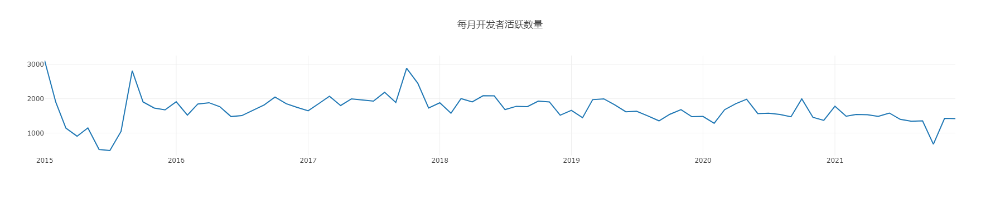

# 开源期末作业

开源项目：https://github.com/nodejs/node  
项目序号：177
项目ID： 27193779

小组成员及分工：

* 刘丹琪 51215903016，
* 刘晟驰 52215903004，负责任务二
* 梅文娟 51215903013，负责任务三

## 一、项目的基本背景和发展历程

### 1. 项目基本信息

### 2. 版本发布历史

### 3. 主要贡献者的构成（国家、区域和组织等）

### 4. CI/CD 的使用

## 二、项目的历史轨迹分析

### 1. 每月新增 Star 和 Frok 的个数

图2-1 每月新增的 star 个数

图2-2 每月新增的 fork 个数
  
&nbsp;

### 2. 每月打开 issue 和关闭 issue 的个数

图2-3 每月打开的 issue 个数

图2-4 每月关闭的 issue 个数

&nbsp;

### 3. 每月打开 PR 和合并 PR 的个数

图2-5 每月打开的 PR 个数

图2-6 每月合并的 PR 个数

### 4. 每月在仓库中活跃（只要有日志产生就算）的不同开发者总数

图2-7 每月活跃的不同开发者个数

**（更详细的结果展示，以及5-7数据分析结果，请查阅.ipynb文件）**

##  三、结合期中分析的归档项目，对比分析活跃/归档项目

1. 项目基础数据（2.1/2.2/2.3）的变化趋势

   2.1 fork和star的数量变化曲线

   * 期末项目：  项目从2015年到至今，star和fork的数量趋势是几乎相同的，几乎每年都会出现一波小的高峰期。在2015年，项目的初期，因为项目还在建成中，所以Star和Fork的数量都很少。当2015年下半年，项目建成之后，项目的受关注度就达到一个顶峰。在2016年至今，项目经过几年的发展star和fork的数量达到一个平稳的状态，每年有不定期的小巅峰。 
   * 期中项目： 据统计图可以看到，项目在14年发布release v1.41之后，受到了开发者较多的关注，15年每月star、fork的数量分别维持在150、50左右。但是从2016年之后，每月star的数量有明显的下降，仅有60上下。每月fork的数量依然可以维持在50附近，但是进入2017后，fork的数量也开始下滑，将至40左右。

   2.2 Issue的打开和关闭数量变化曲线

   * 期末项目： 该项目Issue打开和关闭的趋势几乎相同，可见项目负责人对issue的处理非常快。在项目的2015年到2019年期间，项目的Issue的打开和关闭数量处于波动上升的状态，并于2019年达到顶峰。在2019年到2021年，项目的issue的数目，趋于平稳，在2021年之后，issue的数据波动下降。
   * 其中项目： 该项目15-17年间issue数量较少。2017年该项目归档后，基本没有issue打开或关闭。

   2.3 PR的打开和合并的数量变化

   * 期末项目： 可以分成三个阶段，2015到2017是项目的的建立初期，这个时候，项目还没有什么知名度，在2017年之后，项目的规模和功能已经完善了。使用Nodejs的人也逐渐增加，这个时候提出PR的人就很多。2020年至今提出PR的人变少，并且数量逐渐趋于平缓下降。因为项目的缺陷和待完善的功能都已经被前人提出了。PR的合并数量在2019年之前一直不多，在2019年，项目进行了PR的标准化和测试的完整化。因为测试和开发流程的完善,PR 的总数变少了，但是高质量的PR增多了，因此合并的PR的数目大幅度的提升达到了前所未有的高度。
   * 期中项目： 该项目15-17年间PR数量较少，每月PR数量只有个位数。

2. 开发者数量（2.4）变化趋势

   期末项目： 仓库活跃的开发者总数在最开始的2015到2016年的项目初期，由几百达到了两千多。在此之后，项目开发者的数目一直处于一千五百左右，在2017年下半年出现了高峰期。

   期中项目： 每月活跃的不同开发者总数的变化曲线基本和star的曲线变化一致。在2015年，每月活跃人数基本维持在150人以上，但是从2015年末开始，月活人数开始显著下降至100左右。此后月活人数持续缓慢降低。

   期末的项目的数量远高于期中项目的开发活跃数量。 

- 项目的主要贡献人

  期中项目目前是一个已经归档的项目，它是一个由个人发起的项目，它的主要贡献人是只有个位数。而期末的项目是一个还在活跃的项目，它的主要贡献人高达十几个，是一个非常成熟的社区。正是以为维护人数的差异，Nodejs/node这个项目目前能够如此活跃得益于如此多的开源人士进行维护。

- 发行版本的多样化

  期末项目： 包含了三个不同的发行版本，包括Current and LTS releases，Nightly releases，API documentation。文档中详细的给出了安装和使用的方法。 

  期中项目： 包含了一个发行版本，后来因为项目的改动太大，重新开启项目，该项目就进行了归档。 

3. 项目发展到活跃/归档的主要影响因素及原因：

   归档原因： 结合期中项目，项目的归档原因是项目的版本需要大幅度的修改和迭代。 在Readme中给出了项目的更高版本，以及更高级别的版本和当前版本的区别。 其中包含一个讨论即是否要起初jQuery的依赖以便于项目在其它工具上更好的适应性。 于是在2015年作者便新开了一个项目库用于存放非jQuery依赖的项目库。新的项目库到2021年仍然有人提出PR和Issue，项目的活跃程度很高。 而原来的项目库，也就是本项目库只活跃到2017年。因为活跃程度过少，项目的负责人就将本项目存档了。如果仓库不再活跃开发或者项目开发者不想接受额外的贡献，但这并不意味着作者想要删除它，可以在 Github 上归档仓库让它变成只读。归档一个仓库会让它对所有人只读（包括仓库拥有者），这包括对仓库的编辑、问题(issue)、合并请求(pull request（PR）)、标记、里程碑、项目、维基、发布、提交、标签、分支、反馈和评论。谁都不可以在一个归档的仓库上创建新的问题、合并请求或者评论，但是仍可以 fork 仓库——以允许归档的仓库在其它地方继续开发。期中项目归档的原因是因为项目有了大的修改和迭代。原项目归档之后，后续的更新都会集中到项目新版本上。其它的开发人员不会再对旧版本进行修改，而是基于新版本对项目作出贡献。 这样可以减少项目负责人的精力消耗。=其次，项目归档之后，没有人能对项目进行修改，说明归档的项目已经是一个成熟稳定的版本了。只是后续的功能上因为有大幅度的改变，所以开启了新的项目库进行新版版本的开发。 

   活跃原因： 结合期末项目，项目的活跃原因有很多。 首先是开源社区的投入人数，nodejs/node 这个项目包含了三个不同社区的人进行开发投入，主要开发人数高达三十多个。而期中项目Jquery项目开发人数只有几个。因此，投入越多发展越快，项目至今之所以活跃，就是因为很多开源人员依旧在进行维护和更新。 而jquery的原始项目已经归档，新的部分已经回归jquery社区由更多的开源人士维护。 第二是社区的介入，nodejs/node最开始的社区人数就很多，而jquery是独立开发。 nodejs/node活跃至今就是因为社区的力量。 第三，项目的意义很重大，nodejs是一个分成好用且使用范围很广的工具，所以有很多开源人士愿意为之投入发展。
