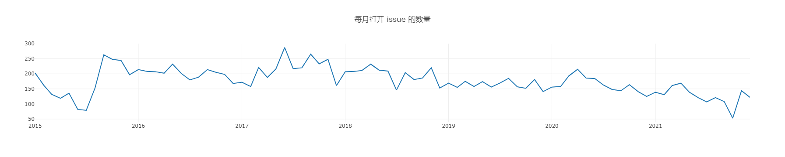

# 开源期末作业

开源项目：https://github.com/nodejs/node  
项目序号：177
项目ID： 27193779

小组成员及分工：

* 刘丹琪 51215903016，负责任务一
* 刘晟驰 52215903004，负责任务二
* 梅文娟 51215903013，负责任务三

## 一、项目的基本背景和发展历程

### 1. 项目基本信息

​	Node.js 诞生于 2009 年，由 Joyent 的员工 [Ryan Dahl](https://github.com/ry) 开发而成，之后 Joyent 公司一直扮演着 Node.js 孵化者的角色。由于诸多原因，Ryan 在2012年离开社区，随后在2015年由于 Node 贡献者对 es6 新特性集成问题的分歧，导致分裂出iojs，并由 iojs 发布1.0、2.0和3.0版本。由于 iojs 的分裂最终促成了2015年Node基金会的成立，并顺利发布了4.0版本。Node.js基金会的创始成员包括 Google、Joyent、IBM、Paypal、微软、Fidelity 和 Linux基金会，创始成员将共同掌管过去由 Joyent 一家企业掌控的 Node.js 开源项目。此后，Node.js 基金会发展非常好，稳定的发布5、6、7、8等版本。

​	Node.js 不是一门语言也不是框架，它只是基于 Google V8 引擎的 JavaScript 运行时环境，同时结合 Libuv 扩展了 JavaScript 功能，使之支持 io、fs 等只有语言才有的特性，使得 JavaScript 能够同时具有 DOM 操作(浏览器)和 I/O、文件读写、操作数据库(服务器端)等能力，是目前最简单的全栈式语言。早在2007年，Jeff Atwood 就提出了著名的 `Atwood定律`：任何能够用 JavaScript 实现的应用系统，最终都必将用 JavaScript 实现。

### 2. 版本发布历史

node.js/node共发布了296个版本，其中：

第一个版本（v0.4.3）发布的时间是2011年3月19日

最后一个版本（v18.4.0）发布的时间是2022年6月16日

### 3. 主要贡献者的构成（国家、区域和组织等）

Node.js项目管理的人员分为以下几类：

- Triagers：Triagers访问在[nodejs/node](https://github.com/nodejs/node)和[nodejs/help](https://github.com/nodejs/help)库中新发起的issues。Node.js Triagers的github团队是@nodejs/issue-triage。Triagers被赋予 "Triage"的GitHub角色并有以下能力：
  - 标记issus和pull requests
  - 评论、关闭和重新打开issus和pull request
- Collaborators：核心的Collaborators维护[nodejs/node](https://github.com/nodejs/node)库。Node.js Collaborators的github团队是@nodejs/Collaborators。Collaborators和non-Collaborators都可以提出对Node.js源代码进行更改。提出此类更改的机制是在GitHub pull requests，Collaborators审查和合并pull requests。两个Collaborators必须一起批准一个pull requests，然后pull requests才能落地。（如果pull requests已打开超过 7 天，则一个Collaborator批准就足够了。）批准pull request表明Collaborators接受更改，并且必须由不是变更作者的Collaborators批准。如果Collaborators反对提议的变更，则变更无法落地。 例外情况是，如果TSC（Technical Steering Committee）不顾反对而投票批准更改。通常，讨论或进一步的改变会导致Collaborators消除他们的反对意见，所以一般不需要TSC的参与。Collaborators有以下能力：
  - 提交和访问[nodejs/node](https://github.com/nodejs/node)库
  - 访问Node.js的持续集成jobs
- Technical Steering Committee：一部分Collaborators组成了Technical Steering Committee (TSC)。TSC对该项目拥有最终权力，包括：
  - 技术方向
  - 项目治理
  - contribution政策
  - GitHub存储库托管
  - 行为准则
  - 维护Collaborators名单

Node.js 项目一共有3057位贡献者，下面介绍一下前5位贡献者：

#### 第一位：Rich Trott

贡献情况：commit3029次，增加 1,100,753行代码，减去1,134,296行代码

id：Trott

区域：San Francisco, CA

职位：Node.js的TSC的一员，并在加利福尼亚大学工作

#### 第二位：Ryan Dahl

贡献情况：commit2941次，增加3,430,075行代码，减去1,788,533行代码

id：ry

区域：New York City

公司：Deno Land

#### 第三位：Ben Noordhuis

贡献情况：commit2226次，增加1,633,844行代码，减去1,204,604行代码

id：bnoordhuis

区域：The Netherlands

#### 第四位：Anna Henningsen

贡献情况：commit1560次，增加167,969行代码，减去152,277行代码

id：addaleax

区域：Germany

公司：mongoDB

#### 第五位：isaacs

贡献情况：commit1499次，增加751,042行代码，减去537,277行代码

id：isaacs

区域：Oakland CA

公司：Tier.run, Inc.

### 4. CI/CD 的使用

CI/CD 是一种通过在应用开发阶段引入自动化来频繁向客户交付应用的方法。CI/CD 的核心概念是持续集成、持续交付和持续部署。本项目中，使用Jenkins进行持续集成。Jenkins是一个开源的、提供友好操作界面的持续集成工具，起源于Hudson（Hudson是商用的），主要用于持续、自动的构建/测试软件项目、监控外部任务的运行。Jenkins用Java语言编写，可在Tomcat等流行的servlet容器中运行，也可独立运行。通常与版本管理工具(SCM)、构建工具结合使用。常用的版本控制工具有SVN、GIT，构建工具有Maven、Ant、Gradle。

​	有用的Jenkins CI jobs：

- [`node-test-pull-request`](https://ci.nodejs.org/job/node-test-pull-request/)是测试pull request的job。在所有受支持的平台上运行*build-ci*和*test-ci*。
- [`citgm-smoker`](https://ci.nodejs.org/job/citgm-smoker/) 使用 [`CitGM`](https://github.com/nodejs/citgm)允许你在大量的通用模块上运行*npm install && npm*测试，可以检查新的代码是否会给整个系统带来破坏。
-  [`node-stress-single-test`](https://ci.nodejs.org/job/node-stress-single-test/)可以在特定平台上反复运行一组测试，用它来检查测试是否可靠。
- [`node-test-commit-v8-linux`](https://ci.nodejs.org/job/node-test-commit-v8-linux/)运行标准V8测试。在Node.js 中更新V8或在V8上浮动新补丁时运行它。
- [`node-test-commit-custom-suites-freestyle`](https://ci.nodejs.org/job/node-test-commit-custom-suites-freestyle/)支持自定义测试套件和参数。它可以执行其他CI测试运行中未使用的测试套件（例如*Internet*或*pummel*目录中的测试）。当其他CI测试运行时未使用标志（例如 --worker），依然可以确保测试通过。 

### 5. Node.js的应用

​	目前 Node.js 在大部分领域都占有一席之地，尤其是 I/O 密集型的，比如 Web 开发，微服务，前端构建等。不少大型网站都是使用 Node.js 作为后台开发语言的，用的最多的就是使用Node.js做前端渲染和架构优化，比如 [淘宝](https://www.taobao.com/) 双十一、[去哪儿网](https://www.qunar.com/) 的 PC 端核心业务等。另外，有不少知名的前端库也是使用 Node.js 开发的，比如，[Webpack](https://github.com/webpack/webpack) 是一个强大的打包器，[React](https://github.com/facebook/react)/[Vue](https://github.com/vuejs/vue) 是成熟的前端组件化框架。

​	Node.js通常被用来开发低延迟的网络应用，也就是那些需要在服务器端环境和前端实时收集和交换数据的应用（API、即时聊天、微服务）。阿里巴巴、腾讯、Qunar、百度、PayPal、道琼斯、沃尔玛和 LinkedIn 都采用了 Node.js 框架搭建应用。此外， Node.js 编写的包管理器 npm 已成为开源包管理了领域最好的生态，直接到2017年10月份，有模块超过47万，每周下载量超过32亿次，每个月有超过700万开发者使用npm。

## 二、项目的历史轨迹分析

### 1. 每月新增 Star 和 Frok 的个数

图2-1 每月新增的 star 个数

图2-2 每月新增的 fork 个数
  
&nbsp;

### 2. 每月打开 issue 和关闭 issue 的个数

图2-3 每月打开的 issue 个数

图2-4 每月关闭的 issue 个数

&nbsp;

### 3. 每月打开 PR 和合并 PR 的个数

图2-5 每月打开的 PR 个数

图2-6 每月合并的 PR 个数

### 4. 每月在仓库中活跃（只要有日志产生就算）的不同开发者总数

图2-7 每月活跃的不同开发者个数

**（更详细的结果展示，以及5-7数据分析结果，请查阅.ipynb文件）**

##  三、结合期中分析的归档项目，对比分析活跃/归档项目

1. 项目基础数据（2.1/2.2/2.3）的变化趋势

   2.1 fork和star的数量变化曲线

   * 期末项目：  项目从2015年到至今，star和fork的数量趋势是几乎相同的，几乎每年都会出现一波小的高峰期。在2015年，项目的初期，因为项目还在建成中，所以Star和Fork的数量都很少。当2015年下半年，项目建成之后，项目的受关注度就达到一个顶峰。在2016年至今，项目经过几年的发展star和fork的数量达到一个平稳的状态，每年有不定期的小巅峰。 
   * 期中项目： 据统计图可以看到，项目在14年发布release v1.41之后，受到了开发者较多的关注，15年每月star、fork的数量分别维持在150、50左右。但是从2016年之后，每月star的数量有明显的下降，仅有60上下。每月fork的数量依然可以维持在50附近，但是进入2017后，fork的数量也开始下滑，将至40左右。

   2.2 Issue的打开和关闭数量变化曲线

   * 期末项目： 该项目Issue打开和关闭的趋势几乎相同，可见项目负责人对issue的处理非常快。在项目的2015年到2019年期间，项目的Issue的打开和关闭数量处于波动上升的状态，并于2019年达到顶峰。在2019年到2021年，项目的issue的数目，趋于平稳，在2021年之后，issue的数据波动下降。
   * 其中项目： 该项目15-17年间issue数量较少。2017年该项目归档后，基本没有issue打开或关闭。

   2.3 PR的打开和合并的数量变化

   * 期末项目： 可以分成三个阶段，2015到2017是项目的的建立初期，这个时候，项目还没有什么知名度，在2017年之后，项目的规模和功能已经完善了。使用Nodejs的人也逐渐增加，这个时候提出PR的人就很多。2020年至今提出PR的人变少，并且数量逐渐趋于平缓下降。因为项目的缺陷和待完善的功能都已经被前人提出了。PR的合并数量在2019年之前一直不多，在2019年，项目进行了PR的标准化和测试的完整化。因为测试和开发流程的完善,PR 的总数变少了，但是高质量的PR增多了，因此合并的PR的数目大幅度的提升达到了前所未有的高度。
   * 期中项目： 该项目15-17年间PR数量较少，每月PR数量只有个位数。

2. 开发者数量（2.4）变化趋势

   期末项目： 仓库活跃的开发者总数在最开始的2015到2016年的项目初期，由几百达到了两千多。在此之后，项目开发者的数目一直处于一千五百左右，在2017年下半年出现了高峰期。

   期中项目： 每月活跃的不同开发者总数的变化曲线基本和star的曲线变化一致。在2015年，每月活跃人数基本维持在150人以上，但是从2015年末开始，月活人数开始显著下降至100左右。此后月活人数持续缓慢降低。

   期末的项目的数量远高于期中项目的开发活跃数量。 

- 项目的主要贡献人

  期中项目目前是一个已经归档的项目，它是一个由个人发起的项目，它的主要贡献人是只有个位数。而期末的项目是一个还在活跃的项目，它的主要贡献人高达十几个，是一个非常成熟的社区。正是以为维护人数的差异，Nodejs/node这个项目目前能够如此活跃得益于如此多的开源人士进行维护。

- 发行版本的多样化

  期末项目： 包含了三个不同的发行版本，包括Current and LTS releases，Nightly releases，API documentation。文档中详细的给出了安装和使用的方法。 

  期中项目： 包含了一个发行版本，后来因为项目的改动太大，重新开启项目，该项目就进行了归档。 

3. 项目发展到活跃/归档的主要影响因素及原因：

   归档原因： 结合期中项目，项目的归档原因是项目的版本需要大幅度的修改和迭代。 在Readme中给出了项目的更高版本，以及更高级别的版本和当前版本的区别。 其中包含一个讨论即是否要起初jQuery的依赖以便于项目在其它工具上更好的适应性。 于是在2015年作者便新开了一个项目库用于存放非jQuery依赖的项目库。新的项目库到2021年仍然有人提出PR和Issue，项目的活跃程度很高。 而原来的项目库，也就是本项目库只活跃到2017年。因为活跃程度过少，项目的负责人就将本项目存档了。如果仓库不再活跃开发或者项目开发者不想接受额外的贡献，但这并不意味着作者想要删除它，可以在 Github 上归档仓库让它变成只读。归档一个仓库会让它对所有人只读（包括仓库拥有者），这包括对仓库的编辑、问题(issue)、合并请求(pull request（PR）)、标记、里程碑、项目、维基、发布、提交、标签、分支、反馈和评论。谁都不可以在一个归档的仓库上创建新的问题、合并请求或者评论，但是仍可以 fork 仓库——以允许归档的仓库在其它地方继续开发。期中项目归档的原因是因为项目有了大的修改和迭代。原项目归档之后，后续的更新都会集中到项目新版本上。其它的开发人员不会再对旧版本进行修改，而是基于新版本对项目作出贡献。 这样可以减少项目负责人的精力消耗。=其次，项目归档之后，没有人能对项目进行修改，说明归档的项目已经是一个成熟稳定的版本了。只是后续的功能上因为有大幅度的改变，所以开启了新的项目库进行新版版本的开发。 

   活跃原因： 结合期末项目，项目的活跃原因有很多。 首先是开源社区的投入人数，nodejs/node 这个项目包含了三个不同社区的人进行开发投入，主要开发人数高达三十多个。而期中项目Jquery项目开发人数只有几个。因此，投入越多发展越快，项目至今之所以活跃，就是因为很多开源人员依旧在进行维护和更新。 而jquery的原始项目已经归档，新的部分已经回归jquery社区由更多的开源人士维护。 第二是社区的介入，nodejs/node最开始的社区人数就很多，而jquery是独立开发。 nodejs/node活跃至今就是因为社区的力量。 第三，项目的意义很重大，nodejs是一个分成好用且使用范围很广的工具，所以有很多开源人士愿意为之投入发展。
