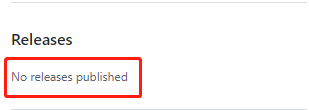
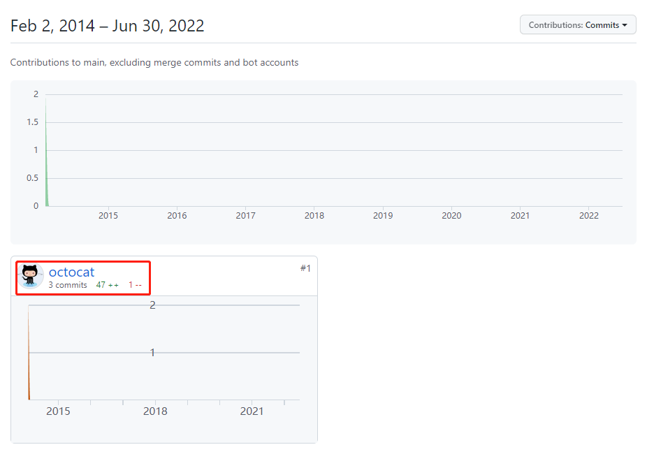
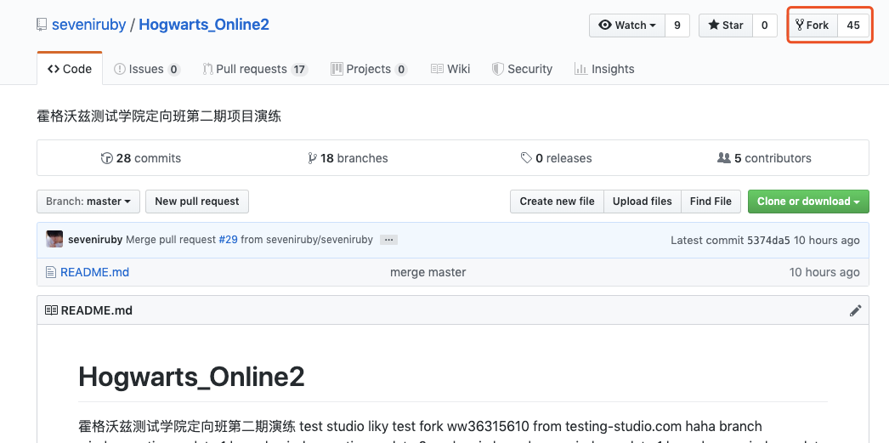
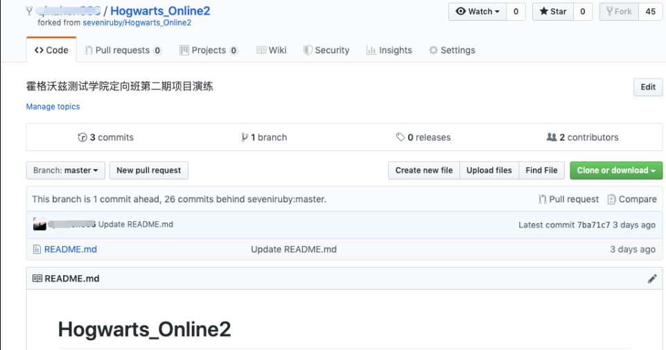

# **期末作业**

## 成员分工

- 刘文辉（52215903014 ）：第一部分

- 刘鑫（52215903010）：第二部分

- 伍志坚（52215903015）：第三部分

## 一、项目的基本背景和发展历程介绍

* 技术类型

Spoon-Knife 是一个托管在 GitHub.com 上的测试仓库。用于测试 Pull Request（PR） 的工作流程和 GitHub Desktop 应用程序。 在人们使用 GitHub 一段时间之后，或许想要给其他人的项目贡献一些代码，或者从其他人现有的项目开始开发，这个过程称之为Forks。创建一个“Fork”的意思是拷贝其他人的项目到自己这里来开发。Forks 充当原始仓库和你的副本之间的桥梁。用户可以通过对原始项目进行更改，并提交PR来帮他人优化他们的项目。Forks 是 GitHub 代码社交的核心。通常大家使用 Spoon-Knife 项目来进行演示，它是一个测试仓库。

* 版本发布历史：无版本发布（No releases published）

  

* 主要贡献者的构成（国家、区域和组织等）：根据github网站对该仓库的记录，该项目的主要由github官方贡献@[octocat](https://github.blog/)。

  

* 关于Forks

  Forks 允许用户在不影响原始仓库(repository)的情况下对项目进行更改。用户可以使用PR从原始仓库库中获取更新或提交更改。

  Fork仓库类似于复制仓库，但有两个主要区别：

  ​        1）用户可以使用PR来建议从用户拥有的Fork到其 GitHub 实例中的原始仓库（也称为上游仓库）的更改。

  ​        2）用户可以通过将分支与上游仓库同步来将更改从上游仓库带到本地分支。

  用户可以将仓库Fork到其个人帐户或具有仓库创建权限的任何组织，具体详情请查阅[组织中的角色](https://docs.github.com/cn/organizations/managing-peoples-access-to-your-organization-with-roles/roles-in-an-organization)。

  如何Fork其他人的仓库？

  ​        1）进入仓库的界面，点击 **Fork** 按钮对仓库进行fork：

  ​        

  

  

  ​        2)  fork完成后就可以在自己的GitHub账户下见到被fork的项目：

  

  

    

## 三、结合期中分析的归档项目，对比分析活跃/归档项目

1. 项目基础数据（2.1/2.2/2.3）的变化趋势

   2.1 fork和star的数量变化曲线

- 从统计图可以看出，项目从2015年以来，每月新增的star数呈震荡波动趋势，单数月份只有100左右，而双数月份则有接近10000的新增star，仍然保持着稳定性。
而新增的fork数则处于波动上升的趋势，从峰值40000到峰值80000，至今仍然保持很强的上升趋势。

   2.2 Issue的打开和关闭数量变化曲线

- 该项目Issue打开趋势在2015年迎来巨大的增加，从月均60猛增至500左右，之后呈缓慢下跌趋势，当前维持在200左右。项目的关闭日常维持在100左右，而在2021年1月关闭了2120个Issue。

   2.3 PR的打开和合并的数量变化

- 该项目PR打开数日常维持500以下，同样在2021年1月，打开了2289个PR，原因如上述。
此外，由于项目用于测试 Pull Request（PR） 的工作流程，因此本项目没有合并PR。

2. 开发者数量（2.4）变化趋势

- 仓库活跃的开发者总数在项目初期达到顶峰，有超过4000开发者，此后缓慢下降稳定在1000人左右。

   

- 项目的主要贡献人

 由于该项目是测试仓库，因此没有主要的贡献人。

3. 项目发展到活跃的主要影响因素及原因：

   活跃原因： Spoon-Knife 是一个托管在 GitHub.com 上的测试仓库。用于测试 Pull Request（PR） 的工作流程和 GitHub Desktop 应用程序。 因此，大量的社区人员使用 Spoon-Knife 项目来进行演示。项目至今都很活跃，就是因为至今仍然有大量开发人员使用。 第二是Spoon-Knife是Github官方的教程中的指定测试仓库，由于官方的推广使得该项目至今仍然活跃。 第三，由于项目本身也具有非常重要的意义和价值，在一定程度上也反映了Github的发展趋势。
