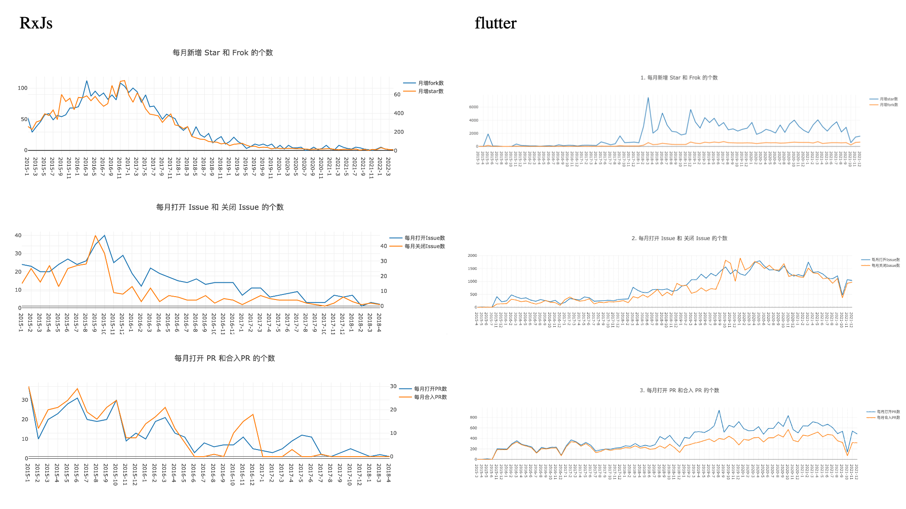
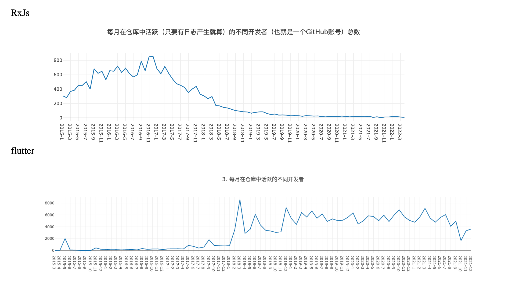

# 期末报告 ([flutter/flutter](https://github.com/flutter/flutter))

**小组成员**:

* 杨珂（学号：51215903064，完成任务三）
* 张凌峰（学号：51215903067，完成任务二）
* 贺惠惠（学号：51215903015，完成任务一）

##		一、项目的基本背景和发展历程介绍

##		二、项目历史轨迹分析

详见flutter.ipynb。

##		三、结合期中分析的归档项目，对比分析活跃/归档项目

​		其中分析的归档项目为` RXJS`。

+ 项目基础数据（2.1/2.2/2.3）变化趋势

​	通过对比图可知：

（1）归档项目` RxJs` 与项目` flutter`相比，在这基础数据这三个维度，前者比后者都要差上1-2 个量级。

（2）虽然两者基础数据变化趋势都是先升高至峰值然后再降低，但是`RxJs`峰值之后不断降低直至趋于零，` flutter`的数据则下降到一定程度呈平稳态势。

+ 开发者数量（2.4）变化趋势

通过对比图可知：

​		`RxJs`的活跃开发者总数相较` flutter`要小一个量级。与基础数据类似，项目`RxJs`的开发者总数至峰值之后不断降低直至趋于零，` flutter`的开发者至峰值后，略有下降，之后呈平稳态势。

+ 其他感兴趣的对比方向

​		比较两个项目PR 从打开到合入的平均时长，项目` RxJs`的值为11.6天，项目`flutter`的值为3.4天，可见` flutter`的维护者处理PR更加及时，可以得出后者比前者社区活跃度更高这一结论。

+ 给出你认为的项目发展到活跃/归档的主要影响因素及原因

​		社区活跃度是影响开源项目发展的重要指标。一个健康的项目应当具有相当的社区活跃度，这体现在项目的提交数、 拉取请求数和贡献者数（其它数据，如代码行数、文件数、issue 数、 fork 数、star 数）等，当一个项目社区活跃度趋于0，则代表该项目趋于归档。

