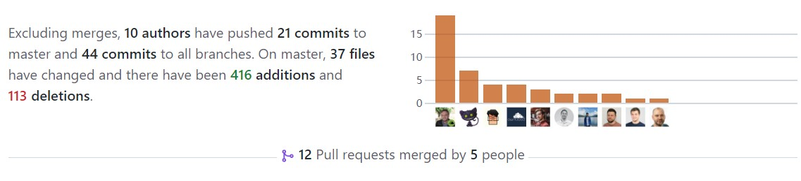
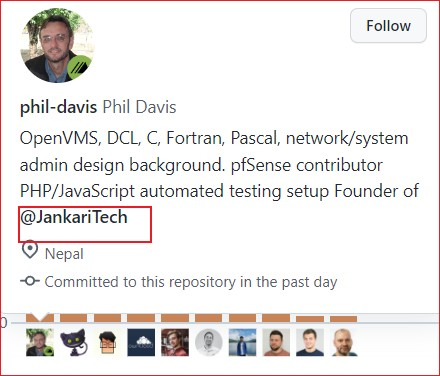
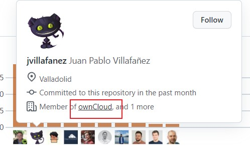
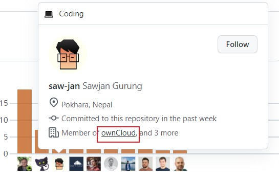
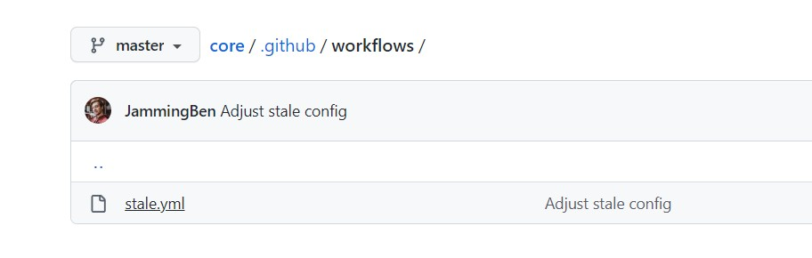
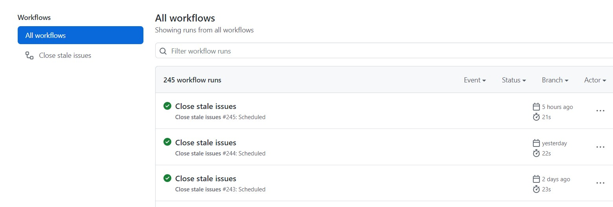

# 期末作业

## 成员及分工

- 郑智健（51215903098）：第一部分
- 张恩（5121590365）：第二部分
- 熊鑫（）：第三部分

## 一、项目的基本背景和发展历程介绍

### 基本介绍

OwnCloud是一个基于PHP开发的个人云盘工具，类似百度云盘，OwnCloud可以让用户在自己的服务器上运行个人云，从而自由地控制自己的数据。

### 技术类型

云计算

### 主要贡献者的构成（国家、区域和组织等）

共有514位贡献者，主要贡献者来自@[JankariTech](https://github.com/JankariTech)和@[owncloud](https://github.com/owncloud)

### CI/CD 的使用

使用[Github Workflows](https://github.com/owncloud/core/tree/master/.github/workflows)来创建CI/CD管道

配置文件如下:

具体使用情况如下:

