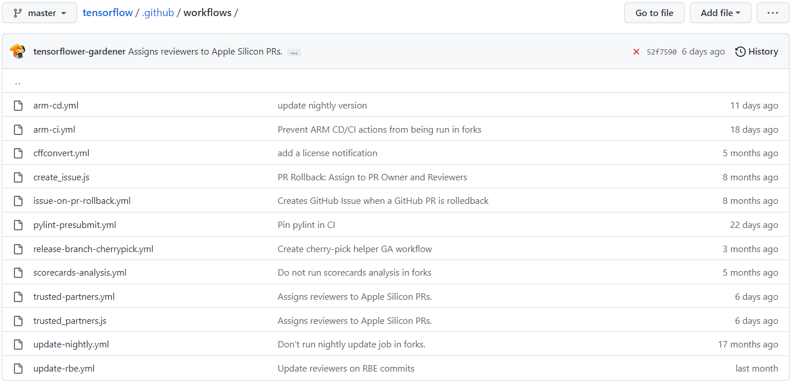

# 期末作业

## 成员及分工

- 曹汇杰(52215903002)：数据处理和第二部分内容

- 牛悦安(51215903012)：第三部分和报告整理

- 马源航(51215903076)：第一部分内容

## 一、项目的基本背景和发展历程介绍

### 基本介绍

&emsp; &emsp; TensorFlow是一个端到端的机器学习开源平台。它拥有一个全面的，活跃的社区生态，让研究人员能够推动机器学习的最新技术，让开发人员能够轻松地构建和部署基于机器学习的应用程序。
TensorFlow最初由[谷歌大脑](https://zh.m.wikipedia.org/wiki/%E8%B0%B7%E6%AD%8C%E5%A4%A7%E8%84%91)团队开发，用于[Google](https://zh.m.wikipedia.org/wiki/Google)的研究和生产，于2015年11月9日在[Apache 2.0](https://zh.m.wikipedia.org/wiki/Apache_2.0)
开源许可证下发布。

### 技术类型

深度学习框架

### 版本发布历史

共发布173个版本，最后一个版本号是“[v2.9.1](https://github.com/tensorflow/tensorflow/tree/v2.9.1)”，发布于2022年5月24号。

### 主要贡献者的构成（国家、区域和组织等）

共有3129个贡献者，从commits的日期与数量来看，其中主要贡献者来自[@google](https://github.com/google) [@tensorflow](https://github.com/tensorflow)

### CI/CD 的使用

使用[Github Workflows](https://github.com/tensorflow/tensorflow/tree/master/.github/workflows)来创建CI/CD管道

**配置文件如下：**

**具体使用情况如下：**

## **二、项目的历史轨迹分析**

我们对项目mozilla/send创建 - 归档 期间的数据分析如下，详情见 analysis.ipynb

1. 每月新增 Star 和 Fork 的个数
    
    
    
2. 每月打开 Issue 和 关闭 Issue 的个数
    
    
    
3.  每月打开 PR 和**合入** PR 的个数（注意，关闭 PR 不等于合入）
    
    
    
4.  每月在仓库中活跃（只要有日志产生就算）的不同开发者总数
    
    
    
5.  Issue 从打开到关闭的平均时长和中位数（单位：天）
    - 中位数14天
    - 平均106.65天
6.  PR 从打开到合入的平均时长和中位数（单位：天）
    - 中位数1天
    - 平均11.84天
7.  Issue和PR从打开到第一次有人回复（非本人回复）的平均时长和中位数（单位：天）
    - 中位数1天
    - 平均15.39天

## 三、活跃/归档项目对比分析

&emsp; &emsp;本节我们将以归档项目send和活跃项目tensorflow为例，对比归档项目和活跃项目。在项目基础数据变化趋势方面，归档项目和活跃项目在项目初期大受欢迎，各项指标较高，且经历几次“爆火”，各项指标出现高峰。但不同的是，活跃项目各项指标平均值更高，出现高峰次数更多，波动频繁。在每月新增Star & Frok 的个数方面，send项目的每月Star的中位数和平均数分别为64，215.8，峰值为3494；tensorflow的每月Star的中位数和平均数分别为2179.5，2528.0，峰值为5215；send项目的每月Fork的中位数和平均数分别为14，21.2，峰值为175；tensorflow的每月Fork的中位数和平均数分别为1186.5，1391.5，峰值为9988。可以看到二者的峰值都能达到过千，但send项目的平均值和中位数都和tensorflow相差甚远，活跃项目tensorflow受到了更加持续的关注。值得注意的是，tensorflow的fork峰值比star的峰值更高，而send的star的峰值远高于fork的峰值。这可能也表明了tensorflow有更多的二次开发者，让其能够成为活跃项目。与star和fork数量类似，每月打开 Issue 和 关闭 Issue 的个数、每月打开 PR 和合入 PR 的个数，也呈现出相似的特征。send项目除了几个峰值为，日常各项指标处于较低的状态，而tensorflow处于较高的状态。

&emsp; &emsp;在开发者数量变化趋势方面，send项目的events数量的变化几乎完全和star数量的变化相同。因此send项目活跃的开发者的变化趋势受WatchEvent所支配。而tensorflow项目除了一个fork造成的尖峰外，变化趋势也与其star的变化趋势基本相同。在众多events种类中，WatchEvent和ForkEvent的数量远超其他种类event，这两者的变化趋势也基本相同，并且同一开发者造成的所有events只记录一次。因此两个项目的开发者数量变化趋势都与star的变化趋势相似。两个项目的star数量的变化趋势已经在上一节中分析过了，因此在这里不再赘述。

&emsp; &emsp;其他方面，send项目的Issue从打开到关闭的时间，PR从打开到合入的时间的平均数和中位数都都短于tensorflow项目。但PR和Issue的第一次平均回复时间tensorflow更短。

&emsp; &emsp;一个项目从发展到活跃的原因多种多样，每个项目的活跃的原因的不尽相同。以tensorflow为例，项目背靠Google大公司，有强有力的开发团队与维护团队，持续的开发与更新，回答或修复社区中的问题；其项目内容又是时下火热的深度学习，被众人所关注和使用。因此，其项目活跃的原因可以归结为：项目的方向被大众所关注，加上自身素质过硬（深度学习方向+google团队开发）；持续的维护（从0.1到2.9.1版本）；活跃的社区（ Issue和PR从打开到第一次有人回复的中位数仅为1天）。与项目活跃原因的多种多样不同，一个项目最终被归档可能只是犯了一个错误。以send项目为例，归档项目send也曾经历爆火，单月最高star数量达到3494，到其归档前夕其使用人数也有很多。但仅仅因为出现安全问题，其就被迫停用，最终归档。因此开源项目想要持续发展的一个重中之重就是保重项目没有安全隐患。