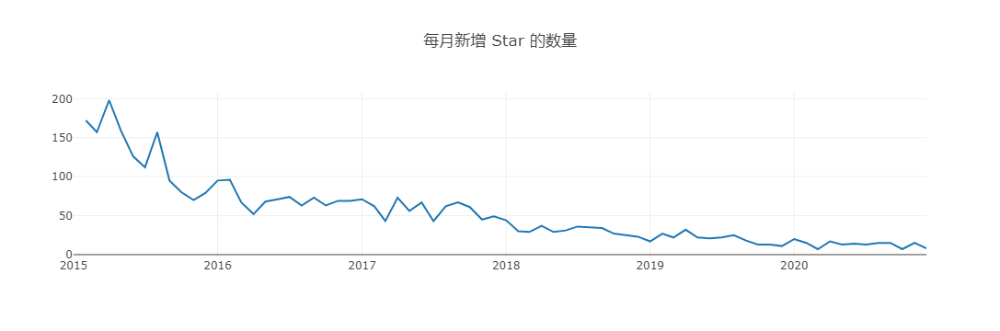
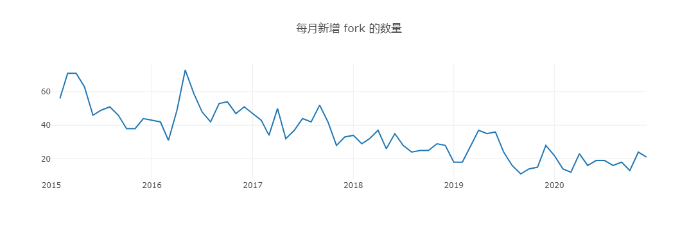
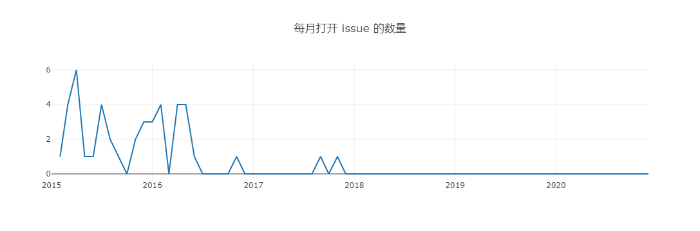
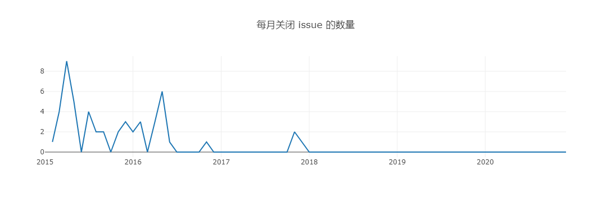
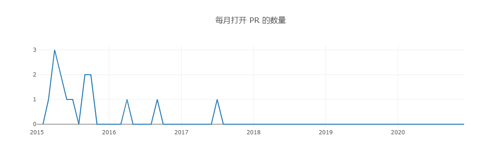
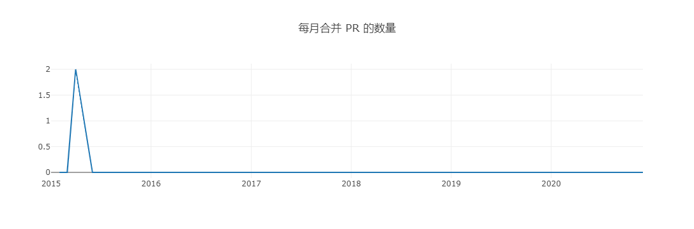
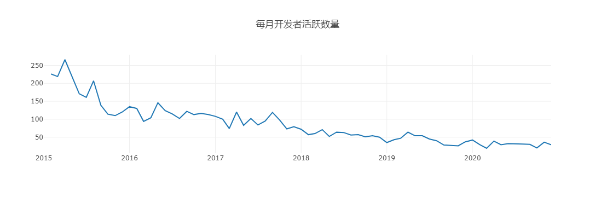

# 开源期中作业

分析的开源项目： https://github.com/carhartl/jquery-cookie  
项目ID：268027

小组成员及分工：

* 刘丹琪 51215903016，负责任务一和任务三的第四个问题
* 刘晟驰 52215903004，负责任务二
* 梅文娟 51215903013，负责任务三的前三个问题

## 一、项目的基本背景和发展历程

### 1. 项目基本信息

Cookies是一种能够让网站服务器把少量数据储存到客户端的硬盘或内存，或是从客户端的硬盘读取数据的一种技术。Cookies是当你浏览某网站时，由Web服务器置于你硬盘上的一个非常小的文本文件，它可以记录你的用户ID、密码、浏览过的网页、停留的时间等信息。当你再次来到该网站时，网站通过读取Cookies，得知你的相关信息，就可以做出相应的动作，如在页面显示欢迎你的标语，或者让你不用输入ID、密码就直接登录等等。

​从本质上讲，它可以看作是你的身份证。但Cookies不能作为代码执行，也不会传送病毒，且为你所专有，并只能由提供它的服务器来读取。保存的信息片断以“名/值”对(name-value pairs)的形式储存，一个“名/值”对仅仅是一条命名的数据。一个网站只能取得它放在你的电脑中的信息，它无法从其它的Cookies文件中取得信息，也无法得到你的电脑上的其它任何东西。
​
Cookies中的内容大多数经过了加密处理，因此一般用户看来只是一些毫无意义的字母数字组合，只有服务器的CGI处理程序才知道它们真正的含义。
​
由于Cookies是我们浏览的网站传输到用户计算机硬盘中的文本文件或内存中的数据，因此它在硬盘中存放的位置与使用的操作系统和浏览器密切相关。在搜狗浏览器中（4.2版本）的Cookies文件的存放位置位置在搜狗浏览器的IE缓存位置。

​硬盘中的Cookies文件可以被Web浏览器读取，它的命令格式为：Cookie:用户名@网站地址。比如我的搜狗浏览器的其中一个cookie文件是Cookie:administrator@matthew2012.blog.51cto.com。要注意的是：硬盘中的Cookies属于文本文件，不是程序。

本项目实现了一个简单的，轻量级的jQuery插件，用于读取，写入和删除Cookie。

​使用了以下工具进行开发：

- 测试工具：Qunit
- 使用NodeJS来运行grunt
- 使用grunt来进行任务管理

### 2. 版本发布历史

carhartl/jquery-cookie共发布了7个版本，其中：

第一个版本（v1.0）发布的时间是2012年7月9日

最后一个版本（v1.4.1）发布的时间是2014年4月28日

### 3. 主要贡献者的构成（国家、区域和组织等）

一共有19位贡献者，其中Klaus Hartl贡献了80%以上的代码

#### 第一位：Klaus Hartl

贡献情况：commit155次，增加2298行代码，减去1533行代码

id：carhartl

区域：Berlin, Germany

公司：digitalservice4germany

#### 第二位：Fagner Brack

贡献情况：commit21次，增加219行代码，减去91行代码

id：FagnerMartinsBrack

区域：Sydney, Australia

公司：The Internet

#### 第三位：Karl Swedberg

贡献情况：commit3次，增加22行代码，减去3行代码

id：kswedberg

区域：Grand Rapids, MI

公司：bamf-health

#### 第四位：Timo Tijhof

贡献情况：commit2次，增加22行代码，减去3行代码

id：Krinkle

公司：Wikimedia Foundation

### 4. CI/CD 的使用

  CI/CD 是一种通过在应用开发阶段引入自动化来频繁向客户交付应用的方法。CI/CD 的核心概念是持续集成、持续交付和持续部署。本项目中，使用Travis CI进行持续集成，Travis CI 是一个托管的分布式持续集成服务，用来构建并测试托管在Github上的软件项目。`.travis.yml`文件的内容如下：

```yaml
language: node_js
node_js:
  - 0.10
before_script:
  - npm install -g grunt-cli
script: grunt ci --verbose
env:
  global:
    - secure: HRae0kyIDDuhonvMi2SfEl1WJb4K/wX8WmzT9YkxFbmWwLjiOMkmqyuEyi76DbTC1cb9o7WwGVgbP1DhSm6n6m0Lz+PSzpprBN4QZuJc56jcc+tBA6gM81hyUufaTT0yUWz112Bu06kWIAs44w5PtG0FYZR0CuIN8fQvZi8fXCQ=
    - secure: c+M5ECIfxDcVrr+ZlqgpGjv8kVM/hxiz3ACMCn4ZkDiaeq4Rw0wWIGZYL6aV5fhsoHgzEQ/XQPca8xKs3Umr7R3b6Vr3AEyFnW+LP67K/1Qbz4Pi3PvhDH/h4rvK7fOoTqTDCVVDEH3v4pefsz2VaKemG4iBKxrcof5aR4Rjopk=
```


## 二、项目的历史轨迹分析

### 1. 每月新增 Star 和 Frok 的个数

<center>

</center>
<center>图2-1 每月新增的 star 个数</center>

<center>

</center>
<center>图2-2 每月新增的 fork 个数</center>  
&nbsp;

每月新增 star 和 fork 的个数如图2-1、2-2所示。根据统计图可以看到，项目在14年发布release v1.41之后，受到了开发者较多的关注，15年每月star、fork的数量分别维持在150、50左右。但是从2016年之后，每月star的数量有明显的下降，仅有60上下。每月fork的数量依然可以维持在50附近，但是进入2017后，fork的数量也开始下滑，将至40左右。

### 2. 每月打开 issue 和关闭 issue 的个数

<center>

</center>
<center>图2-3 每月打开的 issue 个数</center>

<center>

</center>
<center>图2-4 每月关闭的 issue 个数</center>
&nbsp;

该项目15-17年间issue数量较少。2017年该项目归档后，基本没有issue打开或关闭。

### 3. 每月打开 PR 和合并 PR 的个数

<center>

</center>
<center>图2-5 每月打开的 PR 个数</center>

<center>

</center>
<center>图2-6 每月合并的 PR 个数</center>

该项目15-17年间PR数量较少，每月PR数量只有个位数。


### 4. 每月在仓库中活跃（只要有日志产生就算）的不同开发者总数

<center>

</center>
<center>图2-7 每月活跃的不同开发者个数</center>

每月活跃的不同开发者总数的变化曲线基本和star的曲线变化一致。在2015年，每月活跃人数基本维持在150人以上，但是从2015年末开始，月活人数开始显著下降至100左右。此后月活人数持续缓慢降低。

**（更详细的结果展示，以及5-7数据分析结果，请查阅.ipynb文件）**

##  三、洞察项目可能被归档的原因

### 1. 阅读分析项目相关的信息

**主页、主要贡献人相关的技术博客** 

主要贡献人的主页，贡献者是来自与德国数字服务的软件工程师。 主要使用的语言是Java，python，Ruby，typescript，shell，CSS，JavaScript 等语言。

**Issue和PR中有趣的讨论**

* Issue： cookie with % in Json string fails to load 

  通过这个issue，作者发现encodeURIComponet 的使用虽然是方便的是不正确的。因为有过多的字符同时编码，这样的使用会导致一些意外的错误。因为raw设置下会产生很多环境问题，所以作者还给废弃了raw设置。

  同时，可以发现作者的回复非常的迅速，差不多隔天就回复了解决方案，可见作者对这个项目非常的上心。

* 从2011三月份开始该项目不断收到PR，到2015年项目归档，一共收到116个PR。这些Pull requets中主要包括了bug的修复、新功能的实现、文档的完善、冗余代码的删除、平台兼容性问题的解决等。 从项目主要开发人员和项目使用者之间的讨论中，可以看到他们对技术的热爱和精益求精的精神。这些都是值得我们学习的。

* Pull request: #264 CommitJs Support  

  这个讨论是所有PR中，评论次数最多的讨论。这个讨论展现了一个非常典型的Pull requsts的过程，也体现了开源的意义和精神。 这次的Pull request是使用者想要在原本的项目基础上增加一个Commjs插件的支持。

  需求性讨论： PR的提出人和项目的负责人首先讨论了这个插件在项目中的意义，它的主要意义是使得在运行任何的NodeJs程序的时候，使用者都能够获得随请求接受的cookie的值。项目负责人和PR的提出者进行一系列的讨论之后，决定接受这个PR。　

  适用性讨论：在确定这个功能的需求性之后，PR的提出人和项目负责人，在AMD上和远程服务等多个平台上的适用性进行了讨论。

  测试方式讨论： PR的提出人和项目负责人对进行怎么测试进行了讨论，是进行单元测试还是集成测试，单元测试是否足够，测试用例是否需要扩展等？

  在达成一致意见之后，并且测试通过之后，项目负责人接受了这次的PR。整个过程让人启迪，完美的展现了技术的精神和开源的力量。在开源的过程中，一个人的力量是有限的，每个人擅长的东西不一样。比如说，在这次讨论中，项目的负责人对NodeJs并不熟悉，但是PR的提出人就非常的熟悉。所以他们一起讨论的过程中，开源项目的负责人也收获了很多新的知识。开源精神，互帮互助，互相促进对方的成长，在此得以体现。

* Disscussion： Remove jQuery dependency requirement? #349

  这个讨论对这个项目而言是具有里程碑式意义的讨论。 这次主要讨论了项目是否要移除jQuery的依赖。讨论的目的并不是为了单纯移除jQuery的整个框架，而是希望项目有一个新的版本能够不依赖jQuery的工具，这样的话，本项目就可以与其它的工具轻松集成使用。项目负责人也采取了他的建议，并且将重新开启了另外一个版本的项目库。 新版本的项目库在使用中具有更加广阔的适用性，知道2021年还有人继续为其作出贡献。 

**README** 

* readme中的文档非常详细。 其中包含了项目的简要介绍和版本信息、安装信息。  安装方式有两种，第一是在JQuery中包含该脚本信息，第二种是作为AMD或则CommonJS模块进行记载。文档中对该项目的用法也进行了详细的介绍，包含两种配置方法和多种Cookie选项，最后还增加了转换器的用法。 

* 其中很多功能都是后期通过PR完善的，比如说支持CommonJs作为插件进行加载，这个功能是其它开发贡献者提出的。 

**贡献者指南**

该项目的贡献者指南包括开发工具，以及NodeJs的安装方法，以及测试方法和自动编译的方法。 该贡献者文档由两位开发人员进行编辑，最后一次更新是2014年6月。从时间上来看，这个文档的完善也可以见证这个开源项目的完善和规范化。

从提交历史上来看，贡献者指南从2013年开始提交，它从一个只有开发方式的贡献指南到测试开发一应俱全的文档。这中间每次接受的PR都是对该文档完善的重要原因。 

### 2. 项目归档的原因分析

项目的版本需要大幅度的修改和迭代。 在Readme中给出了项目的更高版本，以及更高级别的版本和当前版本的区别。 其中包含一个讨论即是否要起初jQuery的依赖以便于项目在其它工具上更好的适应性。 于是在2015年作者便新开了一个项目库用于存放非jQuery依赖的项目库。新的项目库到2021年仍然有人提出PR和Issue，项目的活跃程度很高。 而原来的项目库，也就是本项目库只活跃到2017年。因为活跃程度过少，项目的负责人就将本项目存档了。

### 3. 归档后产生的影响

如果仓库不再活跃开发或者项目开发者不想接受额外的贡献，但这并不意味着作者想要删除它，可以在 Github 上归档仓库让它变成只读。归档一个仓库会让它对所有人只读（包括仓库拥有者），这包括对仓库的编辑、问题(issue)、合并请求(pull request（PR）)、标记、里程碑、项目、维基、发布、提交、标签、分支、反馈和评论。谁都不可以在一个归档的仓库上创建新的问题、合并请求或者评论，但是仍可以 fork 仓库——以允许归档的仓库在其它地方继续开发。

本项目归档的原因是因为项目有了大的修改和迭代。原项目归档之后，后续的更新都会集中到项目新版本上。其它的开发人员不会再对旧版本进行修改，而是基于新版本对项目作出贡献。 这样可以减少项目负责人的精力消耗。

其次，项目归档之后，没有人能对项目进行修改，说明归档的项目已经是一个成熟稳定的版本了。只是后续的功能上因为有大幅度的改变，所以开启了新的项目库进行新版版本的开发。 

### 4. 对开源项目如何可持续发展的理解

开源项目增长迅速，在各行业中的渗透率加深全球开源项目的数量增长迅速.中国开发者与开源项目均实现迅速增长，高质量项目数量同步增多。**2021年GitHub上的中国开发者人数达到755万，Gitee上开源项目数量增长率达到192%，其中Star数破千的项目数量增长率达到132%，2020年Gitee上的代码仓库总数超过1500万个。**开源软件在不同行业领域中的渗透率不断加深，新兴领域对开源的态度更加开放，行业代码库中开源软件占比最高的前三个行业分别是物联网、网络安全以及制造业、工业与机器人行业，几乎所有行业代码库中开源软件的占比均达到半数。

为了能使开源项目可持续发展，必须加强开源产业的规范性。软件的“源”即其源代码，“开源”的核心概念是软件的编写者将源代码（通常）免费提供给使用者。然而，软件行业内所谓的“开源”概念还包含其他诸多基本要求和限制，需要作者和使用者共同遵循一些规范。OSI（Open Source Initiative）组织是全球范围内开源软件标准的权威发布机构，在该机构的界定中，规范的开源项目和软件除了在开放源代码这一基本要求之外，其开源许可（open source license）还需要满足关于源代码的使用和修改、关于软件传播以及公平性、中立性等方面的诸多要求，这些要求加强了开源产业的规范性，构建了诸多开源商业模式的基础。

开源项目的可持续发展也需要注重开源用户和贡献者的反馈。今天的互联网巨头其成功基本上是建立在开源软件的基础之上的，而这些公司很多只是搭便车，付出很少。所以一些人认为只要巨头们拿出钱来问题就迎刃而解了。当然 IBM 和 Google 这样的公司都鼓励其雇员回报开源社区，Google 称它有 2000 多个活跃的开源项目，如 Go 语言和 Kubernetes 容器软件。从产业主体的角度上看，开源软件产业市场上的主体包括软件的源作者（个人/企业）、开源基金会、开源社区（包括代码托管平台、软件论坛、行业联盟）、二次开发者和使用者等。源作者在开源社区中发起开源项目，这意味着将软件源代码无偿在社区发布，此后二次开发者和使用者作为贡献方进行迭代，并在开源许可证的约束下使用迭代版本，社区中的其他机构提供法律、行业发展等服务和指导，不同角色间互相配合，有效协作，达成技术交流或商业目的。开源运营和治理环节，无论是由企业主导还是由基金会主导，在整个开源项目过程中都处于关键位置，包含软件开发和发行、市场推广、版本迭代更新、版权管理和安全管理等内容，这些环节和商业企业的软件项目有一些相似之处，但更加注重从社区的使用者和贡献者处得到观点和启发，并用以驱动项目未来的发展。
