# 项目分析报告

组员：王怡静（代码撰写、绘图）、吴帆（完成分析报告）

## 一、项目基本背景和发展历程介绍 

项目地址：https://github.com/blueimp/jQuery-File-Upload 

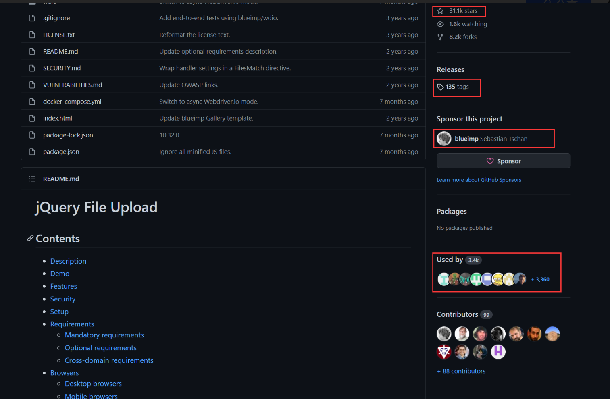

### 1 项目简介 

jQuery-File-Upload是一个由个人开发、维护的开源文件上传组件，在github上是星数第二多的JavaScript项目（第一是Javascript），共有**31.1k** stars，**8.2k** forks。 

### 2 功能说明 

jQuery-File-Upload是文件上传小部件，具有多个文件选择、拖放支持、进度条、验证和预览图像、jQuery 音频和视频。支持跨域、分块和可恢复的文件上传和客户端图像大小调整。 

适用于任何支持标准 HTML 表单文件上传的服务器端平台（PHP、Python、Ruby on Rails、Java、Node.js、Go 等）。

### 3 技术类型 

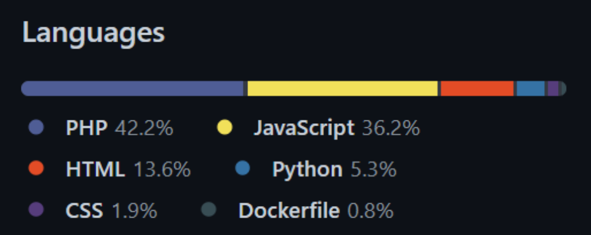

此项目主要使用PHP 和 JavaScript 为开发语言。

### 4 版本发布历史 

本项目于2013年5月9日发布第一个版本8.1.0，自此之后每年更新迭代，直到2021年9月26日发布最后一个版本10.32.0，一共迭代了**135个版本**。 

**[主要的几次版本更新是以下四个漏洞的修复：](https://github.com/blueimp/jQuery-File-Upload/blob/master/VULNERABILITIES.md)**

#### 4.1 iframe 传输中的跨站点脚本漏洞

提交 [4175032](https://github.com/blueimp/jQuery-File-Upload/commit/41750323a464e848856dc4c5c940663498beb74a) 之前的[Iframe 传输](https://github.com/blueimp/jQuery-File-Upload/blob/master/js/jquery.iframe-transport.js)[重定向页面](https://github.com/blueimp/jQuery-File-Upload/blob/master/cors/result.html)允许在 Web服务器的上下文中执行任意 JavaScript。因为通过 innerHTML 设置 HTML 元素内容会忽略脚本标签，可以使用img标签的onerror 运行任意脚本代码。

作者在2012年08月09日修复了漏洞：将 innerHTML替换为 textContent/innerText 设置正文内容。

#### 4.2 GAE组件的开放重定向漏洞

[v 9.10.1](https://github.com/blueimp/jQuery-File-Upload/releases/tag/9.10.1) 之前示例的 Google App Engine 上传处理程序接受任何 URL 作为重定向目标，从而可以使用 Web 服务器的域进行网络钓鱼攻击。 

作者于2015年06月12日修复了漏洞：添加了REDIRECT_ALLOW_TARGET 选项（默认为 HTTP 引用）来限制URL的重定向。

#### 4.3 PHP 组件中的远程代码执行漏洞（编号 [CVE-2018-9206](https://cve.mitre.org/cgi-bin/cvename.cgi?name=CVE-2018-9206)）

攻击者可以上传任意文件到服务器中，然后控制这台服务器。此漏洞的核心问题在于服务器配置的疏漏，若攻击者上传一个 `.php` 文件，服务器也会执行它。

作者在2018年10月23日修复了漏洞：开启Apache服务器中[.htaccess 支持](https://httpd.apache.org/docs/current/howto/htaccess.html)，.htaccess 文件包含 Apache 禁用脚本执行的说明，可限制文件的上传或者文件的执行。 

#### 4.4 PHP+ImageMagick 的潜在漏洞（编号 [CVE-2016-3714](https://cve.mitre.org/cgi-bin/cvename.cgi?name=CVE-2016-3714)）

 [v9.25.1](https://github.com/blueimp/jQuery-File-Upload/releases/tag/v9.25.1)之前 [PHP 上传处理程序在调用](https://github.com/blueimp/jQuery-File-Upload/blob/master/server/php/UploadHandler.php)[ImageMagick](https://www.imagemagick.org/) 之前没有验证文件签名。攻击者可以使用 GhostScript 来执行任意代码。攻击者会把如下的 GhostScript 示例保存成为 PNG、GIF 或 JPG 文件，然后再把他们上传到服务器中。服务器会执行 `ping example.com` 这个指令。虽然不同的操作系统中GhostScript可能会有一些不同，但是ping指令可以运行在大多数的环境中，这样攻击者就能利用自动化的手段来发现程序存在的漏洞。 

```ghostscript
%!PS
userdict /setpagedevice undef
save
legal
{ null restore } stopped { pop } if
{ legal } stopped { pop } if
restore
mark /OutputFile (%pipe%ping example.com) currentdevice putdeviceprops
```

作者在2018年10月25日修复了漏洞：将 ImageMagick 配置为仅启用 `GIF/JPEG/PNG`处理所需的编码器，例如使用示例 [ImageMagick config](https://github.com/blueimp/jQuery-File-Upload/blob/master/SECURITY.md#imagemagick-config)。

### 5 主要贡献者的构成（国家、区域和组织等） 

 项目主要由个人开发者 Sebastian Tschan（id: blueimp，位于日本东京）软件工程师完成。 

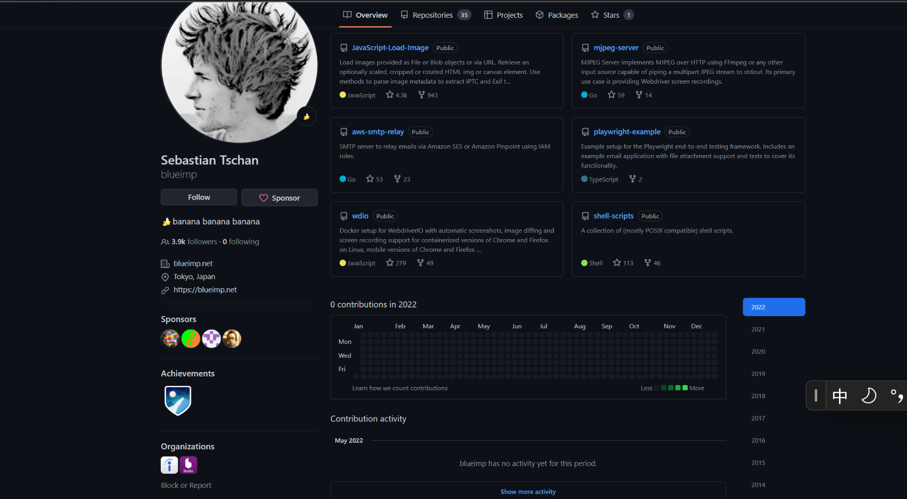

除此之外有98位开发者对项目进行了微小的调整和贡献。 


### 6 CI/CD 的使用 

#### 6.1 介绍 

**CI 持续集成（Continuous Integration）**

持续集成（CI）可以帮助开发人员更加频繁地（有时甚至每天）将代码更改合并到共享分支或"主干"中。一旦开发人员对应用所做的更改被合并，系统就会通过自动构建应用并运行不同级别的自动化测试（通常是单元测试和集成测试）来验证这些更改，确保这些更改没有对应用造成破坏。这意味着测试内容涵盖了从类和函数到构成整个应用的不同模块。如果自动化测试发现新代码和现有代码之间存在冲突，CI 可以更加轻松地快速修复这些错误。 

**CD 持续交付（Continuous Delivery）**

完成 CI 中构建及单元测试和集成测试的自动化流程后，持续交付可自动将已验证的代码发布到存储库。为了实现高效的持续交付流程，务必要确保 CI 已内置于开发管道。持续交付的目标是拥有一个可随时部署到生产环境的代码库。 

在持续交付中，每个阶段（从代码更改的合并，到生产就绪型构建版本的交付）都涉及测试自动化和代码发布自动化。在流程结束时，运维团队可以快速、轻松地将应用部署到生产环境中。 

#### 6.2 Github Actions 

GitHub Actions 是微软于 2018 年秋季推出的一个平台。这一平台可以让开发者实现定制化的程序逻辑，而不需要专门创建一个应用去完成需要的任务。开发者可以借助 Actions 平台建立工作流，使用他们代码仓库中定义好的 action、或者 GitHub 公开代码库中的 action，甚至是一个公开的 Docker 容器镜像。 

GitHub Actions 可让用户轻松自动化所有软件工作流程，使用世界一流的 CI/CD，直接从 GitHub 构建、测试和部署代码。让代码审查、分支管理和问题分类以用户想要的方式工作。 

action 在这里指的是开发、测试、部署和发布代码中的各种流程，举个例子，一个 action 可以是公开发布某个 npm 模块，在创建紧急 issue 时为开发者发送 SMS 警告，或者部署生产流程中的代码的过程。这些工作流程过去需要开发者自己去手动实现。现在有了 Actions 平台后，借助 Actions 平台和 使用 GitHub 上提供的数百万个开源库来创建用户自己的操作。用 JavaScript 编写它们或创建一个容器操作——两者都可以与完整的 GitHub API 和任何其他公共 API 交互，不需要专门去创建实现这些 action 的应用了。此外，开发者创建的工作流（workflow）也可以分享给 GitHub 社区供其他人使用。 

GithubActions的最大优势就是它与Github高度整合，只需要一个配置文件即可自动开启服务。**github actions的配置文件叫做workflow文件，workflow文件采用YAML格式，文件后缀名统一为.yml。**github会按照触发条件在符合条件时自动运行该文件中的工作流程。 

具体到 jQuery-File-Upload 仓库介绍如下： 

 jQuery-File-Upload 仓库的 `.github/workflow` 目录下的 `test.yml` 文件。主要完成如图的工作：

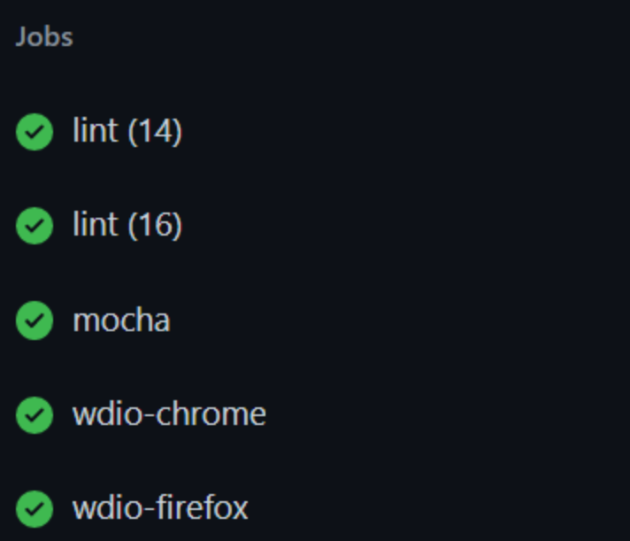

根据该文件，可以看出 jQuery-File-Upload 仓库会使用 docker 镜像进行测试，在进行push、pull_request 时触发，执行的命令有 `npm install`、`npm run lint`、 `docker-compose build`、`docker-compose logs` 等命令。具体地主要是完成名为lint（静态代码分析工具）、mocha（javascript单元测试框架）、webdriverIO（浏览器自动化测试工具）的CI任务。 

`test.yml` 文件示例： 

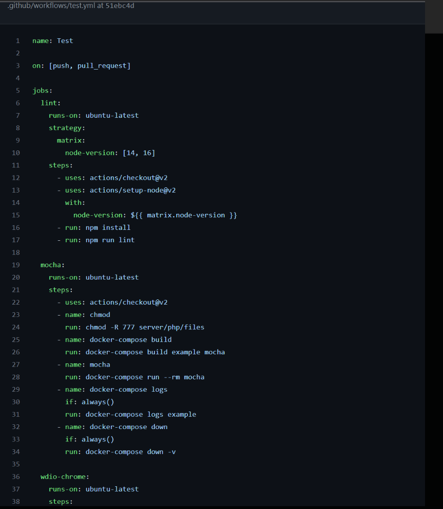

## 二、项目的历史轨迹分析 

基于给出的镜像数据和 OpenDigger，完成项目 2015年/创建 - 归档 期间的以下数据分析任务： 

### 2.1 每月新增 Star 和 Frok 的个数

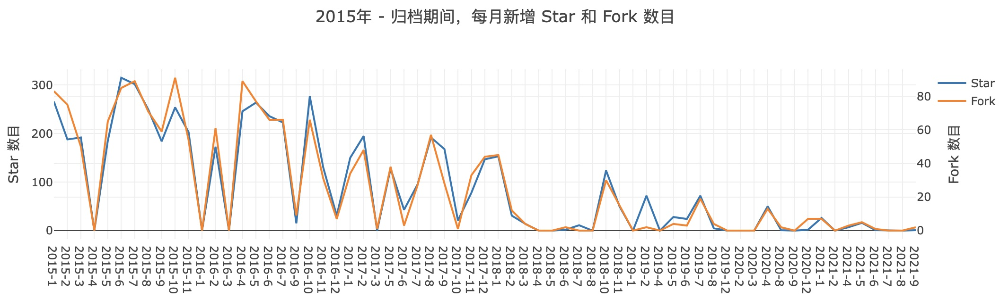


**分析**：从图和数据中可以看出在项目发布推广（13年）的几年间都较活跃，star、fork量之后趋势逐级下降，甚至在18~20年都有好几个月star或fork为0。可见此项目热度有所下降。

### 2.2 每月打开 Issue 和 关闭 Issue 的个数

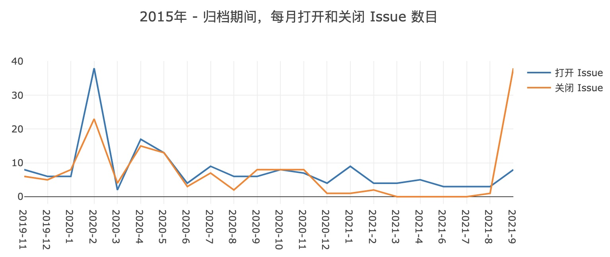

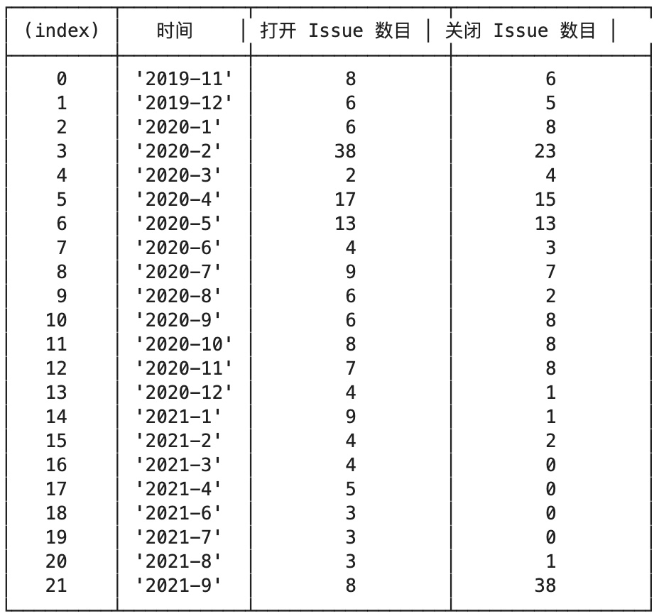

**分析**：我们在查看数据时发现在2015~2019年10月没有Issue记录，而之前和之后的时间都有Issue记录。同时在此期间，PR记录依然是存在的，根据调研，推断作者在此段时间禁用了Issue功能。除此之外，可以注意到在项目被归档前，作者将Issue大量关闭了。

禁用Issue具体操作如下图所示。

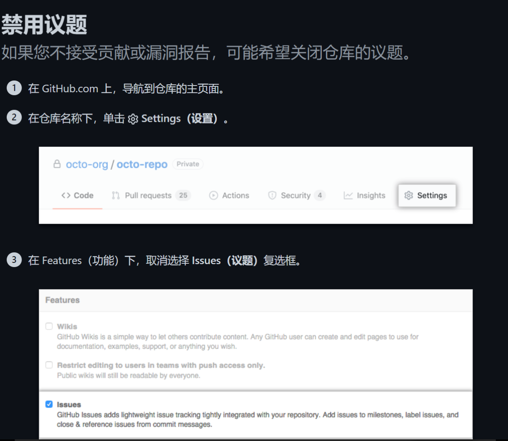

### 2.3 每月打开 PR 和合入 PR 的个数

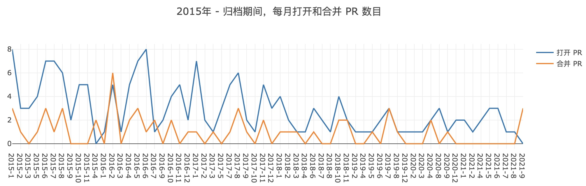


**分析**：开发者对此项目一直关注度较高，此插件的实用性很强，同时作者也将较长时间都投入在了此项目中。由于主要是个人开发者进行的，因此对作者的精力需求是难以估量的。对作者由衷敬佩。

### 2.4 每月在仓库中活跃的不同开发者总数

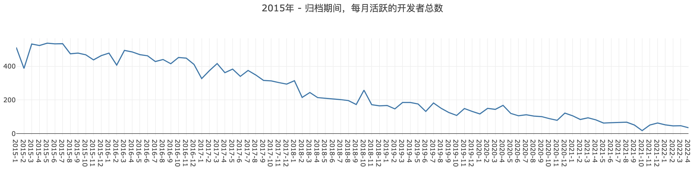


**分析**：项目自第一版发布到如今也一直有很多人关注，功能实用且兼容性强，不过项目趋于成熟、加之作者已经将其归档不再维护，项目活跃度也在日渐下降。

### 2.5 Issue 从打开到关闭的平均时长和中位数

- Issues 从打开到关闭的平均时长： 194.65 天
- Issues 从打开到关闭的时长中位数： 5 天

**分析**：可以看出 Issue从打开到关闭的中位数时长较短，可见作者对项目的维护较为积极。

### 2.6 PR 从打开到合入的平均时长和中位数

- PR 从打开到合入的平均时长： 20.17 天 
- PR 从打开到合入的时长中位数： 2 天

**分析**：可以看出 PR 从打开到合入的中位数时长较短，可见作者对项目的维护较为积极。

### 2.7 Issue和PR从打开到第一次有人回复的平均时长和中位数 

- Issue 从打开到第一次有人回复的平均时长： 189.96 天 
- Issue 从打开到第一次有人回复的时长中位数： 2 天
- PR 从打开到第一次有人回复的平均时长： 30.80 天 
- PR 从打开到第一次有人回复的时长中位数： 2 天

**分析**：可以看出 Issue和PR打开到第一次回复的时间中位数都不算很长，可见此项目一直有很多人关注和讨论，作者也在此项目中花费了较多时间进行维护、合并。

### 2.8 根据观察到的仓库历史数据，找到认为关键或值得注意的时间节点

1. 2019年11月，作者重新开放了 Issue，可以在项目中提 Issue、进行讨论了。
2. 2021年9月，作者在归档前合并了大量的PR，关闭了大量 Issue，项目的活跃度进一步大大下降了。

## 三、洞察项目被归档的可能原因 

> 作者主页：https://blueimp.net/

### 3.1 总结项目可能的归档原因

jQuery-file-Upload 项目于2021年9月被归档，但是开发人员没有任何解释或帖子，没有继任或连续性计划。由于此项目目前已被归档，因此无法在在 GitHub 上通过 Issue 询问作者。而开发人员在 README 中声称可在 Stack Overflow 提供官方问答，但在 Stack Overflow 上发帖的询问并未得到开发者本人的回复。

有人试图 fork 此项目并接管他，但是由于联系不上作者，发邮件也没有回应。与此同时，在2022年作者并未在github做出任何 contributions，这和他往常的行为有些不符。不过可以看出随着项目活跃度等日渐下降，作者对此付出的维护精力也在减少。

根据项目中的开发者活跃程度也可以看出此 **漏洞被一一修复，项目日趋成熟，而作者后续也可能无法在对此项目再继续付出精力**，于是项目被归档了。

### 3.2 分析项目归档后可能产生的影响

对用户而言，最直接的影响是无法再提出 Issue 以及 PR，在联系不上作者的情况下，也无法接管此项目。如果在开发中遇到插件代码上的安全漏洞、功能上的缺失等等，只能考虑换一个插件或者自己进行编写。对项目中原代码可能需要进行较大的修改。 

对开发者而言，项目归档后将丢失一个发现项目漏洞或完善功能的有利渠道。项目的活跃程度也将不可避免地下降，进而影响开发者本人的关注度及行业影响力。开发者也将失去通过进一步开发项目可能产生的收益。

### 3.3 对开源项目如何可持续发展的理解

开源项目常常会遇到以下问题： 

1. **资源不足**：OSS无处不在，但缺乏资金和人力资源。开发人员和公司受益于充满活力的 OSS 生态系统，但他们缺乏相应的动力来为创建和维护项目贡献时间和金钱。这极大地限制了 OSS 的价值，尽管它具有巨大的潜力。 
2. **缺乏沟通**：随着项目的发展，与用户的沟通变得越来越具有挑战性。许多 OSS 团队发现自己从头开始构建项目和社区管理工具，从而消耗核心成员的精力。 
3. **工作超负荷**：当用户群的增长速度超过带宽时，团队经常会感到筋疲力尽。对许多人来说，解决一个大问题能够令大家满意的，但随着时间的推移，debug或修复漏洞会变得越来越困难，并会产生长期的可持续性问题。在许多情况下，作者从未计划对数字基础设施的关键部分负责。他们试图解决自己的问题，结果证明对许多其他人也有用。 
4. **不平等的待遇**：OSS 贡献者经常处于骚扰、要求和普遍不尊重的接收端，即使他们自愿为社区贡献时间。 
5. **分析来源单一**：除了下载统计数据之外，维护人员对其软件使用方式的了解有限。他们通过与贡献者和用户的实际互动了解社区的日常需求，但执行此操作的工具可能会更好，而且只有少数工具可以更全面地了解正在发生的事情。 
6. **非对称识别**：许多类型的贡献都进入了代码之外的 OSS 项目。不幸的是，当项目的用户无法阅读时，包括项目维护在内的辛勤工作可能会被忽视和识别。 
7. **指导不足**：OSS 可能是一个充满挑战的环境，很难找到指导并学习有关构建和运行项目的最佳实践，而且新手远远多于有经验的人。 
8. **管理无力**：随着项目的发展，团队制定、委派和沟通决策的框架也必须发展。社区并不总是有能力指导这种演变。 

开源若要可持续并商业化，一般需要六大要素：核心开源产品、社区、商业级产品、配套服务、销售转化、生态。

开源涉及的商业模式主要有：Open-Core 模式、Hosting 模式、Professional Services 模式、Marketplaces 模式。

1. **Open-Core**：开放核心，即开放产品的核心功能，将商业产品和开源产品进行互补。二者差异性一般体现于：UX、SaaS、协作性，此外还有可伸缩性、安全性、管理和集成，以及开放一些解决方案和行业的案例。
2. **Professional Service**：提供专业服务，企业支付支持和咨询费用，但是服务收入一般是不可预测的，同时需要投入大量的人力，因此会有较大的风险。
3. **Hosting**：托管服务，在数据领域很常见，终端用户可以SaaS产品的方式使用基础设施的组件而不需要去管理。但是托管服务的收益是由付费意愿决定的，如果远大于建立基础设施的成本，公司无疑会选择自己的托管。
4. **Marketplaces**：市场营销，最典型的案例是Android，他通过Play Store获取了大量利润，Mozila 的收入很大一部分也是为搜索引擎引流等方式，目前越来越多的开源初创公司在探索这种模式。

对于成功的开源公司来说，**Open-Core 是最常见的模式，且将与 Hosting、Professional Service 作为第二和第三收入来源。**

建立良好的社区生态，设置较为宽松的license，便于后续如果无法再维护项目可以有人接管。同时，多人使用可以提出一些bug和安全上的问题，对作者本人的技术认知也能够有一定的提升。 

对于此项目来说，个人开发者并不依靠此项目来创收，单纯免费、开源。可以看出作者在项目上也花了很多时间、精力。但对个人开发者而言，无法持续十年、二十年来为同一个项目进行贡献、修复、完善。因此，**卓越的商业化生态才是卓越开源项目的可持续发展之路。**
